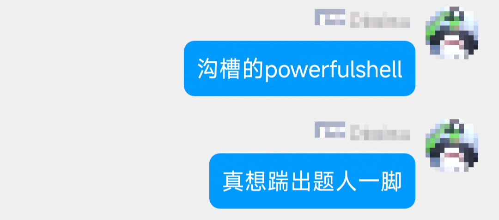
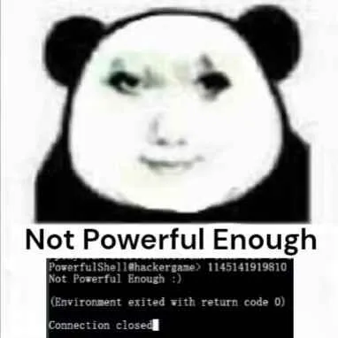

# PowerfulShell

题解作者：[zeredy879](https://github.com/zeredy879)

出题人、验题人、文案设计等：见 [Hackergame 2024 幕后工作人员](https://hack.lug.ustc.edu.cn/credits/)。

## 题目描述

- 题目分类：general

- 题目分值：200

即使贝壳早已破碎，也请你成为 PowerfulShell 之王。

**[完整题目附件下载](files/PowerfulShell.zip)**

<details markdown="1">
  <summary style="display: revert; cursor: pointer" markdown="1"><b>题目核心逻辑预览</b>（点击展开）</summary>

```bash
#!/bin/bash

FORBIDDEN_CHARS="'\";,.%^*?!@#%^&()><\/abcdefghijklmnopqrstuvwxyzABCDEFGHIJKLMNOPQRSTUVWXYZ0"

PowerfulShell() {
    while true; do
        echo -n 'PowerfulShell@hackergame> '
        if ! read input; then
            echo "EOF detected, exiting..."
            break
        fi
        if [[ $input =~ [$FORBIDDEN_CHARS] ]]; then
            echo "Not Powerful Enough :)"
            exit
        else
            eval $input
        fi
    done
}

PowerfulShell
```

</details>

flag 位于根目录 `/` 下。你可以通过 `nc 202.38.93.141 12554` 来连接题目，或者点击下面的「打开/下载题目」按钮通过网页终端与远程交互。

> 如果你不知道 `nc` 是什么，或者在使用上面的命令时遇到了困难，可以参考我们编写的 [萌新入门手册：如何使用 nc/ncat？](https://lug.ustc.edu.cn/planet/2019/09/how-to-use-nc/)

[打开/下载题目](http://202.38.93.141:12555/?token={token})

## 题解

本题的 idea 来自笔者在今年年初的 picoCTF 2024 遇到的一题 [SansAlpha](https://play.picoctf.org/practice/challenge/436?category=5&originalEvent=73&page=1)。SansAlpha 仅仅禁用了所有大小写字母，而笔者在一开始选择了唯一一个不可能解出这一题的做法，这也成为了本次 hackergame 题目 PowerfulShell 的灵感来源。

### TL;DR

```shell
_1=~
# $_1 == /players
_2=$-
# $_2 == hB
${_1:7:1}${_2: -1:1}
# sh
```

注意到 Dockerfile 中用户的家目录做了相当麻烦的处理，且家目录中包含了 8 个不同字符，参考 Bash 手册 [Tilde Expansion](https://www.gnu.org/software/bash/manual/html_node/Tilde-Expansion.html) 一章或礼貌询问 GPT 可得知：

> Bash also performs tilde expansion on words satisfying the conditions of variable assignments (see Shell Parameters) when they appear as arguments to simple commands. Bash does not do this, except for the declaration commands listed above, when in POSIX mode.


`~` 会被扩展为 `$HOME` 变量即家目录，所以我们可以将 `~` 赋值给符合 bash 命名规则（`[_|a-z|A-Z]*`）的变量，从而任意使用这 8 个字符。bash 变量的命令规则可以通过继续询问 GPT 得知。`/players` 可以拼凑出很多常见命令比如 `ls`、`ps`，参考 [Shell Parameter Expansion](https://www.gnu.org/software/bash/manual/html_node/Shell-Parameter-Expansion.html)，我们只需要使用 `${parameter:offset:length}` 的形式就可以拼接字符串任意位置的字符，虽然 PowerfulShell 禁止使用字符 `0`，看似不能获取首位字符，但继续阅读文档可知这一限制是可以绕过的：

```shell
$ string=01234567890abcdefgh
$ echo ${string: -7:2}
bc
```

单依靠家目录的 8 个字符不足以解决本题，检索 [shell special variable](https://www.geeksforgeeks.org/shell-script-to-demonstrate-special-parameters-with-example/) 可找到不包含字母的特殊变量 `$_`, `$$`, `$-`, `$_` 等。设计 PowerfulShell 时笔者将 get shell 所需最简单的两个字符 `s` 和 `h` 分别分到了家目录和 `$-`，其中 `$-` 算是一个隐藏前置条件，读者可以自行分析 `$-` 变量的意义。到了这一步已经具备完成本题的全部条件，但不排除选手解题过程中有其他思路。

### 出题思路

PowerfulShell 是 CTF 比较典型的 jail 类题，笔者认为一道有新意的 jail 类题就必然不能通过简单的 OSINT 方式解出。作为参考笔者 OSINT 到了三类 ban 掉字母的 bash jail 解题思路：

1. `$0`
2. `/???/????64`
3. [BashFuck](https://probiusofficial.github.io/bashFuck/)

因此通配符 `?` 、 `*` 以及 `'` 和字符 `0` 是必须禁用的。

### 花絮

感谢大家对 PowerfulShell 的支持，你们的苦痛和煎熬是笔者出题和写题解的动力源泉。~~明年应该不会有 PowerfulPowerShell 了。~~




