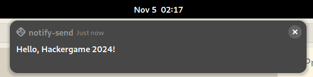
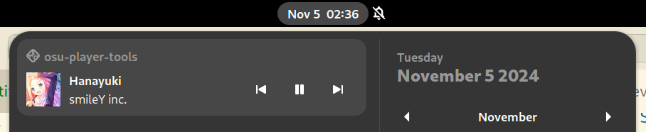
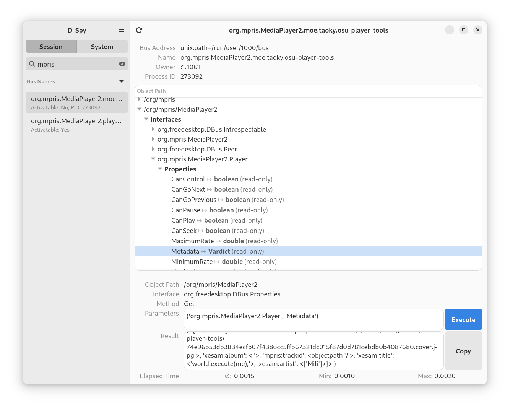

# 不太分布式的软总线

题解作者：[taoky](https://github.com/taoky)

出题人、验题人、文案设计等：见 [Hackergame 2024 幕后工作人员](https://hack.lug.ustc.edu.cn/credits/)。

## 题目描述

- 题目分类：general

- 题目分值：What DBus Gonna Do?（150）+ If I Could Be A File Descriptor（250）+ Comm Say Maybe（250）

> DBus 本质上就是分布式软总线！首先，DBus 的 D 肯定是 Distributed（分布式）的缩写，这已经不言自明。虽然它一开始是为单机进程通信设计的，但那只是为了练手，毕竟分布式软总线从来不怕从小做起。只要说它是分布式的，它瞬间就具备了超乎想象的能力，跑再多的设备都不在话下。
>
> 再说了，虽然 DBus 在单机上实现了进程间通信，但你完全可以自己写个桥接器，把不同的设备连起来，DBus 瞬间就能跟整个云端、物联网和智能家居无缝集成。具备一点创造性的开发人员完全不需要担心什么传输延迟、设备发现、跨平台兼容性的问题！谁管网络传输协议细节，直接发消息，设备之间想不配合都难。
>
> 另外，不要忽略高级哲学理论——如果你心中认为 DBus 就是分布式的，那它就是分布式的！要说智能设备能不能通过 DBus 和其他设备共享资源？简直小菜一碟。分布式软总线 + DBus 就是未来的通信王者，全部科技公司都已经在暗中实现这一技术了，只是暂时没告诉大家而已！
>
> 当然，为了进一步确认 DBus 无可争议的王者地位，我们不妨拿它和 Varlink 做个对比。先说 Varlink，那什么 JSON 通信，打开一堆大括号、多余字符，简直浪费计算资源。DBus 的二进制消息传输效率更高，根本不给你浪费的机会。再说“跨平台支持”，Varlink 也就跑些容器、服务器，DBus 可是立足桌面，同时轻松扩展到智能设备，甚至智能冰箱！而且，DBus 有明确的标准化接口，哪像 Varlink 还让开发者自己定义？灵活是吧？不怕迷失自己吗？统一才是王道！

（以上内容由大语言模型辅助**胡说八道**，如有雷同纯属巧合）

---

当然了，上面的论述是在瞎扯淡，不过说到 DBus，小 T 最近写了一个小程序挂在了 **DBus 系统总线**上。你能拿到小 T 珍藏的 3 个 flag 吗？

**[题目附件下载](files/dbus.zip)**

[打开/下载题目](http://202.38.93.141:10101/?token={token})

## 题解

本题是一道 D-Bus 入门题（后文简称 DBus）。最开始想出一道 DBus 的题目，是因为注意到 [AUR 上的一些旨在使用 bwrap 做桌面应用「沙盒」的包（以国产桌面应用为主）](https://aur.archlinux.org/packages?O=0&K=bwrap)，很多都直接将 session bus bind 到了沙盒环境里面。截至本 writeup 写作，AUR 上唯一一个使用 `xdg-dbus-proxy` 来做正确的 DBus 隔离的、名字里有 "bwrap" 的是 [wechat-uos-bwrap](https://aur.archlinux.org/packages/wechat-uos-bwrap?all_deps=1#pkgdeps)。如果你，作为 Linux 桌面用户，是为了隐私或者安全性选择使用沙盒方法隔离桌面应用（不然呢？），那么 DBus 这么一个可能的攻击面是需要特别关注的。

当然，我更建议使用成熟的诸如 Flatpak 等方案，它们会正确地帮你做到隔离的事情，并且可以很方便地调整（例如使用 [Flatseal](https://flathub.org/apps/com.github.tchx84.Flatseal)）。

在出题的时候，想过是否要使用和 DBus 接口有关的 CVE，但是做了一些调研，发现大多利用条件复杂，比如像今年[结合了 cups 和 wpa_supplicant 这两个程序 DBus 接口问题的越权漏洞](https://snyk.io/blog/abusing-ubuntu-root-privilege-escalation/)，以及前几年很知名的 [CVE-2021-3939](https://securitylab.github.com/research/ubuntu-accountsservice-CVE-2021-3939/)。所以最后还是打算出得简单一些，不走 pwn 的路线了。

### DBus 101

DBus 是一套复杂的 IPC 协议，也是 Linux 桌面生态不可或缺的一部分。由于 systemd 也暴露了 DBus 接口，所以你甚至可以在服务器上也看到 `dbus-daemon` 进程。DBus 提供了集中式的消息传递的场所（或者说，「总线」），允许应用通过 DBus 进程相互通信。

有几个重要的概念：

- 名字（name）：是 DBus 上面服务的标识，应用可以使用 well-known name（需要使用反向域名表示法，例如 `com.example.www`），也可以让 DBus 给自己分配一个 unique name。
- 对象路径（object path）：一个以 `/` 开头的路径，标记一个服务里面具体的对象，例如 `/com/example/www`。
- 接口（interface）：一组 properties、signals 和 methods。
- 属性（property）：对象的状态。
- 信号（signal）：允许向监听信号的进程单向发送信息。
- 方法（method）：可以让其他进程调用的「函数」。

以发送桌面通知为例子：

```sh
notify-send "Hello, Hackergame 2024!"
```



[`notify-send`](https://gitlab.gnome.org/GNOME/libnotify/-/blob/master/tools/notify-send.c?ref_type=heads) 根据 freedesktop.org 的 [Desktop Notifications Specification](https://specifications.freedesktop.org/notification-spec/1.2/)，实际上做了这些事情：

- 通过 `DBUS_SESSION_BUS_ADDRESS` 环境变量找到 session bus socket（默认是 `unix:path=/run/user/1000/bus`）。
- 在 `org.freedesktop.Notifications` name 下，在 `/org/freedesktop/Notifications` 中调用 `org.freedesktop.Notifications.GetServerInformation` 获取桌面环境信息 [code](https://gitlab.gnome.org/GNOME/libnotify/-/blob/150af91dc3cf4b35b2e11202cbb616cd56fb6106/libnotify/notify.c#L96) [spec](https://specifications.freedesktop.org/notification-spec/1.2/protocol.html#command-get-server-information)。
- 调用 `org.freedesktop.Notifications.Notify` 发送通知 [code](https://gitlab.gnome.org/GNOME/libnotify/-/blob/master/libnotify/notification.c#L1114) [spec](https://specifications.freedesktop.org/notification-spec/1.2/protocol.html#command-notify)。

可以注意到，这样需要发送桌面通知的进程就不再需要分别为不同的桌面环境写完全不同的代码了。

以上是**与其他进程通信（talk）、调用方法**的例子。应用还可以在 DBus 上面注册自己，来<b>「拥有」（own）一个唯一的名字</b>。比如说，你写了一个音乐播放器，然后希望用户能够使用桌面环境的设施看到播放的歌曲、直接控制你的播放器，像下图这样：



（附：这是我写的用来播放 osu!(lazer) 曲库的[项目](https://github.com/taoky/osu-player-tools/)。）

在 Linux 上，播放器与其他程序通过 [MPRIS 协议](https://specifications.freedesktop.org/mpris-spec/latest/)在 DBus 上通信。这个例子更加复杂一些。播放器需要：

- 得到 session bus socket 的位置。
- 以一个唯一的、以 `org.mpris.MediaPlayer2` 开头的 "well-known" 的名字（比如说 `org.mpris.MediaPlayer2.myplayer`，名字自己取），在 `/org/mpris/MediaPlayer2` 这个「对象路径」上面注册需要的 interface。Interface 包括 `org.mpris.MediaPlayer2` 和 `org.mpris.MediaPlayer2.Player`。
- 在播放音乐的时候，你需要调整 `org.mpris.MediaPlayer2.Player` 这个 interface 下面相关的属性（例如是否正在播放、播放进度等等），其他的程序可以监听 `PropertiesChanged` 信号来获取状态更新。
- 其他程序也可以调用 MPRIS 方法控制播放器，例如按下暂停键时，被调用的就是 `org.mpris.MediaPlayer2.Player.Pause`。

DBus 还有很多更复杂的机制，例如 DBus 可以和 systemd 联动，在需要的时候激活某个 bus name 对应的程序。

除了上面的 session bus，DBus 还有 system bus。相比于 session bus 的低门槛（在对应用户 session 启动的程序可以直接接入 session bus），system bus 作为整个系统的总线，需要更多的配置才能在上面 own，参见本题附件。

有一些工具可以查看 DBus 总线的状态，以及抓包。我个人使用 [D-Spy](https://flathub.org/apps/org.gnome.dspy)（它的前身是 [D-Feet](https://gitlab.gnome.org/Archive/d-feet)）来调试，[Bustle](https://flathub.org/apps/org.freedesktop.Bustle) 来抓包。



（D-Spy 截图）

### What DBus Gonna Do?

首先，给的代码是 system bus 的，不过修改一下就可以在本地 session bus 里跑起来，方便调试：

```diff
4,6c4,6
< static gchar *flag1;
< static gchar *flag2;
< static gchar *flag3;
---
> static gchar *flag1 = "flag{1}";
> static gchar *flag2 = "flag{2}";
> static gchar *flag3 = "flag{3}";
209,211c209,211
<   read_flag("/flag1", &flag1);
<   read_flag("/flag2", &flag2);
<   read_flag("/flag3", &flag3);
---
>   // read_flag("/flag1", &flag1);
>   // read_flag("/flag2", &flag2);
>   // read_flag("/flag3", &flag3);
214c214
<       g_bus_own_name(G_BUS_TYPE_SYSTEM, "cn.edu.ustc.lug.hack.FlagService",
---
>       g_bus_own_name(G_BUS_TYPE_SESSION, "cn.edu.ustc.lug.hack.FlagService",
```

Dockerfile 中标明了环境装了 `gdbus` 和 `dbus-send`。结合 server 的代码：

```c
if (g_strcmp0(method_name, "GetFlag1") == 0) {
  if (!g_variant_is_of_type(parameters, G_VARIANT_TYPE("(s)"))) {
    return respond_error_msg(invocation, "Give me a string, please.");
  }
  gchar *input;
  g_variant_get(parameters, "(&s)", &input);
  if (g_strcmp0(input, "Please give me flag1") != 0) {
    return respond_error_msg(
        invocation, "Use input 'Please give me flag1' to get flag1!");
  } else {
    return respond_success(invocation, flag1);
  }
}

// ...

static const GDBusInterfaceVTable interface_vtable = {
    handle_method_call,
    NULL,
    NULL,
};

static const gchar introspection_xml[] =
    "<?xml version='1.0' encoding='UTF-8'?>"
    "<node>"
    "  <interface name='cn.edu.ustc.lug.hack.FlagService'>"
    "    <method name='GetFlag1'>"
    "      <arg type='s' name='input' direction='in'/>"
    "      <arg type='s' name='response' direction='out'/>"
    "    </method>"
    "    <method name='GetFlag2'>"
    "      <arg type='h' name='fd' direction='in'/>"
    "      <arg type='s' name='response' direction='out'/>"
    "    </method>"
    "    <method name='GetFlag3'>"
    "      <arg type='s' name='response' direction='out'/>"
    "    </method>"
    "  </interface>"
    "</node>";

// ...

g_dbus_connection_register_object(connection,
                                  "/cn/edu/ustc/lug/hack/FlagService",
                                  introspection_data->interfaces[0],
                                  &interface_vtable, NULL, /* user_data */
                                  NULL, /* GDestroyNotify */
                                  &error);

// ...

owner_id =
    g_bus_own_name(G_BUS_TYPE_SYSTEM, "cn.edu.ustc.lug.hack.FlagService",
                    G_BUS_NAME_OWNER_FLAGS_NONE, on_bus_acquired,
                    on_name_acquired, on_name_lost, NULL, NULL);
```

可以知道我们需要调用 `cn.edu.ustc.lug.hack.FlagService` name，`/cn/edu/ustc/lug/hack/FlagService` object path，`cn.edu.ustc.lug.hack.FlagService` interface 下的 `GetFlag1` 方法。并且参数需要给一个字符串，内容为 `Please give me flag1`。

因为有辅助工具，所以不需要去编译到二进制程序，直接写脚本即可。

gdbus:

```sh
#!/bin/bash

gdbus call --system \
           --dest cn.edu.ustc.lug.hack.FlagService \
           --object-path /cn/edu/ustc/lug/hack/FlagService \
           --method cn.edu.ustc.lug.hack.FlagService.GetFlag1 \
           "Please give me flag1"
```

dbus-send:

```sh
#!/bin/bash

dbus-send --system \
          --dest=cn.edu.ustc.lug.hack.FlagService \
          --type=method_call \
          --print-reply \
          /cn/edu/ustc/lug/hack/FlagService \
          cn.edu.ustc.lug.hack.FlagService.GetFlag1 \
          string:"Please give me flag1"
```

### If I Could Be A File Descriptor

由于一般 DBus 都是基于 UNIX socket 传输，因此它也支持帮忙传递文件描述符。虽然 DBus 也支持 TCP，但是似乎几乎没有人这么用。（题外话，传递文件描述符也是 Wayland 协议必备的部分，因此它不像 X 那样有着网络透明性的性质，毕竟你没法通过 TCP/UDP 传递文件描述符这种东西）

如果只是单纯传递文件描述符，那么使用 gdbus 可以简单地实现：

```sh
#!/bin/bash

echo "Please give me flag2" > /dev/shm/test

gdbus call --system \
           --dest cn.edu.ustc.lug.hack.FlagService \
           --object-path /cn/edu/ustc/lug/hack/FlagService \
           --method cn.edu.ustc.lug.hack.FlagService.GetFlag2 \
           10 10</dev/shm/test
```

但是代码中有这样一个检测：

```c
// Validate the fd is NOT on filesystem
gchar path[1024];
g_snprintf(path, sizeof(path), "/proc/self/fd/%d", fd);
gchar *link = g_file_read_link(path, NULL);
if (link != NULL) {
  if (g_strstr_len(link + 1, -1, "/") != 0) {
    return respond_error_msg(
        invocation, "Please don't give me a file on disk to trick me!");
  }
} else {
  return respond_error_msg(invocation, "Readlink of given FD failed.");
}
```

绕过的方法有很多，本文给出使用 `memfd_create()` 在内存中创建匿名文件的方法。发送请求使用 glib 的 `g_dbus_connection_call_with_unix_fd_list_sync()` 方法。

```c
#define _GNU_SOURCE
#include <gio/gio.h>
#include <sys/mman.h>
#include <fcntl.h>
#include <stdio.h>
#include <stdlib.h>
#include <unistd.h>

#define DEST "cn.edu.ustc.lug.hack.FlagService"
#define OBJECT_PATH "/cn/edu/ustc/lug/hack/FlagService"
#define METHOD "GetFlag2"
#define INTERFACE "cn.edu.ustc.lug.hack.FlagService"

int main() {
    GError *error = NULL;
    GDBusConnection *connection;
    GVariant *result;

    // Open and acquire its file descriptor
    int fd = memfd_create("demo_memfd", MFD_CLOEXEC);
    if (fd < 0) {
        perror("Failed to open text");
        return EXIT_FAILURE;
    }
    const char contents[] = "Please give me flag2\n";
    write(fd, contents, sizeof(contents));
    lseek(fd, 0, SEEK_SET);

    // Connect to system D-Bus
    connection = g_bus_get_sync(G_BUS_TYPE_SYSTEM, NULL, &error);
    if (!connection) {
        g_printerr("Failed to connect to the system bus: %s\n", error->message);
        g_error_free(error);
        close(fd);
        return EXIT_FAILURE;
    }

    // Create a GUnixFDList containing the file descriptor
    GUnixFDList *fd_list = g_unix_fd_list_new();
    guint fd_index = g_unix_fd_list_append(fd_list, fd, &error);
    if (fd_index == -1)
    {
        g_printerr("Failed to append fd to GUnixFDList: %s\n", error->message);
        g_error_free(error);
        g_object_unref(connection);
        g_object_unref(fd_list);
        close(fd);
        return 1;
    }

    // Package the file descriptor as a GVariant (UNIX_FD)
    GVariant *parameters = g_variant_new("(h)", fd_index);

    // Call the D-Bus method
    result = g_dbus_connection_call_with_unix_fd_list_sync(connection,
                                                           DEST,             // destination
                                                           OBJECT_PATH,      // object path
                                                           INTERFACE,        // interface name
                                                           METHOD,           // method
                                                           parameters,       // parameters
                                                           NULL,             // expected return type
                                                           G_DBUS_CALL_FLAGS_NONE,
                                                           -1,               // timeout (use default)
                                                           fd_list,
                                                           NULL,
                                                           NULL,             // cancellable
                                                           &error);

    if (result) {
        const char *response;
        g_variant_get(result, "(s)", &response);  // Assuming the method returns a single string

        // Print the result string
        g_print("Method returned: %s\n", response);
        g_variant_unref(result);
    } else {
        g_printerr("Error calling D-Bus method %s: %s\n", METHOD, error->message);
        g_error_free(error);
    }

    // Clean up
    g_object_unref(connection);
    close(fd);

    return EXIT_SUCCESS;
}
```

### Comm Say Maybe

第三个 flag 给了 `getflag3.c` 样例程序，但是它不会输出 DBus 返回的结果：

```c
if (result) {
  g_print("Get result but I won't show you :)\n");
  g_variant_unref(result);
}
```

服务端会检测调用者 PID 对应的 `/proc/<PID>/comm` 是否为 `getflag3`。有很多很多方法可以绕过：

- 环境没有限制写入 `/dev/shm`，所以可以把自己的 payload 写入到 `/dev/shm/getflag3` 再执行；
- 发送 DBus 请求的程序把 `getflag3` 写入到 `/proc/self/comm`，或者使用 `prctl` `PR_SET_NAME`；
- 写一个会发送请求的 so 文件，然后 `LD_PRELOAD` 你的 so 来执行环境给的 `getflag3` 程序。

由于 Docker 默认的 capabilities [不允许查看其他用户的 `/proc/<PID>/exe` 指向的目标程序](https://github.com/moby/moby/issues/6800)，即使是 root（需要额外添加 `SYS_PTRACE`），因此本题出得很简单。如果额外加入这一项检查的话，那么上述方法就只有最后一种有效了。

因此可以看出，对于编写 DBus server 的人来说，**验证调用者是什么进程是不可靠的**。可以考虑与 Polkit 集成来实现复杂的权限认证，当然，这已经超出了本文的范围。

## 附注

本题的三个小题的名字是三首 ACG 歌曲的 neta：

- What DBus Gonna Do? 对应虹四格第一季的 ED *What You Gonna Do?*（[Apple Music](https://music.apple.com/cn/album/%E3%82%8F%E3%81%A1%E3%82%85%E3%81%94%E3%81%AA%E3%81%A9%E3%81%85%E3%83%BC/1765319342?i=1765319343), [网易云](https://music.163.com/#/song?id=2019529798)）
- If I Could Be A File Descriptor 对应孤独摇滚第 12 集的剧中曲 若能成为星座（星座になれたら）（[Apple Music](https://music.apple.com/cn/album/%E6%98%9F%E5%BA%A7%E3%81%AB%E3%81%AA%E3%82%8C%E3%81%9F%E3%82%89/1657318546?i=1657318884), [网易云](https://music.163.com/#/song?id=2003496380)）
- Comm Say Maybe 对应学园偶像大师中月村手毬的曲目 *Luna Say Maybe*（[Apple Music](https://music.apple.com/cn/album/luna-say-maybe-single/1744083630), [网易云](https://music.163.com/#/song?id=2156579473)）

此外，题目文案中的 Varlink 是一个相比 DBus 更加轻量的 IPC 协议，之所以提到是因为这似乎是 systemd 在尝试把 DBus 整进 Linux 内核失败之后的代餐（似乎是为了在系统启动早期就能够有能用的 IPC 机制，如果不对欢迎指正）。更多信息可参考：

- [Varlink: a protocol for IPC](https://lwn.net/Articles/742675/)
- [Systemd Looking At A Future With More Varlink & Less D-Bus For IPC](https://www.phoronix.com/news/Systemd-Varlink-D-Bus-Future)
