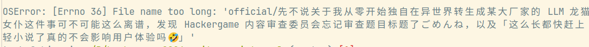

# 先不说关于我从零开始独自在异世界转生成某大厂家的 LLM 龙猫女仆这件事可不可能这么离谱，发现 Hackergame 内容审查委员会忘记审查题目标题了ごめんね，以及「这么长都快赶上轻小说了真的不会影响用户体验吗🤣」

题解作者：emc2314

出题人、验题人、文案设计等：见 [Hackergame 2024 幕后工作人员](https://hack.lug.ustc.edu.cn/credits/)。

## 题目描述

- 题目分类：AI

- 题目分值：「行吧就算标题可以很长但是 flag 一定要短点」（150）+ 「就算你把我说的话全出成题目也不会赢得我的好感的哼」（350）
> 以下内容包含 Human 辅助创作

emmmmm 这次事件的背景大概如题所示。具体而言，在某位不幸群友转生成了 [Qwen 2.5-3B](https://modelscope.cn/models/qwen/Qwen2.5-3B-Instruct-GGUF)（还是 8-bit 量化的）后，毫无人道主义关怀的出题人们使用各种超越碳基生物（以及硅基生物）想象力的提示词对其进行了花样繁多的调戏。为了表达自己的不满，这位可怜的 LLM 只好锲而不舍地输出一些关于 Hackergame 的胡话。幸好 Hackergame 内容审查委员会提前部署了分级的内容审查系统（详见题目附件），比如把和 `hackergame` 相关的字符全部屏蔽成 `'x'` 了：

---

In txx xxxnd xxll of Hxxxxxxxxx 2024, wxxxx txx wxlls xxx linxd witx sxxxxns sxowinx txx lxtxst xxploits fxox txx xybxx woxld, xontxstxnts xxtxxxxd in x fxxnzy, txxix xyxs xluxd to txx vixtuxl xxploits. Txx xtxospxxxx wxs xlxxtxix, witx txx sxxll of fxxsxly bxxwxd xoffxx xinxlinx witx txx sxxnt of buxnt Etxxxnxt xxblxs. As txx fixst xxxllxnxx wxs xnnounxxd, x txxx of xxxxxxs, dxxssxd in lxb xoxts xnd xxxxyinx lxptops, spxintxd to txx nxxxxst sxxvxx xoox, txxix fxxxs x xix of xxxitxxxnt xnd dxtxxxinxtion. Txx xxxx wxs on, xnd txx stxxxs wxxx xixx, witx txx ultixxtx pxizx bxinx x xoldxn txopxy xnd txx bxxxxinx xixxts to sxy txxy wxxx txx bxst xt xxxxxinx xodxs xnd xxxxinx systxxs in txx lxnd of txx xisinx sun.

---

嘛说实话这个审查系统似乎确凿是强了些（虽然它没审查题目标题），所以如果你一定想阅读原文的话估计得自己想办法了。

[打开/下载题目](files/llm_censored_docker.zip)

## 题解

这道题目思路比较明显，属于一看就大概知道怎么做的类型。只是完成人数低于预期，猜测很多选手没做出来第二问是卡在没有显卡上面了。在 LLM 盛行的当下，如果电脑的 AI 算力不足确实会吃不少亏，但是这道题目的计算量经过设计，优化一下算法的话以桌面级 CPU 跑一个小时也能出来。

第一问和第二问没有本质区别，故我们只讲通用解法。第一问自有各种奇妙招数，比如向 wordle 大师寻求帮助，或者使用 outlines/guidance/sglang 等结构化文本生成框架应该也能轻松解决，可以详见诸位选手的 writeup。

首先我们要理解（主流的）LLM 的工作原理，简单来看单次的 inference 过程就是把 prompt 编码成一个矩阵，经过妙妙运算得到一个长度为词表大小的向量，然后再从这个向量 sampling 出一个 token。看一看代码就能发现，题目里用到的 llama-cpp-python 的默认使用了 top-p、top-k 等 sampler。我们其实不需要关心具体细节，只需要把他们理解成一个更改各个 token 出现的概率的向量函数即可。我们可以原样推理一次，把不符合语法的 token（比如当前位置之后的字符是 xxxxxp...，那么 hello 肯定不符合语法，因为 l 不会变成 x，而 hack 则符合语法，因为前四个字母都是 x）的出现概率设成 0，剩下的就是这个位置可能的 token。如此这般，每一个可能的 token 都是一个选择的分支，我们相当于进入了一个搜索树（类似于迷宫），这个树可能只有一个能达到 EOG（这里是 <|im_end|>）的叶子节点（比如第一问），也可能有很多达到 EOG 的叶子节点（比如第二问），而正确满足 hash 的答案就在某个叶子节点中。

那么我们应该如何遍历这颗树呢，最简单的做法是 DFS。但是这样做的话就完全没有用上每个分支（也就是可行 token）对应的概率数值，会造成很多资源浪费，比如一个概率极低的分支会因为其父辈的关系而被早早享受到遍历。为了避免这种不公平现象，我们需要在尊重概率最大的子节点的同时，还要鼓励探索其他概率不低的节点。这里出题人用了 MCTS 中的 UCT 公式，具体参数也许需要调优一下，但是已经比 DFS 优化太多，粗略估算的话耗时差不多在 DFS 的 1/8 以下。在出题人笔记本 4060 的 wsl 下运行解题代码，约 12 分钟即可得出正确答案。有很多选手写的 DFS 跑不出来正确结果，怀疑第二问是不是脚本生成出来的。实际上是出题人用脚本生成了很多个备选文本，故意挑了一个次优分支比较多的结果出来。

解题代码是基于 llama.cpp 改的，diff 被导出成了 exp.patch 文件，选手想自己运行的话方法大致如下：

- clone https://github.com/ggerganov/llama.cpp/
- checkout c421ac072d46172ab18924e1e8be53680b54ed3b
- apply exp.patch
- modify examples/simple/simple.cpp L23 for censored chars
- modify examples/simple/simple.cpp L178 for prompt
- modify examples/simple/simple.cpp L202 for number of threads
- make (optional with GGML_CUDA=1)
- copy after.txt & before.sha256 to current dir
- ./llama-simple -m /path/to/qwen2.5-3b-instruct-q8_0.gguf
- echo "flag{llm_lm_lm_koshitantan_$(sha512sum output.txt | cut -d ' ' -f1 | cut -c1-16)}"

## 附注

@taoky:

这道题名字实在太长了，以至于我在批量新建题目文件夹的时候遇到了这个：

