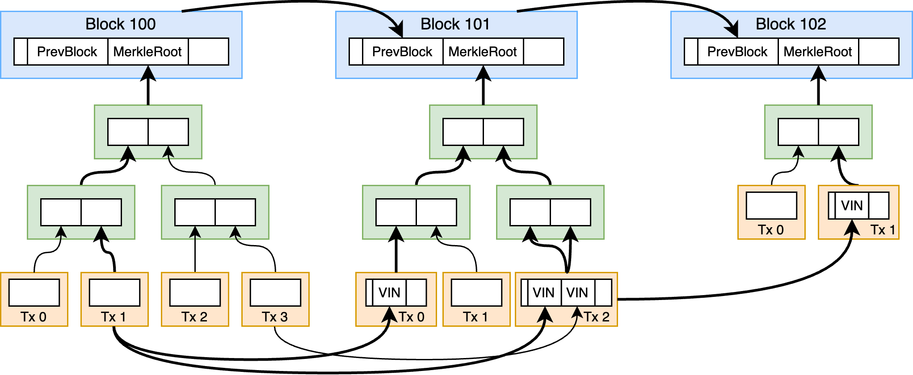

# 哈希三碰撞

题解作者：[zzh1996](https://github.com/zzh1996)

出题人、验题人、文案设计等：见 [Hackergame 2024 幕后工作人员](https://hack.lug.ustc.edu.cn/credits/)。

## 题目描述

- 题目分类：binary

- 题目分值：三碰撞之一（150）+ 三碰撞之二（250）+ 三碰撞之三（300）

> 以下内容包含 AI 辅助创作

「太奇怪了！」小 Z 盯着显示器愁眉不展。

作为一名密码学家，小 Z 一直为自己能轻松找出哈希碰撞而自豪。毕竟在密码学的江湖中，找到两个不同的字符串却产生相同的哈希值，这种本事可不是人人都有的。

但今天，小 Z 遇到了一个前所未有的挑战。

「找到两个碰撞就像找到双胞胎，」小 Z 自言自语，「可是现在，我需要找到三胞胎？！」

是的，在这个平行宇宙中，仅仅找到两个碰撞已经不够刺激了。作为一名合格的哈希碰撞猎人，你必须找到三个不同的字符串，它们在经过哈希计算后会产生相同的值。

「双胞胎在自然界尚且常见，三胞胎可就是凤毛麟角了。」小 Z 叹了口气。

你能帮助小 Z 找到这个传说中的三碰撞吗？

「在密码学的世界里，两个是巧合，三个才是艺术。」

> AI 辅助创作部分结束

**[下载题目文件](files/hashcol3.zip)**

你可以通过 `nc 202.38.93.141 10096` 来连接，或者点击下面的「打开/下载题目」按钮通过网页终端与远程交互。

> 如果你不知道 `nc` 是什么，或者在使用上面的命令时遇到了困难，可以参考我们编写的 [萌新入门手册：如何使用 nc/ncat？](https://lug.ustc.edu.cn/planet/2019/09/how-to-use-nc/)

[打开/下载题目](http://202.38.93.141:10097/?token={token})

## 题解

这道题是我精心设计的一道题，表面看上去像是逆向 + 密码学，但是实际上后两问的预期解法是在区块链上面寻找答案。可惜，这道题参数没设置好，导致被 mcfx 暴力跑出来了后两问。这种靠算力堆出来的非预期解其实是 Hackergame 中不希望出现的，因为会导致有高性能 GPU 的选手占有太多优势。不过第二位解出来的选手是预期解法。

如果你想了解非预期的解法，请参考 mcfx 选手的题解。

## 三碰撞之一

这一问相对较为简单，直接对附件中的第一个二进制文件进行逆向分析即可。如果你不熟悉逆向的工具，可以选择商业软件 IDA Pro 或者免费开源的 [Ghidra](https://github.com/NationalSecurityAgency/ghidra) 等。

**如果觉得逆向非常头疼怎么办？当然是直接让神奇的 AI 帮我们代劳啦！请参见把反编译结果转换成 Python 代码的 [AI 聊天记录 1](chat1.md)**

可以还原出程序的大致逻辑是，分别输入 3 个 8 字节的数据（以十六进制形式输入，也就是一个字节对应两个十六进制数位），然后分别计算这 3 个数据的 SHA-256 哈希。如果它们的 SHA-256 最后 4 个字节相同，就输出 flag1 文件的内容。

对于这一题，因为解法比较 trivial，我直接让 AI 帮我写解题代码了，看起来 AI 可以一次写对：

[solve1.cpp](solve1.cpp)

运行后把结果输入到题目终端即可拿到 flag1。

这一小问只是热身一下，并且让你对计算机穷举 SHA-256 的速度有一个直观感受。

## 三碰撞之二

这一小问逆向出来的逻辑写成 Python 代码大概如下（简化版，不完全等价）：

**如果觉得逆向非常头疼怎么办？当然是直接让神奇的 AI 帮我们代劳啦！请参见把反编译结果转换成 Python 代码的 [AI 聊天记录 2](chat2.md)**

```python
import hashlib

def sha256(s):
    return hashlib.sha256(s).digest()

base = sha256(bytes.fromhex(input()))
s1 = base
s2 = base

for i in range(100):
    salt1 = bytes.fromhex(input())
    salt2 = bytes.fromhex(input())
    salt3 = bytes.fromhex(input())
    salt4 = bytes.fromhex(input())
    assert len(salt1) <= 1000
    assert len(salt2) <= 1000
    assert len(salt1) == len(salt3)
    assert len(salt2) == len(salt4)
    s1 = sha256(salt1 + s1 + salt2)
    s2 = sha256(salt3 + s2 + salt4)
    assert s1 != s2

assert s1[-8:] == s2[-8:] == base[-8:]
print(open('flag2').read())
```

也就是说，把一个 SHA-256 哈希作为起始点，分别沿着两条路径进行 100 次迭代的哈希运算，每次哈希之前加上用户输入的前缀和后缀。在计算完成后，起始点哈希和最后两个哈希的后 8 字节必须完全相同。

这里如果进行穷举的话，计算量是非常大的。（对于非预期解，理想情况下可以通过一些方法把穷举量降低到 2^44 左右，用 GPU 几个小时应该能跑出来。）

我们知道比特币等区块链使用的工作量证明算法就是两次 SHA-256，所以我们可以从区块链上寻找答案。

随便拿来一个比特币的区块哈希，比如：

```
00000000000000000002043e95964c355bb333c071cfca0d74a5ae6ed59000df
```

我们可以发现其前 9 个字节都是 0。去搜索一下比特币的区块哈希是如何计算的可以发现，其实这个区块哈希的字节序跟我们平时见到的 SHA-256 是相反的，所以这 9 个 0 字节实际上就是在最后，满足题目的要求。

比特币的区块头结构是 80 字节，其中包含上一个区块的哈希、当前区块的时间戳、当前区块所有交易的 Merkle Root 等等。而区块的哈希就是区块头这 80 字节的内容计算两次 SHA-256 的结果。所以，题目中的这种加上前缀和后缀的计算，恰好可以用区块头中上一个区块的哈希左边和右边的数据来匹配。两次 SHA-256 的时候，第二次并不需要加前后缀，所以提交空串即可。

但是题目要求的是两条起点一样、中间并不重合的链，这要从哪里寻找呢？答案就是区块链的分叉。比特币在历史上有过几次硬分叉，最经典的就是比特币（Bitcoin，BTC）分叉为比特币现金（Bitcoin Cash，BCH）。通过搜索，我们可以知道分叉的区块高度是 478558。我们把 BTC 和 BCH 两条链在区块高度 478558 附近的区块数据下载下来，然后处理一下，就可以构造出来题目所需的数据。理论上，其他分叉如果工作量证明的难度足够的话，也是同样可以用来解题的。

下载数据时，我们可以使用区块链查看器的 API，也可以随便找个公共 RPC 服务或者自己运行一个区块链节点。以下是参考代码，你需要对 BTC 和 BCH 分别运行：

```python
from bitcoinrpc.authproxy import AuthServiceProxy # pip install python-bitcoinrpc

btc = AuthServiceProxy("你的 RPC 地址")

with open('btc.txt', 'w') as f:
    for b in range(478558, 478558 + 100):
        print(b)
        h = btc.getblockhash(b)
        block = btc.getblock(h, 0)
        print(f"{b} {h} {block[:160]}", file=f)
```

通过区块头信息构造出来题目所需的 salt：

```python
import hashlib

def sha256(s):
    return hashlib.sha256(s).digest()

btcdata = []
with open('btc.txt') as f:
    for line in f:
        btcdata.append(line.strip().split())

bchdata = []
with open('bch.txt') as f:
    for line in f:
        bchdata.append(line.strip().split())

init = sha256(bytes.fromhex(btcdata[0][2]))
print(init.hex())

for i in range(50):
    print(bytes.fromhex(btcdata[i + 1][2])[:4].hex())
    print(bytes.fromhex(btcdata[i + 1][2])[4+32:].hex())
    print(bytes.fromhex(bchdata[i + 1][2])[:4].hex())
    print(bytes.fromhex(bchdata[i + 1][2])[4+32:].hex())
    print()
    print()
    print()
    print()
```

把程序的输出提交到题目终端即可获得 flag2。

## 三碰撞之三

这一小问逆向出来的逻辑写成 Python 代码大概如下（简化版，不完全等价，接上一问）：

**再说一遍：如果觉得逆向非常头疼怎么办？当然是直接让神奇的 AI 帮我们代劳啦！请参见把反编译结果转换成 Python 代码的 [AI 聊天记录 2](chat2.md)**

```python
magic = sha256(bytes.fromhex(input()))
paths = []
for i in range(100):
    n = int(input())
    assert 0 < n <= 100
    s = magic
    path = []
    for _ in range(n):
        salt1 = bytes.fromhex(input())
        salt2 = bytes.fromhex(input())
        assert len(salt1) <= 1000
        assert len(salt2) <= 1000
        s = sha256(salt1 + s + salt2)
        path.append((salt1, salt2))
    assert s == base
    assert path not in paths
    paths.append(path)
print(open('flag3').read())
```

也就是说，要我们找到一个哈希，从它开始，有 100 条不同的添加前后缀然后 SHA-256 的迭代路径，都可以通向第二问中的 base（也就是分叉区块的哈希）。

这就要求我们清楚地知道区块哈希都是由什么数据如何算出来的，以及其中递归地有哪些哈希，它们又是怎么算出来的。

如果我们了解了比特币区块链上所有数据的 SHA-256 关系，并且由此建立了一个有向无环图，我们就可以轻松地在图上搜索出来 100 条路径了。

我们从区块头开始，递归地研究每个数据结构中都有哪些字段可能是 SHA-256 哈希。以下就是比特币区块链中包含的所有 SHA-256 关系（实际上每个都是两次 SHA-256）：

1. 正如第二问用到的，每个区块头部包含了上一个区块的区块头哈希。例如说，区块 478558 的头部包含了区块 478557 的区块头的哈希。**这部分对应了下图中蓝色方块之间的箭头。**
2. 一个区块内的各个交易，会分别计算哈希，然后生成一个 Merkle Tree 的结构，并且 Merkle Root 在区块头中。其中对于叶子数量是奇数的情况，是把自己复制一份来处理。**这部分对应了下图中绿色方块之间的箭头，以及不同颜色方块之间的箭头。**
3. 在每个交易的每个输入（Input）中，会包含生成这个输入的交易的哈希（即这个 UTXO 对应的交易哈希）。例如说，A 交易的某个输出，后来被 B 交易用作了输入，此时 B 交易的原始字符串中就会包含 A 交易的哈希。**这部分对应了下图中黄色方块之间的箭头。**



如图所示，每一个箭头都是两次 SHA-256。我们可以看出，从 Block 100 的 Tx 1，到 Block 102，一共有 5 条路径，对应图中加粗的部分。

我们可以根据这些哈希关系建立一个有向无环图，然后搜索出来满足条件的 100 条路径。完整代码请见 [solve3.py](solve3.py)。

~~注意，这份代码我实现 DAG 的时候没有考虑两个 node 之间存在多条边的情况，所以没支持 Merkle Tree 叶子是奇数的时候产生两条不同路径这个特例，不影响解题。~~ 我测试了一下，其实只靠 Merkle Tree 的叶子数量是奇数的情况就能把这题解出来，根本不需要 UTXO 关系，再次说明了本题出题的失败。实现见 [solve3_2.py](solve3_2.py)。

在代码运行前，我们需要先获取所需的数据，获取数据的参考代码如下：

```python
from bitcoinrpc.authproxy import AuthServiceProxy # pip install python-bitcoinrpc
import json
import decimal

btc = AuthServiceProxy("你的 RPC 地址")

def decimal_default(obj):
    if isinstance(obj, decimal.Decimal):
        return str(obj)
    raise TypeError(f"Object of type {type(obj).__name__} is not JSON serializable")

with open('btcblock.jsonl', 'w') as f:
    for b in range(478558 - 100 + 1, 478558 + 1):
        print(b)
        block = btc.getblock(btc.getblockhash(b), 3)
        print(json.dumps(block, default=decimal_default), file=f)

with open('btcblockheader.txt', 'w') as f:
    for b in range(478558 - 100 + 1, 478558 + 1):
        print(b)
        h = btc.getblockhash(b)
        block = btc.getblock(h, 0)
        print(f"{b} {h} {block[:160]}", file=f)
```

然后运行 `solve3.py`，把程序的输出提交到题目终端即可获得 flag3。

## 其他可能的解法

对于第二问，其实你完全可以找一个随便的比特币区块哈希作为 base，然后让这个哈希包含在两笔格式相同的比特币交易中，然后（真的花钱）发到两个不同的比特币区块上，并且想办法控制它们的 Merkle Path 相同（不然没法满足 salt 之间的长度关系限制）。第三问也可以通过类似的方式来实现。这个方法可以比预期解简单一些，例如说不需要了解 UTXO 相关的内容，但是也没简单多少。

## 出题思路

我个人一直觉得从工作量证明的区块链上面找数据是一件非常有趣的事情，因为如此「疯狂」的哈希结果是在其他地方不可能找到的。（当然，同时我也承认工作量证明的一些坏处。）就以比特币为例，如今平均每 10 分钟的工作量证明就对应着大约 2 ^ 78 次的 Double SHA-256 计算。相比之下，Google 为了寻找 SHA-1 碰撞，计算的 SHA-1 次数是 2 ^ 63，在当时花费了 110 年的 GPU 时间。也就是说，比特币网络每 10 分钟的计算量，就够 Google 碰撞 SHA-1 几万次了。这导致了对于一些精心设计的密码学 puzzle，通过自己的计算是没有可能找到答案的，而在工作量证明的区块链上却可以找到答案。

我在 2018 年出过一道也是从区块链上面找答案的题，在 [这里](https://github.com/ustclug/hackergame2018-writeups/blob/master/official/mining_pool_of_Z/README.md)，但是考察的方式与这次不同。

至于这道题为什么出成一道逆向题而不是直接给 Python 代码，有几个原因：首先，Hackergame 今年除了这道题就没有其他常见指令集的逆向题，我觉得必须要有一个，不然 Hackergame 作为主要起教育和引导作用的比赛，怎么能让搞安全的选手不去试试常见的反编译器呢？其次，如果不是 binary 分类，那要写成 math 还是 general 分类呢？如果写成 general，就会泄漏考点并非密码学这个信息。最后，这题我一开始的设计是用缓冲区溢出来覆盖掉 SHA-256 结果的末尾字节，但是后来没这样出题，框架代码却保留了。

最后，感谢 OpenAI o1-preview 模型帮我写 C 语言代码。我试过很多其他大语言模型，没一个可以做到一次写对，并且保证没有任何缓冲区溢出之类的问题。我最近发现，用 o1-preview 模型来写代码，几乎都可以做到一次就写出来高质量、逻辑正确、安全的代码，让我非常满意（除了有点贵，但真的省下了非常多的时间，所以我觉得很值）。而其他模型，写些一次性脚本和不需要什么思考的业务逻辑还好，但是如果需要写一些需要精细设计和思考的那种代码，就几乎没办法进行了，最后还是要自己去思考各种细节设计。我在赛前验题的时候用 o1-preview 解了很多简单题目，以及提供较难的题目的解题思路并帮助编写代码，而其他模型总是说很多没什么信息量的话。我想强烈给大家推荐 o1-preview 作为解决困难问题的助手。
