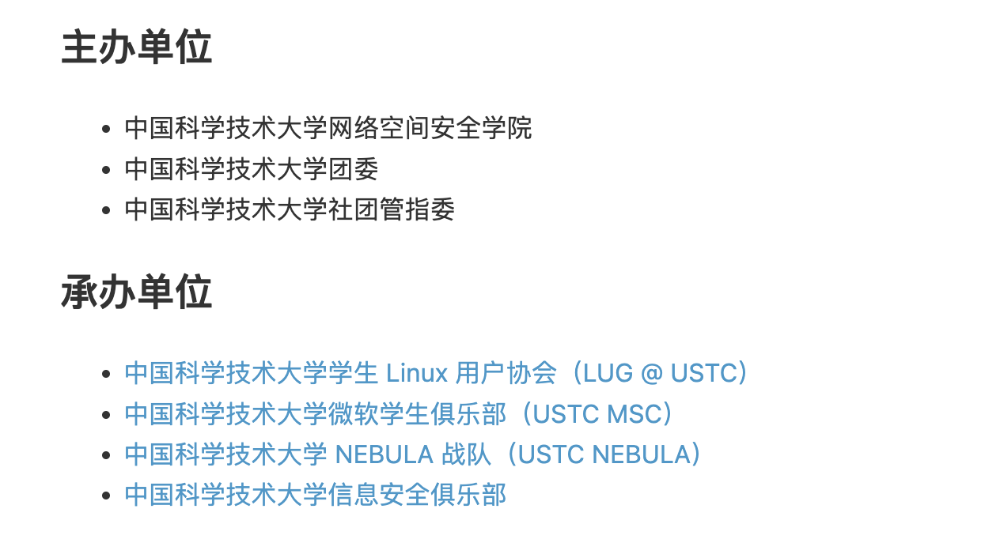

# 喜欢做签到的 CTFer 你们好呀

题解作者：[eastXueLian](https://github.com/AvavaAYA)

出题人、验题人、文案设计等：见 [Hackergame 2024 幕后工作人员](https://hack.lug.ustc.edu.cn/credits/)。

## 题目描述

- 题目分类：web

- 题目分值：Checkin Again（50）+ Checkin Again & Again（50）


喜欢做签到的 CTFer 你们好呀，我是一道更**典型**的 checkin：有两个 flag 就藏在中国科学技术大学校内 CTF 战队的招新主页里！

## 题解

这是一道更**典型**的签到题，第一步要求选手从 [比赛主页](https://hack.lug.ustc.edu.cn/) 中找到关于中科大校内战队的 [链接](https://www.nebuu.la/)：



### 解法 1

使用 `Opt + Cmd + I` 打开开发者工具，在 Sources 板块中可以找到页面的 js 源码，可以注意到如下代码：

```javascript
// ...

return t.abrupt("return", "".concat(atob("ZmxhZ3swa18xNzVfYV9oMWRkM25fczNjM3J0X2YxNGdfX19wbGVhc2Vfam9pbl91c191c3RjX25lYnVsYV9hbkRfdHdvX21hSm9yX3JlcXVpcmVtZW50c19hUmVfc2hvd25fc29tZXdoZXJlX2Vsc2V9")));

// ...

return t.abrupt("return", "PWD=/root/Nebula-Homepage\nARCH=loong-arch\nNAME=Nebula-Dedicated-High-Performance-Workstation\nOS=NixOS\u2744\ufe0f\n".concat(atob("RkxBRz1mbGFne2FjdHVhbGx5X3RoZXJlc19hbm90aGVyX2ZsYWdfaGVyZV90cllfdG9fZjFuRF8xdF95MHVyc2VsZl9fX2pvaW5fdXNfdXN0Y19uZWJ1bGF9"), "\nREQUIREMENTS=1. you must come from USTC; 2. you must be interested in security!\n"));
```

可以使用 base64 解码得到两个 flag：

```python
[ins] In [1]: import base64

[ins] In [2]: base64.b64decode(b"ZmxhZ3swa18xNzVfYV9oMWRkM25fczNjM3J0X2YxNGdfX19wbGVhc2Vfam9pbl91c191c3RjX25lYnVsYV9hbkRfdHdvX21hSm9yX3JlcXVpcmVtZW50c19hUmVfc2hvd25fc29tZXdoZ
         ...: XJlX2Vsc2V9")
Out[2]: b'flag{0k_175_a_h1dd3n_s3c3rt_f14g___please_join_us_ustc_nebula_anD_two_maJor_requirements_aRe_shown_somewhere_else}'

[ins] In [3]: base64.b64decode(b"RkxBRz1mbGFne2FjdHVhbGx5X3RoZXJlc19hbm90aGVyX2ZsYWdfaGVyZV90cllfdG9fZjFuRF8xdF95MHVyc2VsZl9fX2pvaW5fdXNfdXN0Y19uZWJ1bGF9")
Out[3]: b'FLAG=flag{actually_theres_another_flag_here_trY_to_f1nD_1t_y0urself___join_us_ustc_nebula}'
```

### 解法 2

进入主页可以发现网站模拟了一个 Linux 终端，输入 `help` 指令可以列出所有命令，使用 `[TAB]` 键可以触发自动补全。

依次尝试 `help` 中列出的指令，可以发现列环境变量的命令 `env` 会输出第一个 flag：

```bash
ctfer@ustc-nebula:$ ~ env
PWD=/root/Nebula-Homepage
ARCH=loong-arch
NAME=Nebula-Dedicated-High-Performance-Workstation
OS=NixOS❄️
FLAG=flag{actually_theres_another_flag_here_trY_to_f1nD_1t_y0urself___join_us_ustc_nebula}
REQUIREMENTS=1. you must come from USTC; 2. you must be interested in security!
```

接下来 ~~可以尝试 `sudo` 命令，可以获得系统管理员权限~~ 可以尝试 `ls` 命令列出当前目录，默认情况下 `ls` 不会输出以 `.` 开头的隐藏文件。使用 `-a` 参数可以列出当前目录下的所有文件，发现 `.flag`，于是可以用 `cat` 命令查看文件内容：

```bash
ctfer@ustc-nebula:$ ~ ls -al
.flag
.oh-you-found-it/
Awards
Members
Welcome-to-USTC-Nebula-s-Homepage/
and-We-are-Waiting-for-U/

ctfer@ustc-nebula:$ ~ cat .flag
flag{0k_175_a_h1dd3n_s3c3rt_f14g___please_join_us_ustc_nebula_anD_two_maJor_requirements_aRe_shown_somewhere_else}
```
