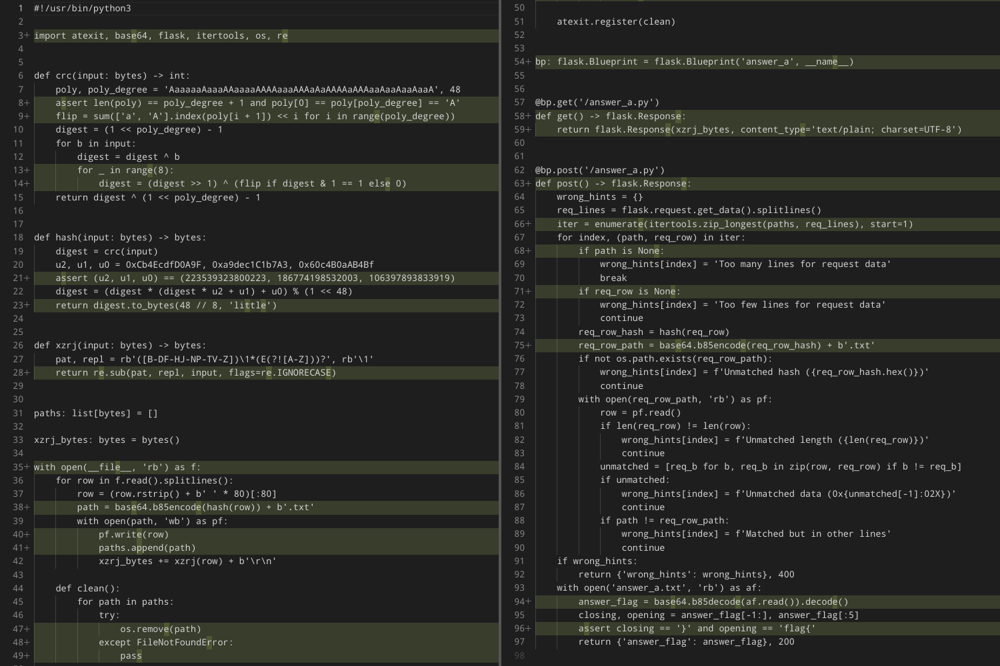
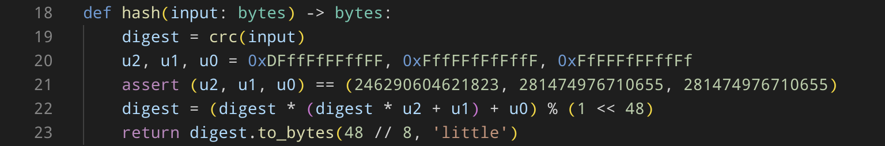

# 惜字如金 3.0

题解作者：[zzzz](https://github.com/ustc-zzzz)

出题人、验题人、文案设计等：见 [Hackergame 2024 幕后工作人员](https://hack.lug.ustc.edu.cn/credits/)。

## 题目描述

- 题目分类：math

- 题目分值：题目 A（150）+ 题目 B（250）+ 题目 C（250）

<!-- markdownlint-disable first-line-heading -->
惜字如金一向是程序开发的优良传统。无论是「[creat](https://stackoverflow.com/questions/8390979/why-create-system-call-is-called-creat)」还是「[referer](https://stackoverflow.com/questions/8226075/why-http-referer-is-single-r-not-http-referrer)」，都无不闪耀着程序员「节约每句话中的每一个字母」的优秀品质。两年前，信息安全大赛组委会正式推出了「惜字如金化」（XZRJification）标准规范，受到了广大程序开发人员的热烈欢迎和一致好评。现将该标准重新辑录如下。

### 惜字如金化标准

惜字如金化指的是将一串文本中的部分字符删除，从而形成另一串文本的过程。该标准针对的是文本中所有由 52 个拉丁字母连续排布形成的序列，在下文中统称为「单词」。一个单词中除「`AEIOUaeiou`」外的 42 个字母被称作「辅音字母」。整个惜字如金化的过程按照以下两条原则对文本中的每个单词进行操作：

* 第一原则（又称 creat 原则）：如单词最后一个字母为「`e`」或「`E`」，且该字母的上一个字母为辅音字母，则该字母予以删除。
* 第二原则（又称 referer 原则）：如单词中存在一串全部由完全相同（忽略大小写）的辅音字母组成的子串，则该子串仅保留第一个字母。

容易证明惜字如金化操作是幂等的：多次惜字如金化和一次惜字如金化的结果是相同的。

### 你的任务

为了拿到对应的三个 flag，你需要将三个「惜字如金化」后的 Python 源代码文本文件补全。**所有文本文件在「惜字如金化」前均使用空格将每行填充到了 80 个字符**。后台会对上传的文本文件逐行匹配，如果每行均和「惜字如金化」前的文本文件完全相符，则输出对应 flag。上传文件**无论使用 LF 还是 CRLF 换行，无论是否在尾部增加了单独的换行符，均对匹配结果没有影响**。

### 附注

本文已经过惜字如金化处理。解答本题（拿到 flag）不需要任何往届比赛的相关知识。

---

XIZIRUJIN has always been a good tradition of programing. Whether it is "[creat](https://stackoverflow.com/questions/8390979/why-create-system-call-is-called-creat)" or "[referer](https://stackoverflow.com/questions/8226075/why-http-referer-is-single-r-not-http-referrer)", they al shin with th great virtu of a programer which saves every leter in every sentens. Th Hackergam Comitee launched th "XZRJification" standard about two years ago, which has been greatly welcomed and highly aclaimed by a wid rang of programers. Her w republish th standard as folows.

### XZRJification Standard

XZRJification refers to th proces of deleting som characters in a text which forms another text. Th standard aims at al th continuous sequences of 52 Latin leters named as "word"s in a text. Th 42 leters in a word except "`AEIOUaeiou`" ar caled "consonant"s. Th XZRJification proces operates on each word in th text acording to th folowing two principles:

* Th first principl (also known as creat principl): If th last leter of th word is "`e`" or "`E`", and th previous leter of this leter is a consonant, th leter wil b deleted.
* Th second principl (also known as referer principl): If ther is a substring of th sam consonant (ignoring cas) in a word, only th first leter of th substring wil b reserved.

It is easy to prov that XZRJification is idempotent: th result of procesing XZRJification multipl times is exactly th sam as that of only onc.

### Your Task

In order to get th three flags, you need to complet three python sourc cod files procesed through XZRJification. **Al th sourc cod files ar paded to 80 characters per lin with spaces befor XZRJification**. Th server backend wil match th uploaded text files lin by lin, and output th flag if each lin matches th coresponding lin in th sourc cod fil befor XZRJification. **Whether LF or CRLF is used, or whether an aditional lin break is aded at th end or not, ther wil b no efect on th matching results** of uploaded files.

### Notes

This articl has been procesed through XZRJification. Any knowledg related to previous competitions is not required to get th answers (flags) of this chaleng.

[打开/下载题目](http://202.38.93.141:19975/)

## 题解

三道小题目的源代码刻意设置成了几乎一模一样，目的便是引导选手递进解题。

### 题目 A

纯填空题，可能是惜字如金系列最简单的一道题了。

下图展示了需要完成补全的字符：



### 题目 B

题目 B 和 A 的区别在于第 7 行被「惜字如金化」的字符有点多——通过~~函数名等~~各种手段我们可以得知这个函数执行的是 ISO HDLC 标准的 CRC（循环冗余校验）算法，`poly` 对应的是**降幂**排列的 48 次模二同余多项式，`B` 代表系数为 1，`b` 代表系数为 0。

模二同余多项式在整系数多项式的基础上增加了一条规则：所有系数模二结果相同的多项式视为同一个多项式。换言之：`179 - 148x + 276x² - 112x³ + 391x⁴` 和 `1 + x⁴` 视为同一个多项式。自然地，所有模二同余多项式都可以化简为系数仅为 0 或 1 的标准形式的多项式。

我们复习一下在 ISO HDLC 标准的 CRC 算法下，给定 `n` 字节的输入和 `k` 次模二同余多项式，是如何得到 CRC 结果的：

1. 将给定的输入以**小端序**表示为一个 `8n` 比特的整数（高位用 0 补齐）：

   > 例（`n = 6`）：`b'HG2024'` => `00110100 00110010 00110000 00110010 01000111 01001000`

2. 在整数高位前增加 `k` 比特的 `1`，并将最低位的 `k` 比特取反（与 `1` 取异或）：

   > 例（`k = 8`）：`00110100 00110010` => `11111111 00110100 00110010` => `11111111 00110100 11001101`

3. 将整数转换为**升幂**形式的多项式（高位对应低次，低位对应高次）：

   > 例（`k = 8`）：`11001101` => `1 + x + x⁴ + x⁵ + x⁷`

4. 将转换后的多项式除以给定的 `k` 次模二同余多项式，并将得到的余式（最高 `k - 1` 次）转换为标准形式：

   > 例（`k = 4`）：`mod(1 + x + x⁴ + x⁵ + x⁷, 1 + x + x⁴)` => `1 - x² - x³`=> `1 + x² + x³`

5. 将**升幂**形式的余式转换回 `k` 比特的整数，并以**小端序**转换为输出：

   > 例（`k = 16`）：`x² + x⁵ + x⁹ + x¹⁰ + x¹³ + x¹⁴ + x¹⁵` => `00100100 01100111` => `b'g$'`

包括题目 B 在内的三道题目的 `k` 均为 48。我们注意到，当我们输入 `b'\xFF\xFF\xFF\xFF\xFF\xFF\xFF\xFF\xFF\xFF\xFF\x7F'` 时——经过前三步的处理，我们将整好得到一个 `1 + x + x² + ... + x⁴⁸` 的多项式——这个多项式的 0 至 48 次均为 1，49 次及更高次均为 0。将这个多项式除以 `poly`，得到的余式对应的整数将正好是 `poly` 的 49 个系数（0 至 48 次）取反后的结果——也就是第 9 行 `flip` 按位取反后的结果！

故事还没有结束。按照源代码的第 18 至 23 行，CRC 结果还需要经过 `u = u₂t² + u₁t + u₀` 后再将 `mod(u, 1 << 48)` 作为输出。经过简单的配方我们可以得到：

> `(u₂ * 2t + u₁)² = u₁² - 4u₂ * (u₀ - u)`

问题转化为求 `u₁² - 4u₂ * (u₀ - u)` 的二次剩余。我们将 `b'\xFF\xFF\xFF\xFF\xFF\xFF\xFF\xFF\xFF\xFF\xFF\x7F'` 上传，可以得到的输出如下：

```json
{
  "wrong_hints": {
    "1": "Unmatched hash (d77759699022)",
    "2": ...
  }
}
```

将 `d77759699022` 作为**小端序**整数 `u` ：

```python
u = int.from_bytes(bytes.fromhex('d77759699022'), 'little') # 38003638106071
```

代入上式，通过 `sympy` 计算二次剩余：

```python
from sympy import sqrt_mod

u2, u1, u0 = 241818181881667, 279270832074457, 202208575380941
rhs = u1 ** 2 - 4 * u2 * (u0 - u) # -80838759903649378693179388311
lhs_sqrt = sqrt_mod(rhs, 1 << 48, all_roots=True) # [2327539748973, 138409948606355, 143065028104301, 279147436961683]
```

得到四个解，计算得到 `2t` 可能的 4 个值（此处需要计算 `u2` 模 `1 << 48` 的倒数）：

```python
# [218134714756316, 208408558555070, 77397226400988, 67671070199742]
double_t = [((i - u1) * pow(u2, -1, 1 << 48)) % (1 << 48) for i in lhs_sqrt]
```

`t` 的可能值为 `2t / 2` 和 `2t / 2 + (1 << 47)` 两种（合计八种），代回验算发现六个增根，只有两个为可能的 `t`：

```python
# [104204279277535, 38698613200494]
t = [j for i in double_t for j in (i // 2, i // 2 + (1 << 47)) if (u2 * j * j + u1 * j + u0) % (1 << 48) == u]
```

`t` 的值为 `flip` 按位取反的结果，经过处理，最终可以得到可能对应的两行：

```python
    # t[0] 对应的第 7 行
    poly, poly_degree = 'BbbbbbBbbbbbBBbbbBBbbBBBBbbBBbbbbbBbBBBbbBbbbbBbB', 48 
    # t[1] 对应的第 7 行
    poly, poly_degree = 'BBbbbBbbBBbbBbBbbbbbBbBBBbBBbbbBBBbBBbbBBbbBBBbBB', 48 
```

逐个尝试，最后确定后者为正确的第 7 行。

### 题目 C

题目 C 在题目 B 的基础上修改了第 20 行，使得 `u2, u1, u0` 分别为 `0xDFFFFFFFFFFF, 0xFFFFFFFFFFFF, 0xFFFFFFFFFFFF`，而被「惜字如金化」的全部为 `F` 或 `f` 字符，可能的情况共有 `1 << 32` 种，每一种均需通过向服务端发送请求拿到结果，选手是根本无法推测出来的：

```python
    # 以下均为第 20 行可能的情况
    u2, u1, u0 = 0xDFFffFFFFfff, 0xFfFfFFfFFffF, 0xFFFffffFFFfF                 
    u2, u1, u0 = 0xDFfFFFFfFfFf, 0xFffFfFFFffFF, 0xFFfFfffFFfFf                 
    u2, u1, u0 = 0xDFffFffFFFfF, 0xFfFFFfFfFFff, 0xFFFFfFfFffFf                 
    u2, u1, u0 = 0xDFfffFffFFFf, 0xFFfFFfffFFfF, 0xFfFFFFFfFfFf                 
    u2, u1, u0 = 0xDFFFFffFfFfF, 0xFffFfFfFffFf, 0xFFFFFFfffFFF                 
    ...
```

我们还有没有什么别的办法呢？

如果选手试着还原了源代码并试图开启一个 HTTP 服务，选手应该会发现根目录生成了一堆 `????????.txt` 的文件，和装有 flag 的 `answer_c.txt` 根本无法分辨——那么我们有没有什么办法在「正统」的访问方式外访问 `answer_c.txt` 呢？通过阅读源代码可以发现，`.txt` 前的部分对应某个 Base85 后的结果，我们可以把 `b'answer_c'` 以 Base85 的形式还原为 `b'q\xd3\xdb\xb1\xa7\xd0'`，对应的**小端序**整数为 `229418662089585`，并通过和题目 B 类似的过程可以得到某个「CRC 结果」对应的余式 `r(x)`：

> `r(x) = x + x⁵ + x¹⁴ + x¹⁶ + x¹⁷ + x²⁰ + x²⁴ + x²⁵ + x²⁶ + x²⁷ + x³⁰ + x³¹ + x³² + x³³ + x³⁶ + x³⁷ + x³⁸ + x³⁹ + x⁴⁰ + x⁴² + x⁴⁴ + x⁴⁶`

通过和题目 B 类似的过程，也可以得到 `poly` 对应的 48 次多项式 `p(x)`：

> `p(x) = 1 + x + x² + x³ + x⁴ + x⁷ + x⁸ + x⁹ + x¹⁰ + x¹¹ + x¹² + x¹³ + x¹⁵ + x¹⁶ + x¹⁷ + x¹⁹ + x²² + x²⁷ + x²⁸ + x³¹ + x³² + x³⁴ + x³⁵ + x³⁶ + x³⁷ + x⁴¹ + x⁴³ + x⁴⁴ + x⁴⁸`

我们的目标是构造长度为 `n` 字节的输入，使其调整前 `m` 个字节（`m` 不小于 6），也就是**小端序**的最低 `8m` 个比特，能够按照题目 B 提到的过程得到多项式 `n(x)`，并使其除以 `p(x)` 后得到的余式正好是 `r(x)`，这样服务端程序便能够读取 `answer_c.txt`，从而可以通过构造以下几个步骤读取内部的数据：

1. 取一个 `n` 的合适范围（例如 7 至 100），输出不为 `Unmatched length (??)` 对应的 `N` 即为 `answer_c.txt` 内数据的大小；
2. 遍历调整最后一个字节，构造长度为 `N` 的输入，输出为 `Unmatched data (0x??)`，如果 `??` 和最后一个字节不同，则最后一个字节固定；
3. 遍历调整倒数第二个字节，构造长度为 `N` 的输入，输出为 `Unmatched data (0x??)`，倒数第二个字节如果和 `??` 不同则固定；
4. 重复以上过程直至确定前 `m` 个字节以外的所有字节。

我们注意到 `answer_c.txt` 存储的是 Base85 形式的 flag，而 flag 的前五个字节必然为 `b'flag{'`，对应 Base85 形式的前六个字节也随之固定。也就是说，如果令 `m = 6`，那么 `answer_c.txt` 的内容也将完全确定下来。现在的问题是：前 `m` 个字节填充什么呢？

前 `m` 个字节对应的是多项式的高次项，也就是 `8n - 8m + 48` 至 `8n + 47` 次——换言之，可以表示成 `q(x) = x ** (8n - 8m + 48)` 再乘以一个最高次数为 `8m - 1` 的多项式。那么，我们有没有办法像整数一样，找到两个多项式 `s(x)` 和 `t(x)`，使得在模二同余多项式的条件下，满足：

> `s(x) * p(x) + t(x) * q(x) = gcd(p(x), q(x)) = 1`

这一等式呢？通过 `sympy.polys.galoistools` 的 `gf_gcdex`（扩展欧几里得算法）可以计算得到

```python
from sympy import ZZ
from sympy.polys.galoistools import gf_gcdex

p = ZZ.map([1, 0, 0, 0, 1, 1, 0, 1, 0,
               0, 0, 1, 1, 1, 1, 0, 1,
               1, 0, 0, 1, 1, 0, 0, 0,
               0, 1, 0, 0, 1, 0, 1, 1,
               1, 0, 1, 1, 1, 1, 1, 1,
               1, 0, 0, 1, 1, 1, 1, 1])

q = [ZZ(1)] + [ZZ(0)] * 504 # 考虑 8n - 8m + 48 = 504 的情况

s, t, gcd = gf_gcdex(p, q, 2, ZZ)
```

我们只需要用到 `t(x)` 的表达式：

>`t(x) = x² + x³ + x⁷ + x⁸ + x¹³ + x¹⁴ + x¹⁸ + x²¹ + x²³ + x²⁴ + x²⁶ + x²⁹ + x³² + x³³ + x³⁷ + x³⁸ + x³⁹ + x⁴⁰ + x⁴¹ + x⁴² + x⁴⁴ + x⁴⁵ + x⁴⁶ + x⁴⁷ + x⁴⁸`（考虑 `8n - 8m + 48 = 504` 的情况）

现在我们将构造流程描述如下：

1. 考虑长度为 `n` 字节的输入，计算对应的多项式，舍去不低于 `8n - 8m + 48` 次的部分，记为 `n'(x)`；
2. 考虑 `p(x)` 和 `q(x)`，通过以上方法计算得到 `t(x)`；
3. 选取最高次项低于 `8m - 48` 次的任意多项式 `u(x)`（共有 `1 << (8m - 48)` 种可供选择）；
4. 考虑期望的余式 `r(x)`，计算 `m(x) = (u(x) * p(x) + r(x) - n'(x)) * t(x)`；
5. 计算 `n(x) = mod(m(x), p(x)) * q(x) + n'(x)`，不难验证 `mod(n(x), p(x)) = r(x)`，且 `n(x)` 低次项和 `n'(x)` 相同；
6. 通过 `n(x)` 反推回 `n` 字节的输入，可以验证仅有前 `m` 字节发生了变化，且 CRC 结果和 `r(x)` 对应。

实际构造时可以选取 `m = 7`，这是因为如果选取 `m = 6`，则构造得到的输入可能会存在 `\r` 或 `\n`，而 `u(x)` 只能选取为 `0`，选取 `m = 7` 可以使得 `u(x)` 有多达 256 种选择，规避掉 `\r` 或 `\n` 的产生。`answer_c.txt` 的第七个字节可以通过穷举 85 种情况得到（只有一种情况会使得解码得到的 flag 全部为 ASCII 可见字符）。

## 附注

1. 题目 C 的做法不能用于题目 A 和题目 B，这是因为不存在某个输入的 Base85 形式是 `answer_a` 或 `answer_b`；

2. 如果有读者实在好奇题目 C 对应的第 20 行是什么，以下是源代码截图：

   
