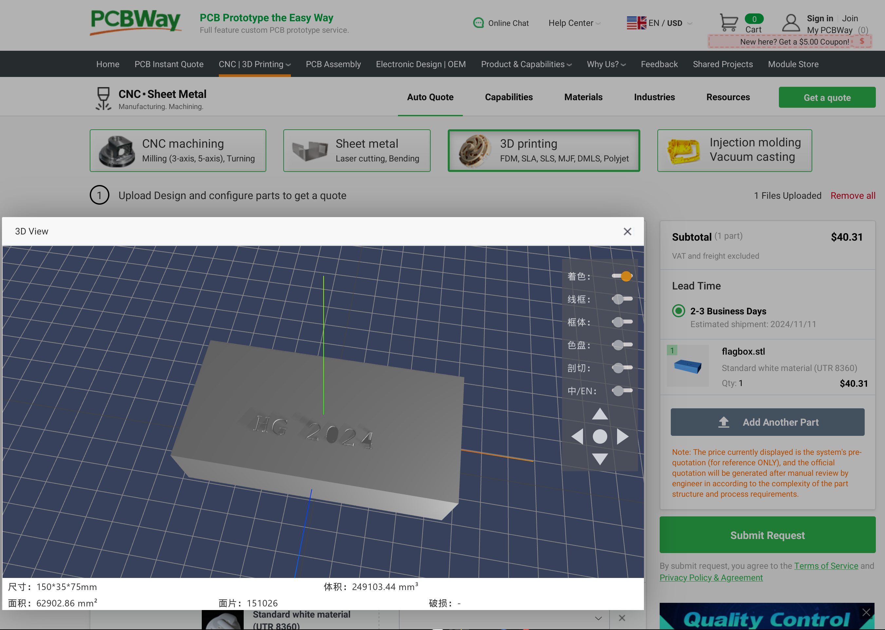
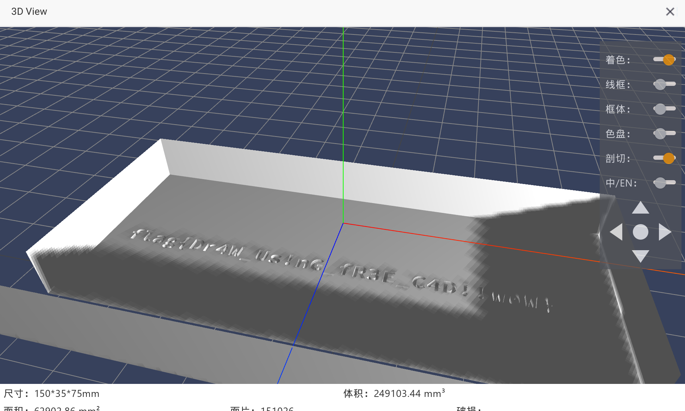
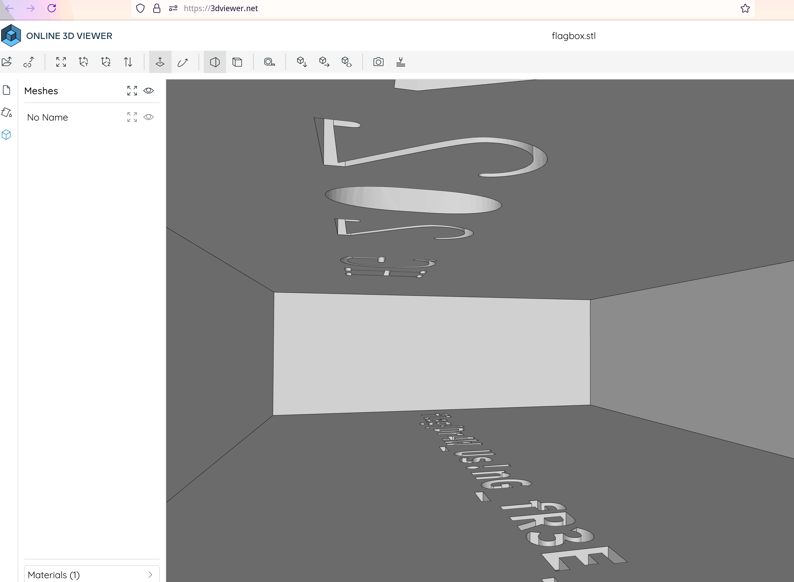

# 打不开的盒

题解作者：[Peter Gu](https://github.com/regymm)

出题人、验题人、文案设计等：见 [Hackergame 2024 幕后工作人员](https://hack.lug.ustc.edu.cn/credits/)。

## 题目描述

- 题目分类：general

- 题目分值：100

如果一块砖头里塞进了一张写了 flag 的纸条，应该怎么办呢？相信这不是一件困难的事情。

现在，你遇到了同样的情况：这里有一个密封盒子的设计文件，透过镂空的表面你看到里面有些东西……

那只要把它 3D 打印出来之后砸开不就解决了？用网上的制造服务的话，可能还没收到东西比赛就结束了，所以难道真的要去买一台 3D 打印机才能够看到里面的东西吗？

[打开/下载题目](files/flagbox.stl)

## 题解

第二签到题，只要在任意 3D 打印服务网站上打开这个模型，选择切片等能够查看模型内部的功能就好了，下图为两个例子。也有出题人表示，用 macOS 系统自带的查看器就可以放大并查看模型内部。

选择剖切查看内部

Zoom in 查看内部

