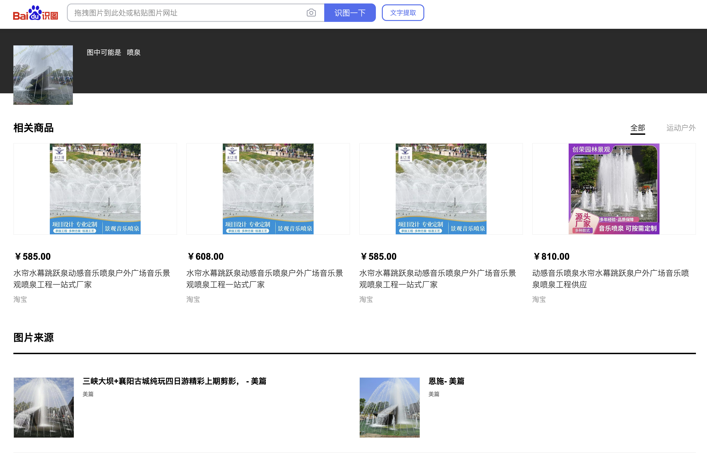
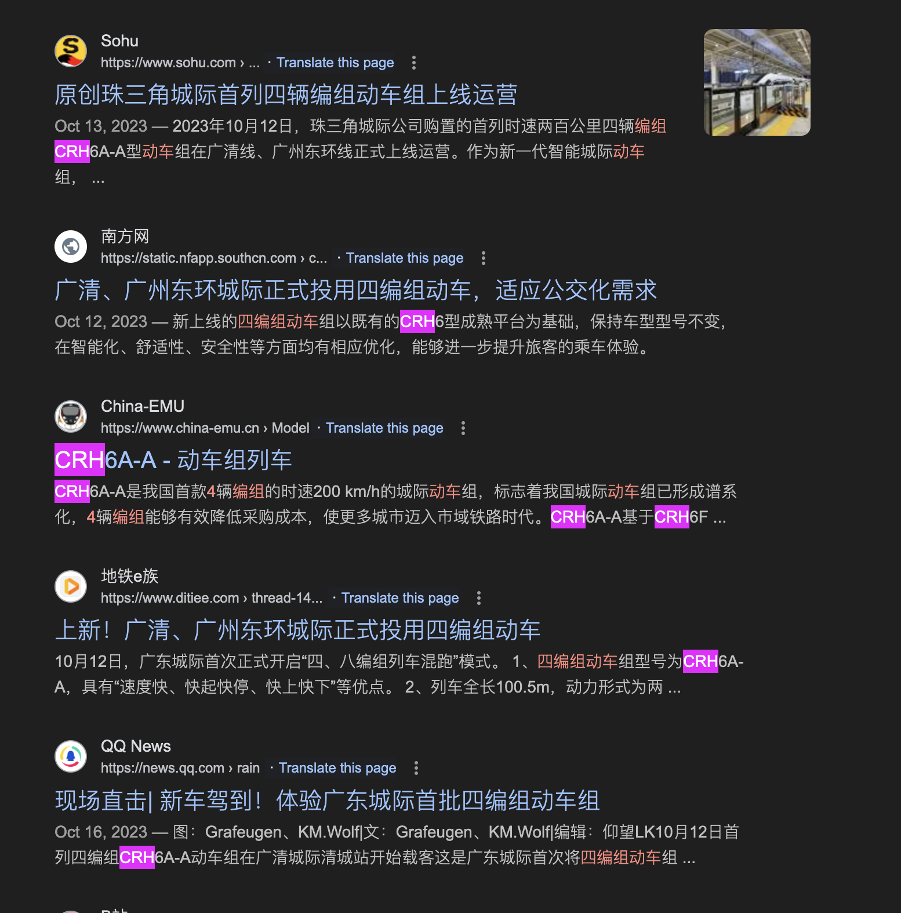

# 旅行照片 4.0

题解作者：[tiankaima](https://github.com/tiankaima)

出题人、验题人、文案设计等：见 [Hackergame 2024 幕后工作人员](https://hack.lug.ustc.edu.cn/credits/)。

## 题目描述

- 题目分类：general

- 题目分值：LEO_CHAN?（100）+ FULL_RECALL（150）+ OMINOUS_BELL（150）

「又要重复吗，绝望的轮回」

你的学长今年还在旅游…… 对，对吗？你似乎注意到了什么。

往年题目：[旅行照片](https://github.com/USTC-Hackergame/hackergame2021-writeups/blob/master/official/%E6%97%85%E8%A1%8C%E7%85%A7%E7%89%87/README.md)、[旅行照片 2.0](https://github.com/USTC-Hackergame/hackergame2022-writeups/blob/master/official/%E6%97%85%E8%A1%8C%E7%85%A7%E7%89%87%202.0/README.md)、[旅行照片 3.0](https://github.com/USTC-Hackergame/hackergame2023-writeups/blob/master/official/%E6%97%85%E8%A1%8C%E7%85%A7%E7%89%87%203.0/README.md)。

> 注意：你不需要阅读往年题目亦能答题，上述链接仅供参考。

请观察照片并结合所有文字内容，正确回答题目以获取 flag。

[打开/下载题目](http://202.38.93.141:12345/?token={token})

### … LEO 酱？……什么时候

「说起来最近学长的 \*\* 空间里怎么没有旅游的照片了……」

正当你在这样想的时候，突然刷到学长的一条吐槽：

> > 你们的生活到底真的假的呀？每天要么就是看漫展看偶像看 live 喝酒吃烧烤，要么就是这里那里旅游。阵容一宣，说冲就冲，群一拉，机票一买，钱就像大风刮来的，时间好像一直有。c\*\*4 你们也去，mu\*\*ca 你们也去，m\*\*o 你们也去，to\*ea\*i 你们也去。我怎么一天到晚都在上班啊，你们那到底是怎么弄的呀？教教我行不行
>
> 

~~出去玩的最多的难道不就是您自己吗？~~

看样子学长是受到了什么刺激…… 会是什么呢？话说照片里这是…… Leo 酱？……什么时候

*问题 1: 照片拍摄的位置距离哪个校门更近？（格式：`X校区Y门`，均为一个汉字）*

*问题 2: 话说 Leo 酱上次出现在桁架上是…… ACG 音乐会？日期我没记错的话是？（格式：`YYYYMMDD`）*

### 诶？我带 LEO 酱出去玩？真的假的？

「拍照的时候带着 LEO 酱看起来是个不错的选择」，回忆完上次的 ACG 音乐会，你这样想到，不过说到底要去哪里呢？

这样想着，你打开自己的相册翻找，「我记得之前保存了几个还不错的地方……」

嗯？奇怪的记忆增加了。诶，我到过这些地方吗？

*问题 3: 这个公园的名称是什么？（不需要填写公园所在市区等信息）*

*问题 4: 这个景观所在的景点的名字是？（三个汉字）*

### 尤其是你才是最该多练习的人

调查自己还是头一回，多新鲜啊。不过，还没来得及理清头绪，你突然收到了来自学长的信息：

> 
>
> 来练练手，看看能挖出什么有趣的东西。

糟了，三番五次调查学长被他发现了？不过，这个照片里的车型是……

*问题 5: 图片中的建筑全称是什么？（八个汉字）*

*问题 6: 左下角的车型是**编号**是？*

## 题解

> [!WARNING]
>
> 这次的问题可能需要借助一些不被搜索引擎索引的、需要登录的 App 来解决。

### 问题 1 - 「科里科气科创驿站」

如果你直接对着照片上的「科里科气科创驿站」搜索的话，排名靠前的几位结果大概不是想要的答案，应该都是一个在建项目的宣传。

在本土的地图软件上稍加搜索，应该能发现下面三个地点：

- 「科里科气新智造产业园」（在建）
- 「中国蜀山科学岛科里科气科创驿站」
- 「科里科气科创驿站」（科大站）

查找图片之后应该能定位到最后一个「『科里科气科创驿站』（科大站）」，这个地点距离「**东校区西门**」更近。

> [!NOTE]
>
> 传说中校区是有东门的，只不过没人真的从那边出去或者进来过……

> [!NOTE]
>
> 另外出题人本人天天在这边买咖啡，但是从来没注意过这样一个地方，大概是不喜欢抬头吧……

### 问题 2 - 「LEO 酱？」

搜索「USTC」、「中科大」、「LEO」等字样应该可以搜到他们的 [Bilibili 账户](https://space.bilibili.com/7021308/)，沿着 [动态](https://space.bilibili.com/7021308/article) 查找即可发现对应的 [帖子](https://www.bilibili.com/opus/930934582351495204)：

那么日期是 **2024/05/19**

> [!NOTE]
>
> 真的有在努力帮忙宣传 LEO 哦，第一小问的 flag 也是 `5UB5CR1B3_T0_L30_CH4N_0N_B1L1B1L1_PLZ_${??????????}`（不过大家都不怎么看 flag ……）, 他们 [B 站](https://space.bilibili.com/7021308/) 大概差 ~120 个粉丝到 1w，所以快去点点关注！

### 问题 3 - 「六安……园林？」

这张图片反向图片搜索几乎无法得到任何有效信息，关键词的提取也异常困难，题目图片中唯一的突破口，也许真的需要用心观察，就是在垃圾桶上面的「六安园林」字样。

> [!NOTE]
>
> 本题 flag `3T41LS_M4TT3R_1F_R3V3RS3_S34RCH_1S_1MP0SS1BL3_${??????????}`

不过到这里并没结束，六安园林看起来只是一个商业公司或者某个部门的名字，那么这座公园呢？在搜索引擎上搜索「六安」、「三色跑道」？似乎都不是很正确。

其实这种专供打卡的地标，几乎一定会出现在小红书上…… 并且小红书的推荐算法异常强悍，只需要搜索「六安」、「公园」，就能在前几个搜索结果中得到答案「中央森林公园」

### 问题 4 - 「坛子岭」

这张图就只需要简单的反向搜索，只不过不是 Google 而是百度（没想到吧……）。

### 问题 5~6 - 「尤其是你才是最该多练习的人」

> [!NOTE]
>
> 并不需要大家成为车迷才能做出来，出题人和验题人对这些内容也都不了解。
>
> 题目中实际上已经给出切入点，也是出题人拍摄时注意到的：「标志性的……四编组动车？」

直接搜索「四编组动车」就能得到一个很详尽的介绍网页。

或者在 Google 的搜索中也能找到「CRH6A-A」的身影

那么第二问的答案得到了，第一问呢？这个时候就是前半句提示语，「标志性的」，搜索 CRH6A-A 的 Wikipeida 页面：

<https://zh.wikipedia.org/wiki/%E5%92%8C%E8%B0%90%E5%8F%B7CRH6%E5%9E%8B%E7%94%B5%E5%8A%9B%E5%8A%A8%E8%BD%A6%E7%BB%84>

向下翻找，便可发现这样一张图片：

作者 <a href="//commons.wikimedia.org/wiki/User:N509FZ" title="User:N509FZ">N509FZ</a> - 自己的作品，<a href="https://creativecommons.org/licenses/by-sa/4.0" title="Creative Commons Attribution-Share Alike 4.0">CC BY-SA 4.0</a>，<a href="https://commons.wikimedia.org/w/index.php?curid=94891427">链接</a>

与题目中型号颜色匹配上，因此猜测是 [怀密线](https://zh.wikipedia.org/wiki/%E5%8C%97%E4%BA%AC%E5%B8%82%E9%83%8A%E9%93%81%E8%B7%AF%E6%80%80%E6%9F%94%E2%80%94%E5%AF%86%E4%BA%91%E7%BA%BF), 接下来沿着线路 **北京北站始，途经海淀区、昌平区、怀柔区，至密云区古北口站** 即可找到：「北京北动车运用所」，在地图上查找，旁边即为「积水潭医院」。