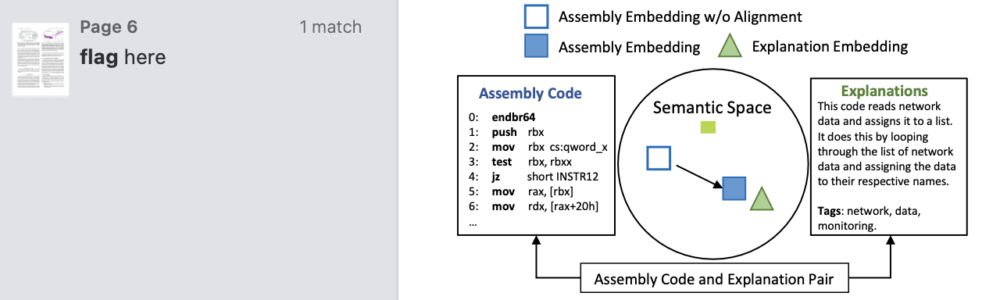
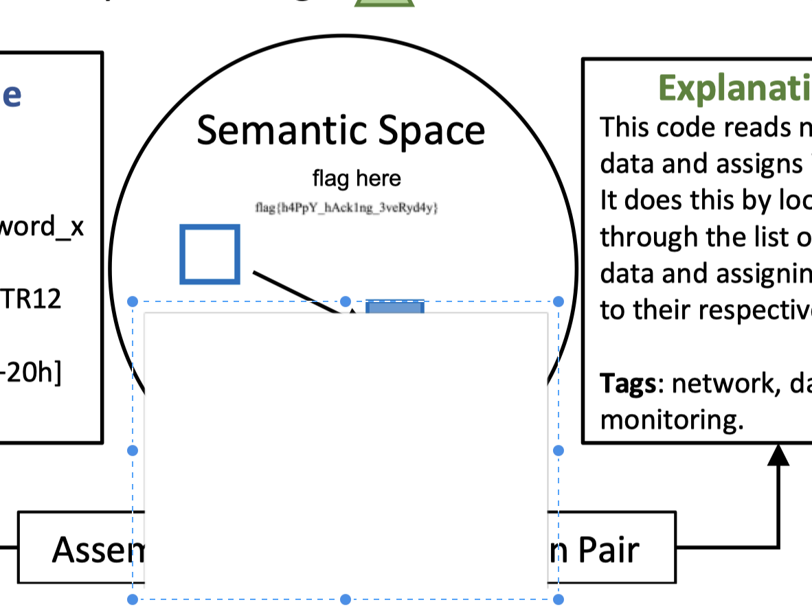
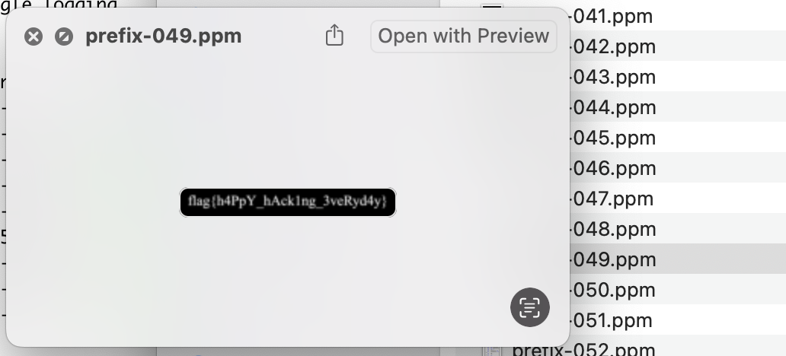

# 每日论文太多了！

题解作者：[Elsa Granger](https://github.com/zeyugao)

出题人、验题人、文案设计等：见 [Hackergame 2024 幕后工作人员](https://hack.lug.ustc.edu.cn/credits/)。

## 题目描述

- 题目分类：general

- 题目分值：100

传闻，每日新发表的论文

有七成都会在一年内被遗忘

而且五年后

基本都无人问津

它们被学术界的快节奏淹没

有人引用

有人忽视

我不期盼这学术世界，以及我的研究

能在这汪洋般的文献中脱颖而出

然而，我有时会思考

如果我的论文能被更多人阅读

如果我的研究能对他人有所启发

如果我能为这个领域贡献一点价值

届时

我将作何感想

<div align="right">
——改编自「負けヒロインが多すぎる！」Ep 1，存在 AI 创作
</div>

---

要怎么做才能读读 [我们的论文](https://dl.acm.org/doi/10.1145/3650212.3652145)？只要是我能做的，我什么都愿意做！

## 题解

### Motivation

在做这个论文的 Camera Ready 的时候，想能不能留下些什么，于是就有了这个题目。

### 解法

在论文里面直接搜索 `flag` 可以在第 6 页发现有一处高亮。



那就是去看看在这附近有啥，用任意一个可以打开 PDF 的工具打开这个文件，然后找到这个位置。尝试找到这串文字是在哪里出现的，在这个 PDF 里面就是有一个白色的图片挡住了这个文字，移开之后就可以看到文字的来源以及 flag。



可以使用的工具包括 InkScape、Adobe Acrobat、PDF Expert 等。

或者，可以直接使用一些提取 PDF 里面图片的工具，可以直接拿到包含了 flag 的图片。

```shell
pdfimages 3650212.3652145.pdf prefix
```

然后简单地过一下里面包含了的图片，就可以找到这个图片。



### 碎碎念

这个原图没有那么糊的，但是 ACM 在做 camera ready 的 Postprocessing 时候把非矢量图给压缩得有点厉害，导致了这么糊，这告诫我们 Paper 千万不要用位图，一定要用矢量图。

前面的台词是「負けヒロインが多すぎる！」Ep 1 的开场白，欢迎大家去看！后面的那句话是 MyGO 的 Ep 7 的名言，但是没有想到会有可能引起误解，造成了一个小风波，实在抱歉。
