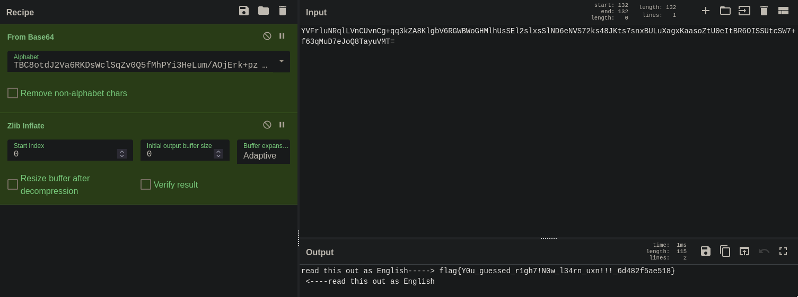

# 神秘代码 2

题解作者：[erina](https://github.com/2403772980ygy)

出题人、验题人、文案设计等：见 [Hackergame 2024 幕后工作人员](https://hack.lug.ustc.edu.cn/credits/)。

## 题目描述

- 题目分类：binary

- 题目分值：你好，___（三个字母）（100）+ 多想想，再看看（250）+ 阴影之下（350）

出题人 R 是套娃 Misc（杂项）爱好者。据说，他在战队招新时出了一道有一千层套娃的 Misc 题目，包括但不限于：

- 凯撒密码
- Base64 编码
- RFC 1751
- Zstandard
- xz
- bzip2
- zlib

最后以一个 Base64 编码大火收汁儿，名曰「神秘代码」。结果不出所料，这道题被其他所有人都骂惨了。

「这次 Hackergame 你不许出神秘代码了！」

出题人 R 想了想，以他的理解出了这道题目，毕竟没有人说不能出神秘代码 2 嘛！而且，既然是神秘代码 **2**，那我有两个「神秘代码」，不过分吧？

提示：

1. 这是一道逆向题目
2. 每一道题目会输出两行，第一行是 Base64 编码的字节码，**第二行是代码运行结果**
3. 代码的输入是 flag 经过 zlib 压缩后的结果，这次真的只有两层，不做千层饼了
4. 你可能是百度搜索的受害者
5. 我已经绞尽脑汁给你们提示了饶了我吧

你可以通过 `nc 202.38.93.141 32100` 来连接，或者点击下面的「打开/下载题目」按钮通过网页终端与远程交互。

> 如果你不知道 `nc` 是什么，或者在使用上面的命令时遇到了困难，可以参考我们编写的 [萌新入门手册：如何使用 nc/ncat？](https://lug.ustc.edu.cn/planet/2019/09/how-to-use-nc/)

[打开/下载题目](http://202.38.93.141:32101/?token={token})

## 题解

以下题解中，以个人输出为例：

### 第一题

```
oAEHgBA3AIAXFoAECCAASIASFmAAAQCAARABASYfgAAQHYAABKABgjgUgBgXBAeABgQZgEAfH4A/HAQGgAYJIAAPAoAABKABgjgUgBgXoAAAgAERgAARbIABEAYgAANAABqAAIAAEKABgjgUgBgXoD0YFwEBBoAGCSD/86ABDxcCAFRCQzhvdGRKMlZhNlJLRHNXY2xTcVp2MFE1Zk1oUFlpM0hlTHVtL0FPakVyaytwekZVbkk0Tnk5N3dYR2cxeGI=
YVFrluNRqlLVnCUvnCg+qq3kZA8KlgbV6RGWBWoGHMlhUsSEl2slxsSlND6eNVS72ks48JKts7snxBULuXagxKaasoZtU0eItBR6OISSUtcSW7+f63qMuD7eJoQ8TayuVMT=
```

参考题面中 `第一行是 Base64 编码的字节码` ，反编码出字节码：

```
b'\xa0\x01\x07\x80\x107\x00\x80\x17\x16\x80\x04\x08 \x00H\x80\x12\x16`\x00\x01\x00\x80\x01\x10\x01\x01&\x1f\x80\x00\x10\x1d\x80\x00\x04\xa0\x01\x828\x14\x80\x18\x17\x04\x07\x80\x06\x04\x19\x80@\x1f\x1f\x80?\x1c\x04\x06\x80\x06\t \x00\x0f\x02\x80\x00\x04\xa0\x01\x828\x14\x80\x18\x17\xa0\x00\x00\x80\x01\x11\x80\x00\x11l\x80\x01\x10\x06 \x00\x03@\x00\x1a\x80\x00\x80\x00\x10\xa0\x01\x828\x14\x80\x18\x17\xa0=\x18\x17\x01\x01\x06\x80\x06\t \xff\xf3\xa0\x01\x0f\x17\x02\x00TBC8otdJ2Va6RKDsWclSqZv0Q5fMhPYi3HeLum/AOjErk+pzFUnI4Ny97wXGg1xb'
```

发现字节码后面有一段明文，是打乱的 Base64 字符表。

猜测是换表 Base64，使用你能想到的任何工具进行解码，这里使用 CyberChef 作为参考。



### 第二题

根据第一题的提示：

第二题开始，需要对 [uxn/tal](https://wiki.xxiivv.com/site/uxntal.html) 有基本了解。

第二题的代码没有经过混淆，但是作为汇编字节码，逆向天然有一定困难。

uxntal 的指令集：[uxntal opcodes](https://wiki.xxiivv.com/site/uxntal_opcodes.html)

uxntal 的设备：[varvara](https://wiki.xxiivv.com/site/varvara.html)

uxn 的逆向工具为 [uxndis](https://git.sr.ht/~rabbits/uxn-utils/tree/main/item/cli/uxndis)，不过作为自产自销的工具，需要先配置 `uxn` 环境。

以下为反汇编核心内容（最下面那 64 byte 就别看了，一看就知道不是 code）：

可以简单的切分 `BRK`, `JMP2r` 作为向量/函数结尾

```
@on-reset ( -> | manually added )
0100:   80 3f      LIT 3f
0102:   80 01      LIT 01
( 3f 01 | 我一开始还以为会是一个 LIT2 但是貌似 uxnlin 会报但是 uxnasm 不会优化 )
0104:   11         STZ ( 将 3f 放置在 0001 )
0105:   a0 01 0c   LIT2 010c ( 010c 看着不像下面那玩意吗? 向量的地址 )
0108:   80 10      LIT 10
010a:   37         DEO2 ( 将 010c 放入 Console/vector(10) 中, 参见varvara )
010b:   00         BRK ( 睡了 )

<-- manually added split line -->

@on-console ( -> | manually added )
010c:   80 17      LIT 17  ( 17: Console/type )   <--- 010c
010e:   16         DEI     ( 读入当前状态 )
010f:   80 04      LIT 04  ( 如果是 argument-end 的话 ( 这个参数较为奇怪, stdin-end 其实也是 argument-end 而不是 no-qeueue ) )
0111:   08         EQU
0112:   20 00 53   JCI +83 ( 这里 83 是十进制, 建议用前面53算, 这里跳转到 0168, opcodes 讲的不好, JCI 的相对位移要从下一条指令算起, 那个 +2 应当理解为必定会发生的 )
0115:   80 12      LIT 12
0117:   16         DEI     ( 读入一个 byte )
( byte | 这个记号表示栈状态 )
0118:   60 00 01   JSI +1  ( 011c, 这个会储存返回坐标, +1 的原理和 JCI 一致, 从下一条指令算起 )
011b:   00         BRK     ( 睡觉 )

<-- manually added split line -->

@core ( byte -- | manually added )
011c:   80 01      LIT 01
011e:   10         LDZ ( 读内存 0001 的一个 byte, 由上面代码知道其初始值为 3f, 接下来将这个 byte 称作 bitmask )
( byte bitmask )
011f:   26         DUP2
( byte bitmask byte bitmask )
0120:   1c         AND
( byte bitmask newbyte | 因为出题人是个傻子, 所以没有使用 ANDk )
0121:   80 00      LIT 00
0123:   10         LDZ
( byte bitmask newbyte queue | 将位于 0000 的 byte 称作 queue )
0124:   1d         ORA
( byte bitmask outbyte )
0125:   60 00 1a   JSI +26 ( 0142 | 吃掉了一个 byte )
( byte bitmask )
0128:   8f         STHk
( byte bitmask | bitmask | 这个记号包含了 return stack 中需要注意的数值, 其实没什么大用 )
0129:   80 ff      LIT ff
012b:   1e         EOR ( xor )
( byte invbm | bitmask )
012c:   1c         AND
( hibyte | bitmask | byte 的先前没有被用上的位 )
012d:   80 02      LIT 02
012f:   1f         SFT
( newqueue | bitmask | 没被用上的位右移两位存起来 )
0130:   4f         STHr
( newqueue bitmask | 嗨嗨嗨我回来了 )
0131:   80 02      LIT 02
0133:   1f         SFT
( newqueue newbm | 右移两位作为新的 bitmask )
0134:   06         DUP
0135:   20 00 06   JCI +6 ( 如果 bitmask 为 0, 那么输出了三次了, 应该把 queue 输出并且归零, 同时把 bitmask 归为 3f, 不然的话跳过下面这段到 013e )
0138:   04         SWP
( 00 newqueue | 一箭双雕, 出题人出这里的时候相当开心, 你能说出是哪双雕吗? )
0139:   60 00 06   JSI +6 ( 0142 )
( 00 )
013c:   80 3f      LIT 3f
( 00 3f )
( 这里不多解说, 出题人依然非常开心 )
( newqueue newbm )
013e:   80 00      LIT 00 ( 一箭双雕, 出题人非常开心 )
0140:   31         STZ2
0141:   6c         JMP2r ( 返回, 主要是要 POP 掉 return stack 上的返回地址 )

<-- manually added split line -->

@putchar-or-is-it ( byte6 -- | 相当恶趣味的函数 )
0142:   a0 03 1d   LIT2 031d
( byte 03 1d )
0145:   05         ROT
( 03 1d byte )
0146:   1a         MUL
0147:   18         ADD
0148:   80 3f      LIT 3f
014a:   1c         AND ( 这是在干什么呢? 好难猜啊 bushi )
( newbyte )
014b:   80 02      LIT 02
014d:   90         LDZk ( 出题人发现如果直接输出的话, 三个 byte 对应的四个字符是一样的, 可以通过暴力枚举破解, 怎么办呢? 加一点中间状态! 这里为了好懂, 中间状态也是 zero-page, 而不是第三题中的代码当内存用(事先说好, 这个操作其实相当常见) )
( newbyte 02 anti-cheat )
014e:   06         DUP
014f:   01         INC
0150:   05         ROT
( newbyte anti-cheat anti-cheat+1 02 )
0151:   11         STZ
( newbyte anti-cheat )
0152:   18         ADD
( outbyte )
0153:   80 3f      LIT 3f
0155:   1c         AND ( 其实可以和上面的取模一起的, 但是...... 欸嘿, 出题人是个傻子(重复) )
0156:   80 00      LIT 00
0158:   04         SWP
0159:   a0 01 84   LIT2 0184
015c:   38         ADD2 ( "字母表"位置 )
015d:   14         LDA ( 读取字母 )
015e:   a0 e4 39   LIT2 e439 ( 找到了一个 使字母表中可打印字符比较少的 参数 )
0161:   05         ROT
0162:   1a         MUL
0163:   18         ADD ( 这是在做什么呢? 好难猜啊 )
0164:   80 18      LIT 18
0166:   17         DEO ( 输出字符 )
0167:   6c         JMP2r

<-- manually added split line -->

@finalize (用来输出最后没有输出完以及等于号的辅助函数)
0168:   80 00      LIT 00
016a:   30         LDZ2
( queue bitmask )
016b:   06         DUP
016c:   80 3f      LIT 3f
( queue bitmask bitmask 3f )
016e:   09         NEQ ( 已经结束了? )
016f:   20 00 02   JCI +2 ( 还没结束 )
0172:   22         POP2 ( 刚刚搞进来的 queue bitmask 干掉 )
0173:   00         BRK  ( 结束了 )
0174:   04         SWP
( bitmask queue )
0175:   60 ff ca   JSI -54 ( putchar-or-is-it )
( bitmask )
0178:   a0 3d 18   LIT2 3d18 ( 循环头 )
017b:   17         DEO ( 输出等于号 )
017c:   80 02      LIT 02
017e:   1f         SFT ( 右移 2 直到 bitmask 归零 )
017f:   20 ff f6   JCI -10 ( 循环尾 )
0182:   02         POP
0183:   00         BRK

字母表部分省略
```

### 第三题

**对于第三题没做出来的人的提示：第三题运行时有参数，如果因为这个卡住可以再去看看**

第三题中包含了一些简单的混淆，混淆原理相当简单...... 只是加了一点不会被使用的代码以及没有删除的调试代码罢了，逆向过程基本和上一题一致，这里简单带过。

这一题最后的字母表是没有用的，是调试代码的一部分，顺便欺骗一下不愿意认真逆向的选手（都到这一步了，其实没有人会上当吧？）

```
@on-reset ( -> )
0100:   a0 01 13   LIT2 0113 ( @on-argument )
0103:   80 10      LIT 10    ( .Console/vector )
0105:   37         DEO2
0106:   80 17      LIT 17    ( .Console/type )
0108:   16         DEI
0109:   20 00 06   JCI +6    ( no-queue(0)? jump to BRK )
010c:   a0 01 2f   LIT2 012f ( @on-stdin )
010f:   80 10      LIT 10    ( .Console/vector )
0111:   37         DEO2
0112:   00         BRK

@on-argument ( -> )
0113:   80 17      LIT 17    ( .Console/type )
0115:   16         DEI
0116:   80 04      LIT 04    ( argument-end(4) )
0118:   09         NEQ
0119:   20 00 07   JCI +7    ( to 0123 )
011c:   a0 01 2f   LIT2 012f ( @on-stdin )
011f:   80 10      LIT 10    ( .Console/vector )
0121:   37         DEO2
0122:   00         BRK
0123:   80 12      LIT 12    ( .Console/read )
0125:   16         DEI
0126:   80 ff      LIT ff    ( counter value, use program bytes as cache )
0128:   01         INC
( byte newcounter )
0129:   80 fb      LIT fb    ( relative to 0127 )
012b:   93         STRk      ( store to counter )
( byte newcounter counterpos )
012c:   02         POP
( byte newcounter )
012d:   11         STZ
012e:   00         BRK

@on-stdin ( -> )
012f:   80 17      LIT 17    ( .Console/type )
0131:   16         DEI
0132:   80 04      LIT 04    ( argument-end/EOF(4) )
0134:   08         EQU
0135:   20 00 24   JCI +36   ( finalize )
0138:   80 12      LIT 12    ( .Console/read )
013a:   16         DEI
( byte )
013b:   80 00      LIT 00    ( counter, was previously used to cut off flag{ part, after zlib becomes useless )
( byte ctr )
013d:   06         DUP
013e:   01         INC
( byte ctr ctr+1 )
013f:   80 fa      LIT fa
0141:   13         STR       ( update counter )
( byte ctr )
0142:   80 ff      LIT ff
0144:   0a         GTH
( byte false )
0145:   02         POP
( byte )
0146:   80 01      LIT 01
( byte true )
0148:   20 00 02   JCI +2    ( 014d )
014b:   02         POP
014c:   00         BRK
014d:   06         DUP
( byte byte )
014e:   80 7d      LIT 7d
( byte byte "} )
0150:   09         NEQ
( byte bool )
0151:   02         POP
( byte )
0152:   80 01      LIT 01
( byte true )
0154:   20 00 01   JCI +1    ( 0158 )
0157:   00         BRK
0158:   60 00 3e   JSI +62   ( core )
015b:   00         BRK

@finalize ( -- )
015c:   a0 80 0f   LIT2 800f ( 80 .System/state )
015f:   17         DEO       ( exit 0 )
0160:   00         BRK       ( previously JMP2r, but this didn't work well with the above code and may fell into a infinite loop )

@zip ( -- )
0161:   80 30      LIT 30    ( .state )
0163:   80 00      LIT 00
0165:   07         OVR       ( begin loop )
( ptr8* data ptr8* )
0166:   10         LDZ
( ptr8* data bit )
0167:   1d         ORA
( ptr8* newdata )
0168:   04         SWP
( newdata ptr8* )
0169:   01         INC
( newdata newptr8* )
016a:   04         SWP
016b:   07         OVR
( newptr8* newdata newptr8* )
016c:   80 06      LIT 06
016e:   9b         DIVk
016f:   1a         MUL
0170:   19         SUB       ( modulo 06 )
( newptr8* newdata pm6 )
0171:   20 00 05   JCI +5    ( 0179 )
0174:   60 00 1b   JSI +27   ( putchar )
( newptr8* )
0177:   80 00      LIT 00
( newptr8* 00 )
0179:   80 10      LIT 10
017b:   1f         SFT       ( shifts data to allow for new bit )
017c:   07         OVR
017d:   80 48      LIT 48    ( .state + 24 )
017f:   09         NEQ
0180:   20 ff e2   JCI -30   ( loop end )
0183:   80 54      LIT 54    ( the following is useless in this case, tell me why )
0185:   90         LDZk
0186:   80 17      LIT 17
0188:   1a         MUL
0189:   80 18      LIT 18
018b:   9b         DIVk
018c:   1a         MUL
018d:   19         SUB
018e:   04         SWP
018f:   11         STZ
0190:   22         POP2
0191:   6c         JMP2r

@putchar ( byte -- )
0192:   80 30      LIT 30
0194:   18         ADD       ( some idiot put this here )
0195:   60 00 69   JSI +105  ( hexify )
0198:   6c         JMP2r

@core    ( byte -- )
0199:   80 54      LIT 54    ( .ptr )
019b:   30         LDZ2
( byte ptr bct )
019c:   0f         STH       ( loop begin )
019d:   26         DUP2
( byte ptr byte ptr | bct )
019e:   a0 01 1f   LIT2 011f
01a1:   3c         AND2
( byte ptr lowbit ptr | bct )
01a2:   80 30      LIT 30
01a4:   18         ADD
01a5:   11         STZ
( byte ptr | bct )
01a6:   80 00      LIT 00
01a8:   04         SWP
( byte longptr )
01a9:   a0 00 0d   LIT2 000d
01ac:   3a         MUL2
01ad:   a0 00 07   LIT2 0007
01b0:   38         ADD2
01b1:   a0 00 18   LIT2 0018
01b4:   bb         DIV2k
01b5:   3a         MUL2
01b6:   39         SUB2
( byte newlongptr )
01b7:   03         NIP       ( converting into long type is actually because...... you guess? )
( byte newptr )
01b8:   04         SWP
01b9:   80 01      LIT 01
01bb:   1f         SFT
01bc:   04         SWP
( newbyte newptr )
01bd:   4f         STHr
( newbyte newptr bct )
01be:   01         INC
( newbyte newptr bct+1 )
01bf:   06         DUP
01c0:   80 07      LIT 07
01c2:   1c         AND       ( mod 8 )
01c3:   20 ff d6   JCI -42   ( loop end )
01c6:   06         DUP
01c7:   80 18      LIT 18
01c9:   9b         DIVk
01ca:   1a         MUL
01cb:   19         SUB       ( mod 24 )
01cc:   80 55      LIT 55
01ce:   11         STZ
01cf:   80 18      LIT 18
01d1:   09         NEQ
01d2:   20 00 03   JCI +3
01d5:   60 ff 89   JSI -119  ( zip )
01d8:   80 54      LIT 54    ( .ptr )
01da:   11         STZ
01db:   02         POP
01dc:   6c         JMP2r

@zipping\n\0, debug info
01dd:   7a         MUL2r
01de:   69         NEQ2r
01df:   70         LDZ2r
01e0:   70         LDZ2r
01e1:   69         NEQ2r
01e2:   6e         JSR2r
01e3:   67         OVR2r
01e4:   0a         GTH
01e5:   00         BRK

@vig ( blob -- )
01e6:   80 00      LIT 00   ( counter )
01e8:   90         LDZk
01e9:   06         DUP
01ea:   20 00 04   JCI +4
01ed:   22         POP2
01ee:   80 00      LIT 00
01f0:   90         LDZk
01f1:   04         SWP
01f2:   01         INC
01f3:   80 f1      LIT f1
01f5:   13         STR
01f6:   18         ADD
01f7:   80 0f      LIT 0f
01f9:   1c         AND
01fa:   80 61      LIT 61   ( ascii a )
01fc:   18         ADD
01fd:   80 18      LIT 18   ( .Console/write )
01ff:   17         DEO
0200:   6c         JMP2r

@hexify
0201:   06         DUP
0202:   80 04      LIT 04
0204:   1f         SFT
0205:   60 ff de   JSI -34  ( vig )
0208:   80 0f      LIT 0f
020a:   1c         AND
020b:   60 ff d8   JSI -40  ( vig )
020e:   6c         JMP2r

@code-after-this-is-never-used
020f:   94         LDAk
0210:   06         DUP
0211:   20 00 03   JCI +3
0214:   02         POP
0215:   22         POP2
0216:   6c         JMP2r
0217:   60 00 04   JSI +4
021a:   21         INC2
021b:   40 ff f1   JMI -15
021e:   06         DUP
021f:   80 04      LIT 04
0221:   1f         SFT
0222:   80 00      LIT 00
0224:   04         SWP
0225:   a0 02 49   LIT2 0249
0228:   38         ADD2
0229:   14         LDA
022a:   80 18      LIT 18
022c:   17         DEO
022d:   80 0f      LIT 0f
022f:   1c         AND
0230:   80 00      LIT 00
0232:   04         SWP
0233:   a0 02 49   LIT2 0249
0236:   38         ADD2
0237:   14         LDA
0238:   80 18      LIT 18
023a:   17         DEO
023b:   6c         JMP2r
023c:   94         LDAk
023d:   80 18      LIT 18
023f:   17         DEO
0240:   21         INC2
0241:   94         LDAk
0242:   06         DUP
0243:   20 ff f7   JCI -9
0246:   02         POP
0247:   22         POP2
0248:   6c         JMP2r
```

程序的过程是：3 byte -> 24 bits -> 6 + 6 + 6 + 6 bits -> (2 + 4) bits -> viginere cipher -> 输出。

Viginere 密码的密钥由参数给出。

为了使这题变得可做，Viginere 密码的密钥长度必定为奇数。

因为经过 zip 产生的 4 组数据大小为 0-64，经过 putchar & hexify 过程后变为 3-6 0-15 两个数，因此可以反过来限制 Viginere 密钥的可能性，枚举并且进行解压可以得到 flag。

三道题的 exp 与 rom 文件对应的源代码可以参考对应文件夹下的代码。

