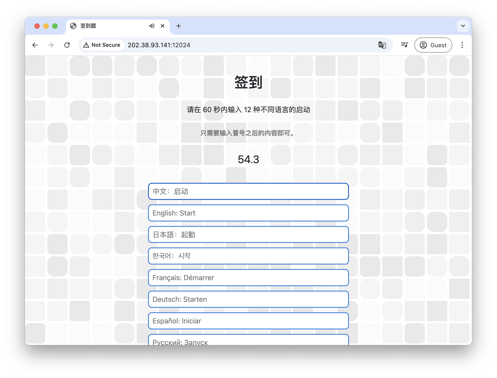
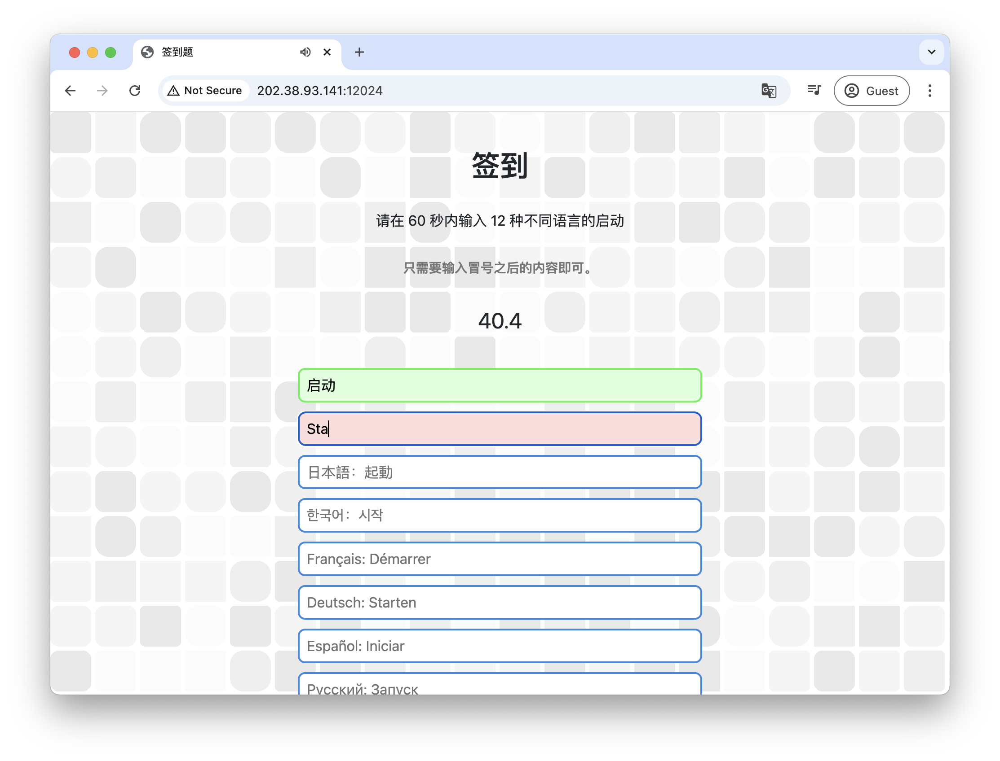
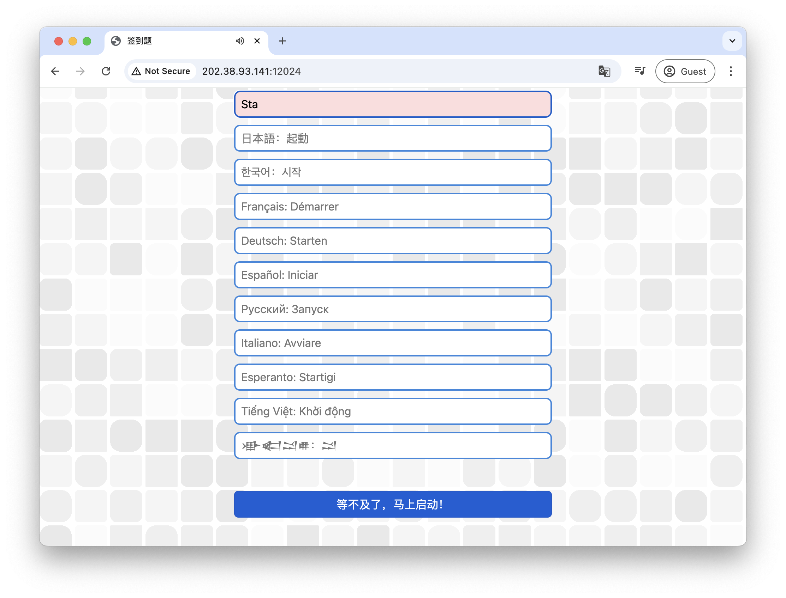
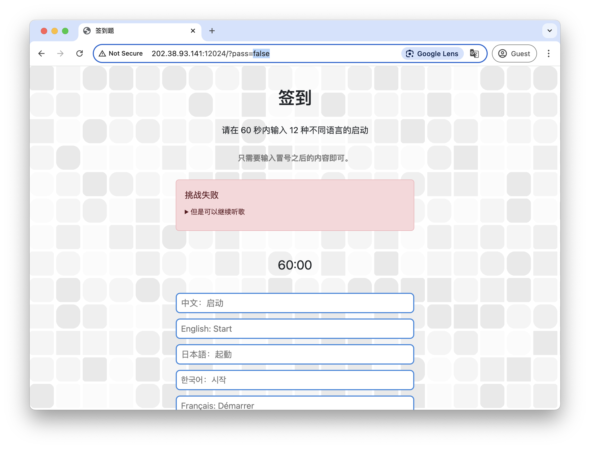
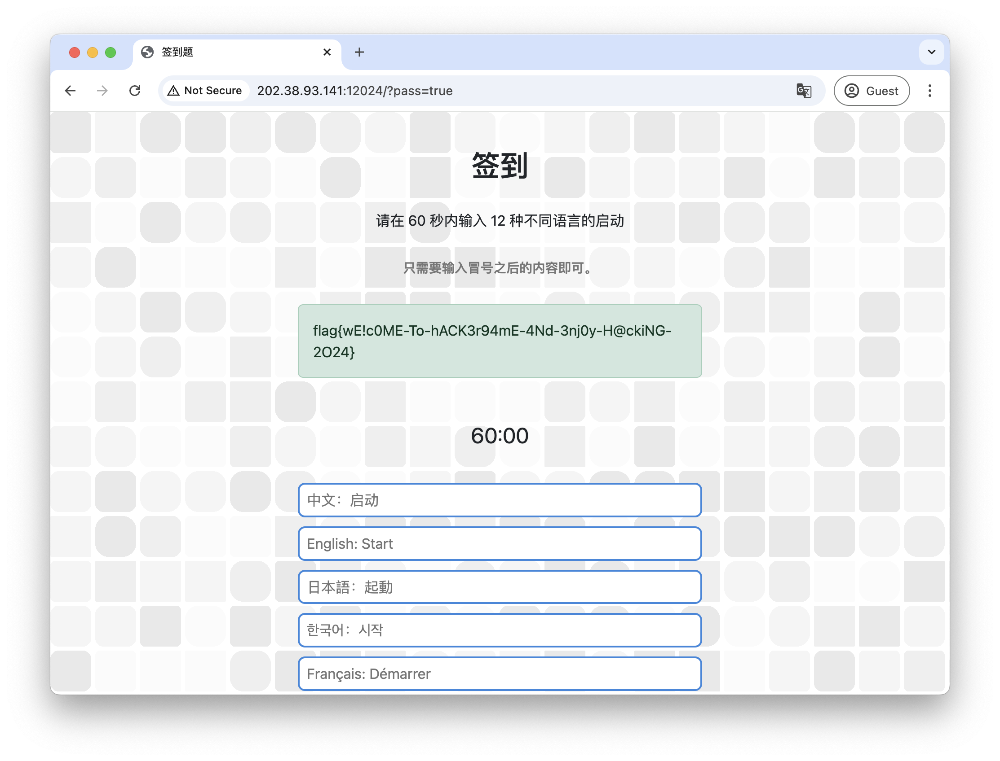
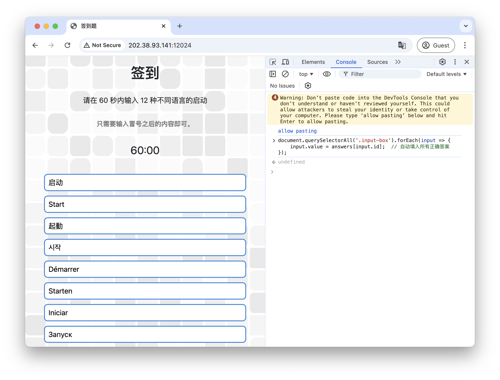

# 签到

题解作者：[volltin](https://github.com/volltin)

出题人、验题人、文案设计等：见 [Hackergame 2024 幕后工作人员](https://hack.lug.ustc.edu.cn/credits/)。

## 题目描述

- 题目分类：web

- 题目分值：50

让我们说……各种语言，开始今年的冒险！

提示：完成题目遇到困难？你可以参考 [2018 年签到题题解](https://github.com/ustclug/hackergame2018-writeups/blob/master/official/qiandao/README.md)、[2019 年签到题题解](https://github.com/ustclug/hackergame2019-writeups/blob/master/official/%E7%AD%BE%E5%88%B0%E9%A2%98/README.md)、[2020 年签到题题解](https://github.com/USTC-Hackergame/hackergame2020-writeups/blob/master/official/%E7%AD%BE%E5%88%B0/README.md)、[2021 年签到题题解](https://github.com/USTC-Hackergame/hackergame2021-writeups/blob/master/official/%E7%AD%BE%E5%88%B0/README.md)、[2022 年签到题题解](https://github.com/USTC-Hackergame/hackergame2022-writeups/blob/master/official/%E7%AD%BE%E5%88%B0/README.md) 和 [2023 年签到题题解](https://github.com/USTC-Hackergame/hackergame2023-writeups/blob/master/official/Hackergame%20%E5%90%AF%E5%8A%A8/README.md)。

[打开/下载题目](http://202.38.93.141:12024/?token={token})

## 题解

### 常规解法

和往年一样，本题作为 Hackergame 2024 的第一道题，是一个简单的 web 类题目。

打开题目后根据题目提示可以看出，这道题需要选手完成多个文本框的填写，在用户点击第一个文本框之后，倒计时（和音乐）会开始，如图：



如果某个框内输入的文本正确，则该框会变为绿色，否则变为红色，并且此网页通过 JavaScript 脚本禁用了粘贴操作：



在第一次尝试时，选手可以等待倒计时结束，或者用底部按钮直接提交，如果以上文本没有完全正确，则会出现提示：



注意看浏览器上方的地址栏，可以看到地址栏的 URL 发生了变化，并且有 `pass=false` 参数，表示选手没有通过本题。




直接在地址栏修改 `pass` 参数为 `true` （如图所示）并回车即可获得本题 flag。



### 使用 AI 解题

在网页中右键查看源代码，复制后粘贴到比较厉害的大语言模型中，并询问「如何通过」，即可获得多种解法，比如一种解法是直接在控制台中输入这段代码，将正确答案直接填入：

```javascript
document.querySelectorAll('.input-box').forEach(input => {
    input.value = answers[input.id];  // 自动填入所有正确答案
});
```

效果：



最后提交即可得到 flag。

### 注明
本题的音乐、歌词基于游戏《沙威玛传奇（Shawarma Legend）》中文主题曲改编，由 Suno AI 制作。

音乐文件：[Hackergame.mp3](files/Hackergame.mp3)
