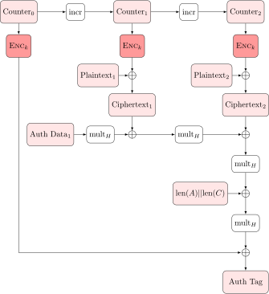

# 认证恢复码

题解作者：[tl2cents](https://github.com/tl2cents)

出题人、验题人、文案设计等：见 [Hackergame 2024 幕后工作人员](https://hack.lug.ustc.edu.cn/credits/)。

## 题目描述

- 题目分类：math

- 题目分值：Hello? Admin!（250）+ Super Talent!（350）

传统的加密系统饱受 Padding Oracle Attack 的困扰，因此需要相当小心地处理数据填充逻辑。如果我们有一种方式能够有效检测到数据篡改，一切都迎刃而解了。于是小 A 决定设计一个超安全的认证加密系统，既然是超安全的系统，那么就用超安全的 Rust 语言、超标准的 AES-GCM 算法、以及超严格的限制来实现吧。另外，小 A 还超贴心地增加了一个认证恢复码，以防用户注册后不仅忘记了密码还忘记了自己的用户名，为了防止这个功能被滥用，小 A 严格限制了其使用次数。

最后，小 A 想到在这么有限的次数的访问下，密钥的熵值其实小一些也未尝不可，于是使用了 PIN 初始化了超级管理员的密钥。但是听说妮可神童口算 RSA 分解，相信对数穷举也不在话下，比如 $2^{32}$ 大小的密钥空间，穷举 32 次应该绰绰有余。

**[下载题目源代码](files/auth_recovery_code.zip)**

提示：点击下面的「打开/下载题目」按钮会为你创建一个独立的题目环境，有效时间一小时。如果环境遇到问题，可以 [关闭环境](https://chal00-manager.hack-challenge.lug.ustc.edu.cn/docker-manager/stop?{token}) 后再试。

**注记**：本题给出了项目源码，可以在本地运行 `cargo run --release` 调试项目，请尽量在本地求解后再尝试远程。

[打开/下载题目](https://chal00-manager.hack-challenge.lug.ustc.edu.cn/docker-manager/start?{token})

## 题解

这题的出题思路是现有带关联数据的认证加密（AEAD：Authenticated Encryption with Associated Data）的两个安全性问题：nonce 复用和 Partitioning Oracle Attack。与传统加密不同的是，认证加密会检测密文是否合法，即 MAC 的正确性，是存在解密失败的可能性的。对目前标准化的认证加密算法而言，解密失败的信息不能泄露，虽然大部分情况下不足以利用产生漏洞，但仍会削弱安全强度。

第二问源自于 Shadowsocks VPN 中存在的 Partitioning Oracle Attack (简记为 POA)，POA 通过构造多密钥碰撞密文，使得单次 Oracle 可以确定一组密钥的正确性，而不是传统意义上的单个密钥，这也是 Partitioning 的意义。值得一提的是，目前所有标准化的认证加密算法比如 TLS 1.2/1.3 中广泛使用的 AES-CGM、ChaCha20-Poly1305，都是 non-committing AEAD，所谓 **non-committing AEAD 意味着密文不与密钥严格绑定，因此，一个由攻击者精心构造的密文和 MAC 值，可以让其在特定的一组密钥下解密成功，容易受到 POA 的威胁**。因此，committing AEAD 也是近年来认证加密设计的热点，比如 22 年欧密 [Efficient Schemes for Committing Authenticated Encryption](https://eprint.iacr.org/2022/268) 提了 AES-GCM 一个非常简单的改进方案，使得 AES-GCM 可以成为 committing AEAD，据笔者目前来看，标准化还没有部署这个方案，其安全性证明也还待进一步验证。

本题 EXP 参考 [exp1.py](./solutions/exp1.py) 和 [exp2.py](./solutions/exp2.py)。

### Hello? Admin!

第一问只需要任意登陆一个具有 admin 权限的用户即可获得 flag。首先我们重点关注认证恢复码的逻辑：

1. 系统初始化一个超级管理员和随机的 32 字节密钥 KEY，根据超级管理员的 username 和 PIN 生成一个 SUPER KEY。
2. 用户注册逻辑：每个用户注册时，会根据其 username 和 password 生成一个 12 字节的 `Nonce = HMAC-SHA256(key=username, data=password)`，然后 Server 加密 username 生成密文 `Cipher = AES-GCM(KEY, Nonce, username, AD="admin=false")`，Server 存储凭证信息 `Credential = (Nonce, Cipher, AD)`，并且将其序列号化后以 BASE64 编码返回给用户，即认证恢复码。
3. 登陆认证逻辑：双重验证，根据用户的 username 和 password，首先验证 `HMAC-SHA256`，即 Nonce 的正确性，然后验证 `AES-GCM` 解密的正确性。
4. 认证恢复码逻辑：用户忘记密码或者用户名后，可以使用认证恢复码找回，Server 会根据用户提供的认证恢复码解密出 USERNAME，然后根据认证恢复码重置用户相关信息。

值得注意的，认证恢复码生成时使用 username 作为 HMAC 的密钥，从而我们可以构造 HMAC 伪碰撞，注意到一般的 HMAC 框架如下：

$$
\begin{aligned}
\textsf{HMAC}(K, m) & =\mathrm{H}\left(\left(K^{\prime} \oplus \text { opad }\right) \| \mathrm{H}\left(\left(K^{\prime} \oplus \text { ipad }\right) \| m\right)\right) \\
K^{\prime} & = \begin{cases}\mathrm{H}(K) & \text { if } K \text { is larger than block size } \\
K & \text { otherwise }\end{cases}
\end{aligned}
$$

我们在 username 后面添加若干个 0 字节（username 长度不超过 64），得到的 Hmac 值是一样的，比如用户名 `tl2cents\x00` 和 `tl2cents`。这样可以导致认证恢复码复用 nonce 加密不同的消息，通过 GHASH 的相关构造，我们可以求解有限域上的多项式方程恢复完整性密钥，从而通过 Recover 功能修改现有用户的权限（AD），进而认证为 admin。

简单介绍 AES-GCM 中 GHASH 的相关构造：

- 伽罗瓦域：$`\mathbb{F}_{2^{128}}`$ ，模多项式为 $P(x) = x^{128} + x^7 + x^2 + x + 1$.
- MAC 密钥：$`H = \textsf{AES}_K(0) \in \mathbb{F}_{2^{128}}`$.
- 常数系数：$`C = \textsf{AES}_K(\textsf{Nonce||1})`$.

记由密文和关联数据组成的填充消息 `pad(AD) || pad(CT) || len(AD) || len(CT)` 表示为 $p = (p_1, \cdots, p_n) \in \mathbb{F}_{2^{128}}^{n}$，。 `GHASH` 函数可以表示为一个简单的多项式求值：

$$
tag = \sum_{i=1}^{n} p_i \cdot H^{i} + C
$$

一个简单的图示如下：

<center></center>

如果 nonce 不变，那么 $H，C$ 固定，密文与关联数据已知，一旦复用了相同 nonce 加密不同消息得到： $(p, t), (p^\prime, t^\prime)$，则

$$
\begin{cases}
t &= \sum_{i=1}^{n} p_i \cdot H^{i} + C \\
t^\prime &= \sum_{i=1}^{n} p_i^\prime \cdot H^{i} + C
\end{cases}
$$

解上述方程组，可以恢复出 $H, C$，然后修改 AD 为 admin 的权限，生成新的 MAC。有关 AEAD 的 nonce 复用攻击可以参考 [Nonce-Reuse-Attacks](https://github.com/tl2cents/AEAD-Nonce-Reuse-Attacks) 的具体实现。


### Super Talent!  

第二问需要登陆系统中初始超级管理员的账号获得 flag。认证恢复码恢复账户的逻辑需要 nonce 与 server 端现有的 nonce 相同，我们不能通过第一问恢复出来的 nonce 对应的密钥信息，尝试修改系统中已有的账户。但是 Recover 中有另一个逻辑可以绕过 nonce 的匹配，直接修改用户的密码，那就是使用超级管理员的密钥（super key）认证。super key 是典型的弱密钥，使用超级管理员的 username 和 6 位的 PIN 值生成，因此在完成第一问后，我们可以通过查看 users 页面得到超级管理员的 username，从而减少 super key 的熵值，未知的是仅 6 位的 PIN（为了减少运行时间，实际熵为 $9^6 \approx 2^{19}$），需要在 30 次尝试中找到正确的 Super Key，一般穷举成功的概率是 $5.6 \times 10^{-5}$。如果考虑非预期的爆破，预计次数 17714，应该不会有选手尝试这种做法吧。

预期解是利用 Partitioning Oracle Attack 进行近似对数穷举，每次生成特殊的密文消息（multi-key collision ciphertext），对一半的密钥而言，它能够正确解密（但是解密为随机的数据），对于另一半的密钥而言，它们不能解密成功，解密是否成功的信息可以从 http response 返回的状态码中得到。从而每次我们都能筛选掉一半的密钥，在理想状态下可以在 19 次以内得到密钥。但是，考虑到生成特殊的密文消息（multi-key collision ciphertext），需要进行拉格朗日多项式插值，复杂度与需要碰撞的密钥的个数 $k$ 相关，即 $\mathcal{O(k^2)}$ ，最优的拉格朗日插值是 $\mathcal{O}(k \log ^2 k )$。因此考虑到这个复杂度，预期是先每次生成 $2^{15}$ 大小的 multi-key collision 密文，直到在某次出现 404 的状态码，然后进行二分穷举，最多在 $16 - 1 + 15 = 30$ 次以内可以得到正确的密钥，通过 super key 和 Recover 功能，我们可以修改包括超级管理员在内的任意用户的密码。

下面简要介绍 Partitioning Oracle Attack 的基本原理。记 $m$ 个密钥为 $`K = \{K_1, \cdots, K_m\}`$。我们的目标是找到一个多密钥碰撞密文 $c = (c_1, \cdots, c_m)$ 和一个 MAC 值 $t$ 使得 $c, t$ 可以被 $K$ 中的所有密钥成功解密。这意味着对于固定 MAC 值 $t$，以下等式成立：

$$
t = \sum_{i=1}^{n} c_i \cdot H_j^{i} + C_j, \quad \forall j \in \{1, \cdots, m\}
$$

上述等式可以重写为 $\mathbb{F}_{2^{128}}$ 上的 $m$ 个多项式点求值：$`(x_i, P(x_i)) = (H_i, (t - C_j)/H_j)`$ 。拉格朗日插值算法可以恢复出多密钥碰撞密文块的多项式系数。实际上，由于 GCM 中的填充机制，合并消息的最后一个块 $p_1$ 是已知的 `len(AD) || len(CT)`，其中 `len(AD)` 是关联数据的长度，`len(CT)` 是密文的长度。因此，对于 $`i \in \{1, \cdots, m\}`$，拉格朗日插值点可以进一步写成 $(x_i, y_i) = (H_i, (t - C_j - p_1 H_j)/H_j^2)$。对于上述点集，典型的拉格朗日插值算法基于以下公式：

$$
P(x) = \sum_{i=1}^{m} y_i \cdot L_i(x),
$$

其中 $L_i(x)$ 是拉格朗日基多项式：

$$
L_i(x) = \prod_{j=1, j \neq i}^{m} \frac{x - x_j}{x_i - x_j}.
$$

对 $n$ 个点，拉格朗日插值算法时间复杂度为 $O(n^2)$ 。可以应用一些优化技术来降低计算拉格朗日基多项式的时间复杂度。在论文 [Partitioning Oracle Attacks](https://eprint.iacr.org/2020/1491.pdf) 中，作者提到，通过使用技术 [Fast Modular Transformations](https://www.sciencedirect.com/science/article/pii/S0022000074800292)，时间复杂度可以降低到 $O(n \log^2 n)$。但是据论文作者介绍，标准库中没有找到相关实现。笔者测试了三种拉格朗日插值算法的实现：

- Sagenmath 多项式环内置的 `lagrange_polynomial` 方法。
- PARI 库实现的 `polinterpolate` 方法。
- C++ NTL 库实现的拉格朗日插值算法。

上述插值算法在我本机上测试的效率依次递增。EXP 中最终使用了 C++ 的 NTL 库进行拉格朗日插值，对于 $2^{15}$ 大小的数据，运行一次的时间不超过 2min，这部分多核并行可以显著增加效率。因此单核跑 exp 的预期时间应该在 16 min 左右（最多半小时），这在单次连接 1 小时的限制下是完全可以接受的。NTL 插值脚本和 Partitioning Oracle Attacks 的实现参考 [ghash_multi_collision.py](./solutions/ghash_multi_collision.py) 和 [poly_interpolate.cpp](./solutions/poly_interpolate.cpp)。


### 其他

最开始这个题的 demo 是使用 `ChaCha20-Poly1305` 实现的，由于 `Poly1305` 中有双模数和明文块的填充特征，会比现有的这题更难一些，`Poly1305` 中 POA 的多密钥碰撞密文的构造需要求解 CVP 问题，本地测试发现，随着格维度的增大，有限时间内最多生成 $2^{8}$ 个密钥同时碰撞的密文，这样导致在现有的框架下直接多开几个 docker 爆破的可行性变大。于是最终还是用了 AES-GCM，感兴趣的读者可以尝试一下 ChaCha20-Poly1305 的 POA 攻击。

关于 EXP:

- 运行环境：Sagemath 10.2，一些低版本的 SageMath 比如 9.5 不兼容。比如 `gf2e.from_integer` 和 `gf2e.to_integer` 方法。
- NTL 依赖：如果需要运行 EXP，需要首先安装 NTL 库，然后编译 binary：
  
  ```bash
  $ g++ -O2 -std=c++11 -pthread -march=native -o interpolate poly_interpolate.cpp -lntl -lgmp -lm
  ```


参考文献：
1. Partitioning Oracle Attacks: https://eprint.iacr.org/2020/1491.pdf
2. Partition Oracles from Weak Key Forgeries: https://eprint.iacr.org/2021/1296
3. Galois/Counter Mode Wiki: https://en.wikipedia.org/wiki/Galois/Counter_Mode